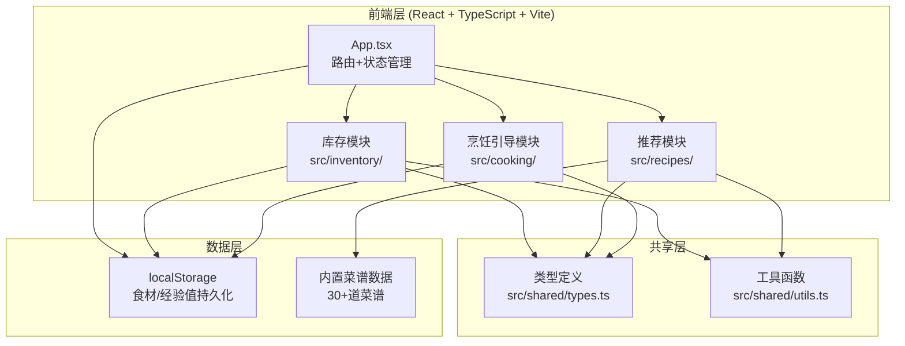
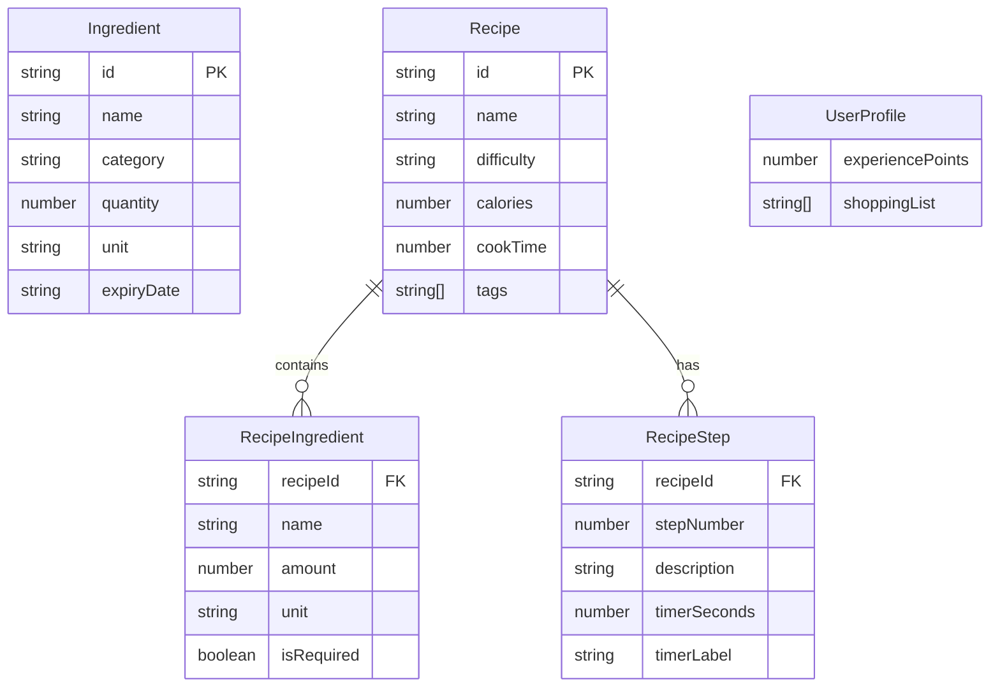

## 1. 架构设计



## 2. 技术说明
- 前端：React@18 + TypeScript + Vite
- 初始化工具：Vite
- 后端：无（纯前端应用）
- 数据库：localStorage + 内置静态数据
- 样式：CSS Modules + CSS变量主题
- 动画：CSS transitions/animations + Canvas API（粒子效果）
- 路由：React状态切换（单页应用，无需React Router）

## 3. 路由定义
| 路由 | 用途 |
|------|------|
| /（默认） | 食材库存管理页 |
| /recipes | 菜谱推荐页 |
| /cooking | 烹饪引导页 |

## 4. API定义
- 无后端API，所有数据通过localStorage和内置静态数据提供

## 5. 服务器架构图
- 不适用（纯前端应用）

## 6. 数据模型

### 6.1 数据模型定义



### 6.2 数据定义语言

```typescript
interface Ingredient {
  id: string;
  name: string;
  category: 'vegetables' | 'meat' | 'seafood' | 'seasoning' | 'grains' | 'dairy' | 'fruits' | 'others';
  quantity: number;
  unit: 'g' | 'kg' | 'pcs' | 'cup' | 'ml' | 'spoon' | 'pinch';
  expiryDate: string;
}

interface Recipe {
  id: string;
  name: string;
  difficulty: 'easy' | 'medium' | 'hard';
  calories: number;
  cookTime: number;
  tags: string[];
  ingredients: RecipeIngredient[];
  steps: RecipeStep[];
  nutritionRatio: { carbs: number; protein: number; fat: number };
}

interface RecipeIngredient {
  name: string;
  amount: number;
  unit: string;
  isRequired: boolean;
}

interface RecipeStep {
  stepNumber: number;
  description: string;
  timerSeconds?: number;
  timerLabel?: string;
}

interface UserProfile {
  experiencePoints: number;
  shoppingList: string[];
}
```
