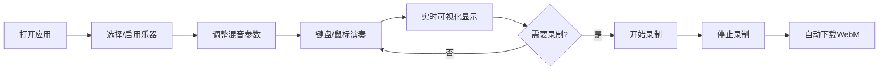

## 1. 产品概述

在线虚拟乐器组合与即兴演奏应用，让用户能在浏览器中通过鼠标或键盘组合多种虚拟乐器（钢琴、鼓、合成器）的片段，实时混合播放并录制混音结果，同时以可视化波形和频谱显示音频输出。

- **目标用户**：音乐爱好者、音乐制作人、学生、教育工作者
- **产品价值**：无需专业硬件，在浏览器中即可体验多轨音乐创作，降低音乐制作门槛

## 2. 核心功能

### 2.1 用户角色

| 角色 | 注册方式 | 核心权限 |
|------|----------|----------|
| 普通用户 | 无需注册，直接使用 | 使用所有乐器功能、混音控制、录制导出 |

### 2.2 功能模块

1. **乐器组合面板**：乐器卡片展示、拖拽排序、启用/禁用切换
2. **混音控制台**：音量滑杆、声像旋钮、播放/停止控制、总音量控制
3. **演奏键盘**：虚拟钢琴键盘、鼠标交互、键盘快捷键映射、音符动画
4. **波形与频谱可视化**：实时波形绘制、频谱柱状图、播放暂停冻结
5. **录制与导出**：录制控制、时长计数、自动下载WebM文件

### 2.3 页面详情

| 页面名称 | 模块名称 | 功能描述 |
|----------|----------|----------|
| 主应用页 | 乐器组合面板 | 左侧展示6种乐器卡片，支持拖拽排序、启用/禁用 |
| 主应用页 | 混音控制台 | 底部固定控制栏，各音轨音量和声像控制 |
| 主应用页 | 演奏键盘 | 中央区域25键虚拟钢琴（C4-C6） |
| 主应用页 | 波形可视化 | 控制台上方实时波形和频谱显示 |
| 主应用页 | 录制模块 | 录制按钮、时长计数、自动导出 |

## 3. 核心流程

用户打开应用 → 选择并启用乐器音轨 → 通过虚拟键盘或电脑键盘演奏 → 调整各音轨音量和声像 → 观察波形和频谱变化 → 点击录制按钮开始录制 → 再次点击停止录制 → 自动下载混音音频文件

## 4. 用户界面设计

### 4.1 设计风格
- **主色调**：蓝色渐变（#0f0c29 → #302b63 → #24243e）
- **背景色**：#1a1a2e（主背景）、#16213e（面板背景）
- **点缀色**：金色#f0c040（高亮）
- **效果**：磨砂玻璃（backdrop-filter: blur）、平滑过渡动画（0.2s ease）
- **字体**：现代无衬线字体，显示字体与正文字体搭配
- **图标风格**：简洁线性图标，使用lucide-react

### 4.2 页面设计概述

| 页面名称 | 模块名称 | UI元素 |
|----------|----------|--------|
| 主应用页 | 乐器组合面板 | 磨砂玻璃卡片、发光边框、拖拽半透明效果、自动让位动画 |
| 主应用页 | 混音控制台 | 垂直音量滑杆（带dB刻度）、旋转旋钮（蓝色渐变）、数值实时显示 |
| 主应用页 | 演奏键盘 | 浅灰底色、白键30px、黑键18px、悬停微凸、点击下压、音符飘散动画 |
| 主应用页 | 波形可视化 | 蓝色波形线、绿紫渐变频谱柱、30FPS+刷新率 |
| 主应用页 | 录制模块 | 红色录制按钮、脉冲动效、MM:SS时长计数器 |

### 4.3 响应性
- **桌面端**（≥768px）：乐器卡片垂直排列、键盘单排布局
- **移动端**（<768px）：乐器卡片水平滑动选择、键盘两行紧凑布局
- **触摸优化**：增大触控目标尺寸，支持触摸事件

### 4.4 动画效果
- **页面加载**：各模块从底部滑入，不同延迟
- **交互反馈**：所有按钮、滑杆、键盘0.2s平滑过渡
- **启用效果**：乐器卡片柔和发光边框
- **录制状态**：按钮脉冲闪烁动画
