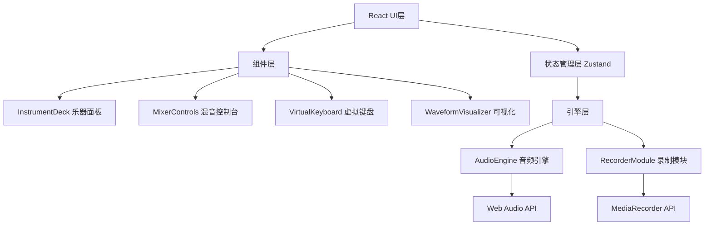

## 1. 架构设计



## 2. 技术描述

- **前端框架**：React@18 + TypeScript
- **构建工具**：Vite@5
- **状态管理**：Zustand
- **音频处理**：Web Audio API（原生）
- **可视化**：Canvas API（原生）
- **录制**：MediaRecorder API（原生）
- **图标**：lucide-react
- **样式**：CSS Modules + CSS Variables

## 3. 目录结构

```
src/
├── engine/
│   ├── AudioEngine.ts      # 音频引擎，管理Web Audio节点
│   └── RecorderModule.ts   # 录制模块，MediaRecorder封装
├── components/
│   ├── InstrumentDeck.tsx  # 乐器音轨选择与组合面板
│   ├── MixerControls.tsx   # 混音控制台
│   ├── VirtualKeyboard.tsx # 虚拟演奏键盘
│   └── WaveformVisualizer.tsx # 波形频谱可视化
├── store/
│   └── useAudioStore.ts    # 音频状态管理
├── types/
│   └── index.ts            # TypeScript类型定义
├── App.tsx                 # 主应用组件
├── main.tsx                # 应用入口
└── index.css               # 全局样式
```

## 4. 核心模块说明

### 4.1 AudioEngine.ts
- 管理AudioContext、GainNode、PannerNode等Web Audio节点
- 加载预置乐器音频缓冲
- 提供playNote、stopNote、setVolume、setPan等方法
- 提供getByteTimeDomainData和getByteFrequencyData用于可视化
- 支持6个独立音轨，低延迟音频处理

### 4.2 RecorderModule.ts
- 封装MediaRecorder API
- 从AudioContext的destination录制
- 支持开始/停止录制
- 自动生成文件名（JamSession_YYYYMMDD_HHmmss.webm）
- 录制完成后自动触发下载

### 4.3 状态管理
```typescript
interface TrackState {
  id: string;
  name: string;
  icon: string;
  enabled: boolean;
  volume: number; // 0-1
  pan: number; // -1 to 1
  order: number;
}

interface AudioState {
  tracks: TrackState[];
  masterVolume: number;
  isPlaying: boolean;
  isRecording: boolean;
  recordingTime: number;
  setTrackVolume: (id: string, volume: number) => void;
  setTrackPan: (id: string, pan: number) => void;
  toggleTrack: (id: string) => void;
  reorderTracks: (fromIndex: number, toIndex: number) => void;
  startRecording: () => void;
  stopRecording: () => void;
}
```

## 5. 性能优化

### 5.1 音频性能
- 使用Web Audio API的低延迟模式
- 预加载所有乐器音频缓冲
- 音轨复用AudioNode，避免频繁创建销毁
- 最大同时发声数限制，防止音频爆音

### 5.2 渲染性能
- Canvas使用requestAnimationFrame，保证30FPS+
- 组件memo化，减少不必要重渲染
- 状态更新批处理
- 拖拽使用transform而非top/left

### 5.3 内存管理
- 组件卸载时清理AudioContext
- 停止所有音频节点
- 取消所有动画帧请求
- 移除事件监听器

## 6. 类型定义

```typescript
// 乐器类型
type InstrumentType = 'piano' | 'epiano' | 'strings' | 'drums' | 'synth-lead' | 'synth-pad';

// 音轨配置
interface TrackConfig {
  id: string;
  type: InstrumentType;
  name: string;
  icon: string;
  enabled: boolean;
  volume: number;
  pan: number;
}

// 音频引擎接口
interface IAudioEngine {
  init(): Promise<void>;
  playNote(trackId: string, note: number, velocity?: number): void;
  stopNote(trackId: string, note: number): void;
  setVolume(trackId: string, value: number): void;
  setPan(trackId: string, value: number): void;
  setMasterVolume(value: number): void;
  getTimeDomainData(): Uint8Array;
  getFrequencyData(): Uint8Array;
  getDestination(): MediaStreamAudioDestinationNode;
}
```
