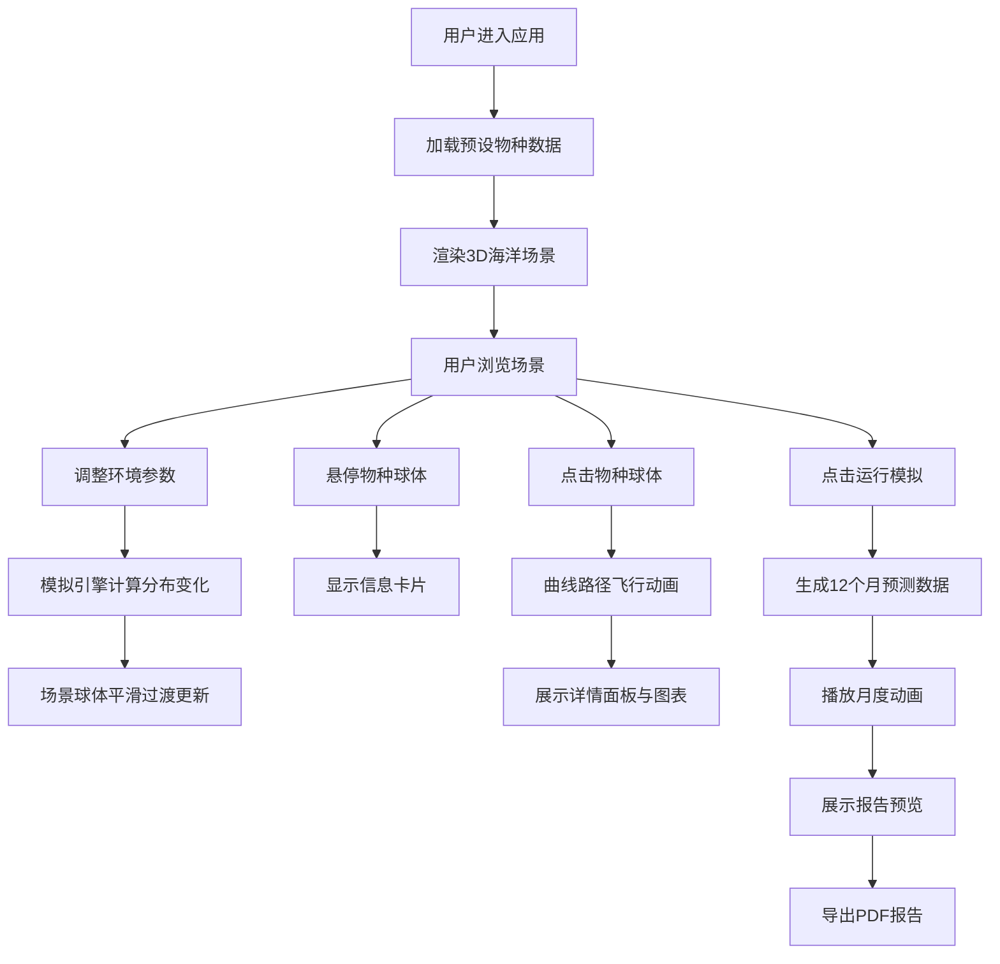

## 1. 产品概述

交互式3D海洋生态数据可视化与模拟应用，为海洋生态研究人员提供沉浸式的数据探索体验。用户可在虚拟海洋空间中浏览不同深度层的生物群落分布，实时调整环境参数观察物种变化趋势，并生成可导出的分析报告。

- 目标用户：海洋生态研究人员、环境科学家、教育工作者
- 核心价值：将多维度生态调查数据以三维动态方式直观呈现，支持环境参数模拟与趋势预测

## 2. 核心功能

### 2.1 功能模块

1. **3D海洋场景渲染**：虚拟海洋空间、物种球体分布、水层效果、海底地貌、动态光照
2. **环境参数调节**：温度、盐度、光照穿透深度控制，实时反馈生态区域描述
3. **数据辅助探索**：悬停信息卡片、物种详情面板、采样点分布图表
4. **模拟趋势分析与导出**：12个月预测模拟动画、趋势报告预览、PDF导出

### 2.2 页面详情

| 页面名称 | 模块名称 | 功能描述 |
|----------|----------|----------|
| 主应用 | 3D海洋场景 | 渲染虚拟海洋环境，包含半透明水层、动态海面波动、海底低多边形模型，以发光球体表示各物种分布 |
| 主应用 | 控制面板 | 右侧毛玻璃面板，提供温度(5-30°C)、盐度(30-40ppt)、光照(10-200m)三个滑块，显示当前数值和生态区域描述，提供运行模拟和导出按钮 |
| 主应用 | 悬停信息卡 | 鼠标悬停物种球体时显示圆角信息卡，包含物种名称、拉丁学名、深度、丰度百分比、温度偏好带 |
| 主应用 | 物种详情面板 | 点击球体后左侧固定面板，展示采样点丰度柱状图和时间序列折线图（Canvas 2D绘制） |
| 主应用 | 模拟进度条 | 场景底部显示月进度条和预测说明文本，动画播放时逐月更新 |
| 主应用 | 报告预览区域 | 模拟结束后右侧出现，包含关键发现摘要、迁徙路径简图、月丰度热力图、导出PDF按钮 |

## 3. 核心流程

用户进入应用后，系统加载预设物种数据并渲染3D海洋场景。用户可通过鼠标交互（拖拽旋转、滚轮缩放、右键平移）浏览场景。拖动控制面板滑块时，模拟引擎实时计算物种分布变化，场景球体位置、大小和透明度带0.5秒平滑过渡。点击物种球体时，场景沿曲线路径飞近目标（1秒动画），并展示详情面板。点击"运行模拟"后，系统生成12个月预测数据并播放动画，结束后展示报告预览，用户可导出PDF。

## 4. 用户界面设计

### 4.1 设计风格

- **主色调**：深海蓝(#0a1628)到墨黑(#000510)渐变背景
- **次要色**：冷青色(#00e5ff)用于UI控件边框和辉光，白色(#ffffff)用于文本
- **强调色**：暖橙黄色(#ff9a3c)用于高亮和按钮激活状态
- **面板效果**：毛玻璃效果（backdrop-filter: blur(16px) + 半透明背景 rgba(10,22,40,0.6)），青色辉光边框
- **按钮样式**：圆角8px，悬停时背景加深+发光，激活时有按压效果
- **字体**：使用现代无衬线字体，标题使用更有科技感的字体
- **布局风格**：全屏3D场景为主体，右侧浮动控制面板，点击物种时左侧出现详情面板
- **动画**：所有过渡使用ease-in-out缓动，持续0.5秒；场景相机移动带平滑阻尼

### 4.2 页面设计概述

| 页面名称 | 模块名称 | UI元素 |
|----------|----------|--------|
| 主应用 | 3D海洋场景 | 全屏渲染，深海渐变背景，动态光照，发光物种球体，半透明水层，海面波动，低多边形海底地貌 |
| 主应用 | 控制面板 | 右侧固定宽度320px，毛玻璃背景，青色边框辉光，滑块带刻度，数值实时显示，描述文本动态更新，按钮带悬停发光效果 |
| 主应用 | 悬停信息卡 | 跟随鼠标，圆角12px，毛玻璃背景，标题+详情文字，颜色指示条 |
| 主应用 | 物种详情面板 | 左侧固定宽度360px，标题栏+图表区域，柱状图有加载动画，折线图平滑曲线 |
| 主应用 | 模拟进度条 | 底部水平进度条，月数标记，说明文字，进度带发光效果 |
| 主应用 | 报告预览 | 右侧扩展面板，摘要卡片，简图区域，热力图，导出按钮 |

### 4.3 响应式设计

- 桌面端优先，最小宽度1280px
- 控制面板和详情面板采用固定宽度，确保操作区域稳定
- 3D场景自适应剩余空间

### 4.4 3D场景指导

- **环境氛围**：深海蓝色调雾气(FOG)，随深度增加能见度降低
- **光照设置**：顶部方向光模拟阳光穿透，随光照参数变化强度和穿透深度；物种球体自发光
- **相机设置**：PerspectiveCamera，初始位置俯视海面，支持OrbitControls（拖拽旋转、滚轮缩放、右键平移），带阻尼动画
- **场景组成**：海面（正弦波位移顶点Shader）、水体（半透明渐变多层）、海底（低多边形随机地形）、沙石珊瑚、物种球体粒子系统
- **交互动画**：参数变化时球体位置/大小/透明度0.5秒插值过渡；点击时相机沿CatmullRom曲线飞行1秒到目标附近
- **性能优化**：物种使用InstancedMesh批量渲染，LOD策略，最大实例数控制在2000以内
