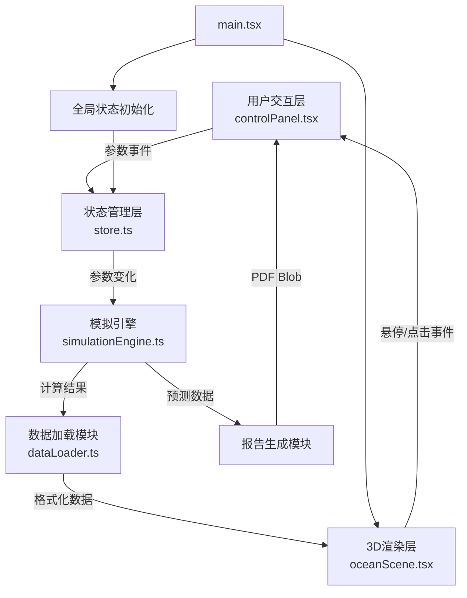

## 1. 架构设计



## 2. 技术描述

- **前端框架**：React 18 + TypeScript
- **构建工具**：Vite
- **3D渲染**：three.js + @react-three/fiber + @react-three/drei
- **状态管理**：zustand（轻量级，适合3D场景高频状态更新）
- **样式方案**：TailwindCSS 3 负责UI布局，内联样式/主题变量处理毛玻璃与辉光特效
- **图表绘制**：原生 Canvas 2D API（柱状图与折线图，确保性能）
- **PDF导出**：jsPDF（轻量，纯前端导出）
- **状态管理数据流向**：controlPanel → zustand store → simulationEngine → dataLoader → oceanScene

## 3. 目录结构与文件职责

```
src/
├── main.tsx              # 应用入口，挂载React，初始化全局store
├── App.tsx               # 根组件，组合3D场景、控制面板、详情面板
├── store.ts              # zustand全局状态：环境参数、选中物种、模拟数据
├── types.ts              # TypeScript类型定义：Species, SamplePoint, EnvParams
├── dataLoader.ts         # 数据加载模块：加载预设JSON，格式化为层级结构
├── simulationEngine.ts   # 模拟引擎：基于参数计算物种分布概率、生成12月预测
├── oceanScene.tsx        # 3D渲染模块：OceanScene组件及子组件
│   ├── components/
│   │   ├── OceanWater.tsx     # 海面波动+半透明水层
│   │   ├── SeaFloor.tsx       # 低多边形海底地貌
│   │   ├── SpeciesPoints.tsx  # 物种球体InstancedMesh渲染
│   │   └── HoverTooltip.tsx   # 悬停信息卡片
│   └── hooks/
│       └── useSpeciesAnimation.ts  # 球体过渡动画hook
├── controlPanel.tsx      # 交互控制面板：滑块、按钮、区域描述
├── speciesDetail.tsx     # 物种详情面板：Canvas柱状图+折线图
├── simulationProgress.tsx # 模拟进度条组件
├── reportPreview.tsx     # 报告预览：摘要+简图+热力图+导出
└── styles/
    └── index.css         # 全局样式、毛玻璃工具类、CSS变量
```

**模块调用关系与数据流向：**

1. **main.tsx** 初始化 zustand store，加载 App.tsx
2. **App.tsx** 组合三大模块：OceanScene（主区域）、ControlPanel（右侧）、SpeciesDetail（左侧，条件渲染）
3. **ControlPanel** 用户拖动滑块 → 更新 store.envParams → 触发 simulationEngine.recalculate()
4. **simulationEngine** 基于参数计算每个物种新的深度偏移、丰度系数 → 更新 store.speciesData
5. **OceanScene → SpeciesPoints** 订阅 store.speciesData，通过 useSpeciesAnimation hook 以0.5秒缓动过渡更新球体位置/大小/颜色
6. **SpeciesPoints** 悬停时调用 store.setHoveredSpecies，展示 HoverTooltip；点击时调用 store.setSelectedSpecies，触发相机动画
7. **点击运行模拟** → simulationEngine.generate12MonthForecast() → store.forecastData → SimulationProgress 播放动画逐月更新
8. **模拟结束** → reportPreview.tsx 渲染报告 → 用户点击导出 → jsPDF 生成PDF下载

## 4. 数据模型

### 4.1 TypeScript类型定义

```typescript
// 物种数据
interface Species {
  id: string;
  name: string;           // 中文名称
  latinName: string;      // 拉丁学名
  category: 'shallow' | 'mid' | 'deep';  // 物种分类
  preferredTemp: [number, number];  // 适宜温度范围
  preferredSalinity: [number, number];
  baseDepth: number;      // 基准深度(m)
  depthRange: [number, number]; // 深度范围
  color: string;          // 基础颜色
  samplePoints: SamplePoint[];
}

// 采样点
interface SamplePoint {
  lat: number;
  lng: number;
  depth: number;
  abundance: number;      // 丰度 0-1
  season: 'spring' | 'summer' | 'autumn' | 'winter';
}

// 环境参数
interface EnvParams {
  temperature: number;    // 5-30 °C
  salinity: number;       // 30-40 ppt
  lightPenetration: number; // 10-200 m
}

// 渲染用物种实例（供InstancedMesh使用）
interface RenderableSpecies {
  speciesId: string;
  position: [number, number, number]; // x,y,z
  scale: number;
  opacity: number;
  color: string;
}

// 月度预测数据
interface MonthForecast {
  month: number;  // 1-12
  speciesData: RenderableSpecies[];
  summary: string;
}
```

## 5. 关键实现策略

### 5.1 3D渲染性能

- **InstancedMesh**：所有同物种球体使用InstancedMesh批量渲染，减少draw call
- **动态过渡**：使用 useFrame 钩子在每帧以 easeInOut 插值更新 instance matrix，避免全量重渲染
- **深度雾效**：THREE.FogExp2 随深度雾化，自然剔除远处不可见物体
- **顶点Shader**：海面波动在顶点着色器中实现，避免每帧JS计算大量顶点

### 5.2 模拟引擎算法

- 物种分布概率 = 温度适宜度 × 盐度适宜度 × 光照适宜度
- 适宜度函数：正态分布曲线，以物种偏好中心值为均值
- 升温时：浅海暖水物种深度偏移 +Δ（向深海扩散），冷水物种深度偏移 -Δ
- 结果归一化到 0-1 范围作为球体缩放和透明度系数

### 5.3 相机动画

- 使用 THREE.CatmullRomCurve3 创建从当前相机位置到目标附近的平滑曲线路径
- 沿曲线以 t∈[0,1] 参数化，1秒内完成，使用 requestAnimationFrame + easeInOutCubic

### 5.4 PDF导出

- 使用 jsPDF 将报告预览区域的文本、Canvas热力图、简图转化为PDF页面
- 热力图使用 toDataURL 转图片嵌入PDF
