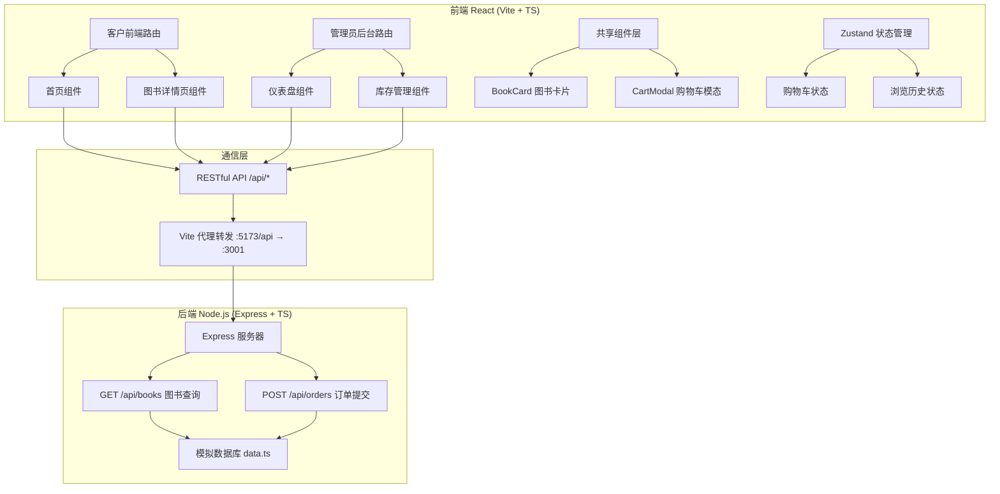
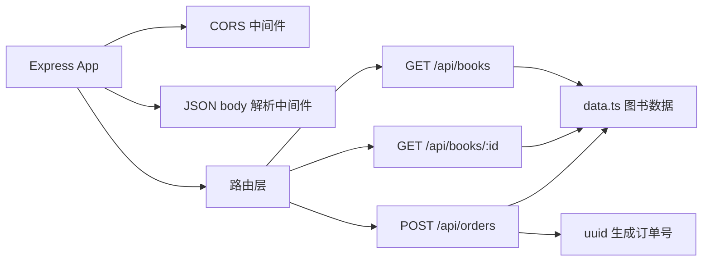
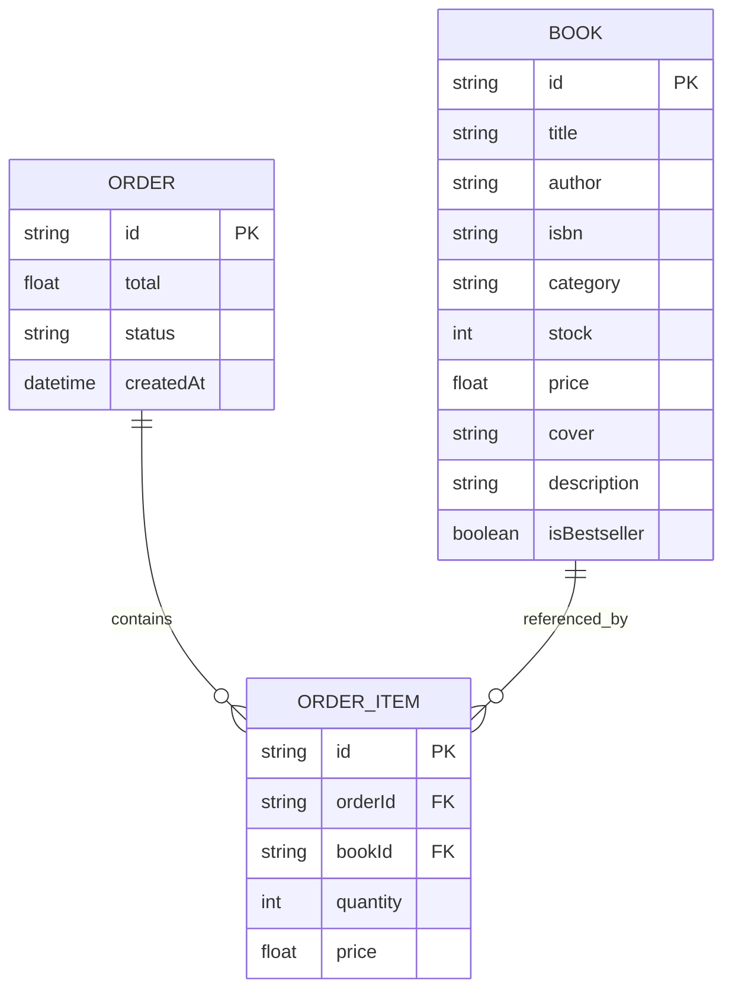

## 1. 架构设计



## 2. 技术说明

- **前端框架**：React 18 + TypeScript
- **构建工具**：Vite 5
- **状态管理**：Zustand
- **路由**：React Router DOM 6
- **样式方案**：Tailwind CSS 3 + 自定义 CSS 动画
- **图标库**：Lucide React
- **后端框架**：Express 4
- **后端语言**：TypeScript（ts-node/tsx 运行）
- **数据库**：内存模拟数据（data.ts 常量数组）
- **跨域处理**：Vite devServer proxy → Express cors 中间件
- **进程管理**：concurrently 同时启动前后端

## 3. 路由定义

| 路由路径 | 页面用途 |
|----------|----------|
| `/` | 客户首页（轮播 + 猜你喜欢推荐） |
| `/book/:id` | 图书详情页 |
| `/admin` | 管理员仪表盘（统计卡片 + 库存表格） |

## 4. API 定义

### 4.1 GET /api/books

查询参数：
```typescript
interface BookQuery {
  search?: string;      // 书名/作者模糊搜索
  page?: number;        // 页码，默认 1
  pageSize?: number;    // 每页数量，默认 20
  category?: string;    // 分类过滤
}
```

响应：
```typescript
interface BookListResponse {
  total: number;
  list: Book[];
}

interface Book {
  id: string;
  title: string;
  author: string;
  isbn: string;
  category: string;
  stock: number;
  price: number;
  cover: string;       // 封面图片 URL
  description: string; // 书籍简介
  isBestseller?: boolean;
}
```

### 4.2 GET /api/books/:id

响应：`Book`（单本详情）

### 4.3 POST /api/orders

请求体：
```typescript
interface OrderItem {
  bookId: string;
  title: string;
  price: number;
  quantity: number;
}

interface OrderRequest {
  items: OrderItem[];
  total: number;
  customerName?: string;
}
```

响应：
```typescript
interface OrderResponse {
  orderId: string;     // uuid
  success: boolean;
  message: string;
}
```

## 5. 后端服务架构



## 6. 数据模型

### 6.1 数据模型定义



### 6.2 初始数据

- 模拟 20-30 本图书数据，覆盖文学、科幻、历史、艺术、商业等分类
- 每本图书包含完整字段：id（uuid）、title、author、isbn、category、stock（0-50 之间含低库存样例）、price（25-128 元）、cover（使用占位图服务）、description
- 部分图书标记 isBestseller: true 用于首轮推荐
