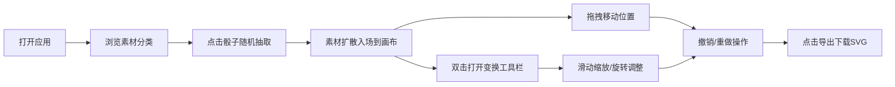

## 1. 产品概述

随机剪贴画灵感生成与布局工坊是一款面向创意工作者的在线拼贴画创作工具，帮助用户打破固定素材库的思维限制，通过随机抽取与自由拖拽排版快速生成灵感草图。

- 目标用户：创意工作坊学员、设计师、插画师、视觉创作者
- 核心价值：随机性激发灵感，手动布局实现构想，一键导出保留创作成果

## 2. 核心功能

### 2.1 用户角色
本产品为单用户本地工具，无需注册登录。

| 角色 | 权限 |
|------|------|
| 访客用户 | 使用全部创作功能，导出SVG文件 |

### 2.2 功能模块
1. **素材面板**：分类素材展示、随机抽取功能
2. **画布区域**：拖拽布局、缩放旋转、无限平移、网格辅助
3. **历史管理**：撤销/重做操作，快捷键支持
4. **导出工具**：SVG序列化导出，保留变换属性

### 2.3 页面详情
| 页面名称 | 模块名称 | 功能描述 |
|---------|---------|----------|
| 主工作台 | 素材面板 | 四分类素材展示（自然/几何/动物/抽象），折叠展开，骰子按钮随机抽取 |
| 主工作台 | 画布区域 | SVG元素拖拽、缩放（0.5-3.0x）、旋转（0-360°）、双击变换工具栏、无限画布平移缩放 |
| 主工作台 | 底部工具栏 | 撤销/重做按钮（翻转动画）、导出按钮（脉冲光效） |
| 主工作台 | 响应式适配 | <768px时素材面板转为底部抽屉式 |

## 3. 核心流程

用户打开应用 → 浏览左侧分类素材 → 点击骰子按钮随机抽取素材 → 素材以扩散动画出现在画布中央 → 拖拽移动调整位置 → 双击素材打开变换工具栏 → 滑动缩放/旋转调整 → 可撤销/重做任意操作 → 点击导出按钮下载SVG文件。

## 4. 用户界面设计

### 4.1 设计风格
- **主色调**：米白色背景（#F5F0E8）、暖木色面板（#D9C8A9）、纯白画布（#FFFFFF）
- **辅助色**：浅灰网格线（#E0E0E0）、柔和阴影 rgba(0,0,0,0.15)
- **纹理细节**：亚麻纹理背景应用于素材面板
- **动画规范**：所有动画统一 0.3s，缓动函数 cubic-bezier(0.4, 0, 0.2, 1)
- **字体**：优雅衬线字体搭配现代无衬线字体，体现艺术工坊质感

### 4.2 页面设计概述
| 页面名称 | 模块名称 | UI元素 |
|---------|---------|--------|
| 主工作台 | 素材面板 | 暖木色背景+亚麻纹理、分类折叠标题、3x2网格素材卡片、骰子图标按钮、悬停上升4px、点击缩放0.95 |
| 主工作台 | 画布区域 | 纯白背景、浅灰虚线网格（拖拽时显示）、可拖拽SVG元素、双击变换工具栏（缩放滑动条+旋转旋钮） |
| 主工作台 | 底部工具栏 | 撤销按钮（左弧形箭头）、重做按钮（右弧形箭头）、导出按钮（下载图标+脉冲光效）、历史步数翻转动画 |
| 主工作台 | 响应式 | <768px：素材面板转为底部抽屉，浮动按钮展开，画布填满剩余高度 |

### 4.3 响应式
- 桌面端（>768px）：左右分栏布局，左侧素材面板固定宽度，右侧画布自适应
- 移动端（≤768px）：画布全屏，素材面板折叠为底部抽屉，浮动按钮触发展开

### 4.4 性能要求
- 30个素材元素同时拖拽帧率≥50fps
- SVG导出响应时间≤1秒
- 使用 requestAnimationFrame 优化拖拽性能
- 轻量级状态更新避免不必要重绘
