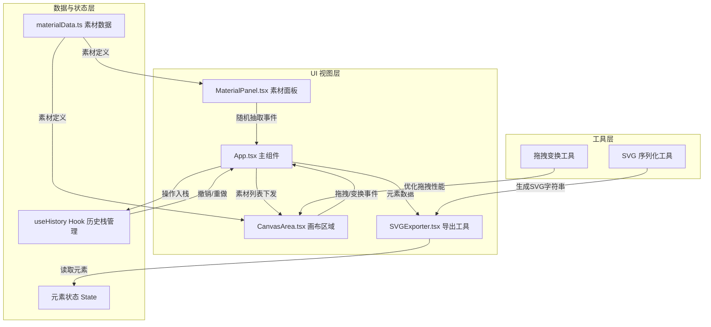

## 1. 架构设计



## 2. 技术描述

- **前端框架**：React 18 + TypeScript 5
- **构建工具**：Vite 5
- **状态管理**：React useState + 自定义 useHistory Hook（撤销/重做历史栈）
- **唯一ID生成**：uuid
- **图标库**：lucide-react
- **样式方案**：原生 CSS + CSS Variables（不使用 Tailwind，确保精细动画控制）
- **无后端**：纯前端应用，数据本地存储在内存中

## 3. 文件结构与调用关系

```
auto125/
├── package.json
├── vite.config.js
├── tsconfig.json
├── index.html
└── src/
    ├── App.tsx              # 主组件：组装面板与画布，全局状态管理
    ├── components/
    │   ├── MaterialPanel.tsx    # 素材侧边栏：分类展示，随机抽取
    │   ├── CanvasArea.tsx       # 中央画布：拖拽、缩放、旋转
    │   └── SVGExporter.tsx      # 导出工具：SVG序列化与下载
    ├── data/
    │   └── materialData.ts      # 静态素材数据：分类素材定义
    ├── hooks/
    │   └── useHistory.ts        # 历史栈Hook：撤销/重做
    ├── utils/
    │   └── svgUtils.ts          # SVG工具函数
    ├── types/
    │   └── index.ts             # TypeScript 类型定义
    └── styles/
        └── global.css           # 全局样式与动画
```

**调用关系说明：**
1. `App.tsx` ← `materialData.ts`（引用素材类型定义）
2. `MaterialPanel.tsx` ← `materialData.ts`（获取素材列表）→ `App.tsx`（onRandomPick 回调）
3. `CanvasArea.tsx` ← `App.tsx`（接收 elements 列表）→ `App.tsx`（onUpdateElements 回调）
4. `SVGExporter.tsx` ← `App.tsx`（接收 elements 列表）→ `svgUtils.ts`（序列化）
5. `useHistory.ts` → `App.tsx`（提供 undo/redo 能力）

## 4. 数据模型

### 4.1 类型定义

```typescript
// 素材定义（静态数据）
interface Material {
  id: string;
  category: 'nature' | 'geometry' | 'animal' | 'abstract';
  name: string;
  svgPath: string;       // SVG path 数据
  defaultColor: string;
  viewBox: string;       // SVG viewBox
}

// 画布上的元素实例（运行时状态）
interface CanvasElement {
  id: string;            // 实例唯一ID (uuid)
  materialId: string;    // 关联素材ID
  x: number;             // 画布X坐标
  y: number;             // 画布Y坐标
  scale: number;         // 缩放比例 0.5-3.0
  rotation: number;      // 旋转角度 0-360
  color: string;         // 当前颜色
  isNew?: boolean;       // 入场动画标记
}

// 画布视口状态
interface Viewport {
  offsetX: number;       // 平移偏移X
  offsetY: number;       // 平移偏移Y
  zoom: number;          // 缩放比例 0.5-2.0
}

// 历史记录
interface HistoryState {
  elements: CanvasElement[];
}
```

### 4.2 素材分类数据

| 分类 | 数量 | 示例元素 |
|------|------|---------|
| nature（自然） | 6+ | 树叶、花朵、山脉、云朵、太阳、水滴 |
| geometry（几何） | 6+ | 圆形、三角形、正方形、六边形、星形、菱形 |
| animal（动物） | 6+ | 鸟、鱼、蝴蝶、猫、兔子、鹿 |
| abstract（抽象） | 6+ | 波浪、螺旋、斑点、线条、泼墨、网格 |

## 5. 核心数据流

### 5.1 随机抽取流程
1. 用户点击 MaterialPanel 骰子按钮
2. MaterialPanel 从对应分类随机选择一个 Material
3. 触发 onRandomPick(material) 回调到 App.tsx
4. App.tsx 创建新的 CanvasElement（位置=画布中央，scale=1，rotation=0，isNew=true）
5. 将新元素入栈到历史记录
6. 更新 elements 状态下发给 CanvasArea
7. CanvasArea 渲染新元素并播放入场扩散动画

### 5.2 拖拽变换流程
1. CanvasArea 监听元素 pointerdown 事件
2. 使用 requestAnimationFrame 更新元素 x/y 坐标（仅内存中更新，不触发 setState）
3. pointerup 时通过 onUpdateElements 一次性提交新状态到 App.tsx
4. App.tsx 推入历史栈并更新状态

### 5.3 SVG导出流程
1. 用户点击导出按钮
2. SVGExporter 获取当前 elements 数组
3. 遍历 elements，根据每个元素的 transform（translate + scale + rotate）生成 SVG <g> 元素
4. 组合成完整 SVG 字符串
5. 创建 Blob → ObjectURL → 触发 a 标签下载

## 6. 性能优化方案

| 优化点 | 方案 |
|--------|------|
| 拖拽帧率 | requestAnimationFrame + 局部DOM操作（不触发React重渲染） |
| 状态更新 | 拖拽过程中仅更新ref，结束时一次性setState |
| 重绘范围 | CanvasArea 中每个元素独立 memo，避免全量重渲染 |
| SVG渲染 | 复用 Material 定义的 path 数据，避免重复创建对象 |
| 导出速度 | 同步字符串拼接，避免异步开销，目标 <100ms |

## 7. 快捷键支持

| 快捷键 | 功能 |
|--------|------|
| Ctrl + Z | 撤销 |
| Ctrl + Shift + Z | 重做 |
| Delete | 删除选中元素（可选扩展） |
