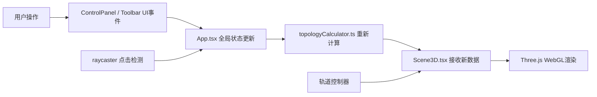

# 产品需求文档：量子拓扑微雕工坊

## 1. 产品概述

量子拓扑微雕工坊是一个基于WebGL的三维拓扑可视化交互应用，从微观物理奇观中获取灵感，让用户在浏览器中实时操控并观察三维空间中粒子轨迹如何遵循拓扑不变的法则缠绕、分离和重联，解决抽象拓扑概念难以直观感受的问题。

- **目标用户**：数学/物理爱好者、学生、研究人员、创意设计师
- **核心价值**：将抽象的拓扑数学概念转化为可交互、可感知的三维视觉奇观

## 2. 核心功能

### 2.1 功能模块清单

1. **3D粒子场景模块**：动态粒子系统渲染、拓扑结路径生成、轨迹光带效果、自动旋转
2. **参数控制面板模块**：粒子数量调节、运动速度调节、拓扑模式切换、折叠/展开交互
3. **视角交互模块**：轨道控制旋转、双指缩放、惯性效果、点击高亮
4. **拓扑信息面板模块**：绕数、交点数、能量值等拓扑参数展示
5. **底部工具栏模块**：编辑模式、播放模式、导出模式切换、PNG截图/JSON导出
6. **导出工具模块**：画布快照捕获、粒子坐标序列化

### 2.2 页面详情

| 页面名称 | 模块名称 | 功能描述 |
|---------|---------|---------|
| 主页面 | 3D粒子场景 | 中央展示3D粒子系统，四个对称环面结，粒子沿路径运动拖出半透明轨迹光带，场景自动缓慢旋转 |
| 主页面 | 右侧参数面板 | 暗色毛玻璃半透明面板，默认可折叠，折叠时显示齿轮图标；包含粒子数量滑块(100-1000)、速度滑块(0.1-3倍)、拓扑模式选择器 |
| 主页面 | 左侧信息面板 | 点击结时浮动显示，展示该结的拓扑参数（绕数、交点数、能量值） |
| 主页面 | 底部工具栏 | 三种模式切换按钮（编辑/播放/导出），模式切换时工具栏背景色平滑过渡；导出模式显示导出选项 |

## 3. 核心流程

### 3.1 主要用户流程

用户打开应用 → 场景初始化（四个环面结自动旋转展示）→ 用户可选择：
- 拖拽旋转视角 / 缩放观察 → 体验拓扑结构空间关系
- 打开右侧面板调整参数 → 粒子系统流畅过渡重排
- 点击某个粒子结 → 高亮显示 + 左侧拓扑信息面板弹出
- 切换底部模式 → 编辑模式可拖拽结位置 / 播放模式带闪烁效果 / 导出模式可截图或导出数据
- 导出画面或数据 → 获得PNG/JSON文件

### 3.2 数据流流程图

## 4. 用户界面设计

### 4.1 设计风格

- **色彩主题**：深色主题，中心紫罗兰→墨蓝星云渐变背景
- **粒子色系**：青蓝(#00D4FF)、品红(#FF2D95)、翠绿(#3DFFA2)、琥珀(#FFB347)
- **材质质感**：暗色毛玻璃(backdrop-filter: blur)面板，霓虹光晕按钮/滑块
- **字体**：等宽风格（JetBrains Mono / Fira Code 类）
- **动效原则**：所有过渡动画200-300ms，参数变更采用弹跳插值，轨迹渐隐再重绘
- **视觉记忆点**：粒子轨迹拖尾的星云光带感、拓扑结缠绕的立体感、霓虹UI的量子科技感

### 4.2 页面设计概览

| 页面名称 | 模块名称 | UI元素设计 |
|---------|---------|-----------|
| 主页面 | 3D场景 | 星云渐变背景，AmbientLight+PointLight四点补光，OrbitControls带阻尼，粒子使用PointsMaterial带Additive混合，轨迹用LineSegments渐变色 |
| 主页面 | 右侧控制面板 | 固定右侧，宽度280px，毛玻璃(rgba(10,10,30,0.55)+blur(16px))，1px边框发光，可折叠至48px窄条显示齿轮⚙图标，滑块轨道带霓虹发光，悬停时强度增加 |
| 主页面 | 左侧信息面板 | 悬浮左侧，宽度260px，点击结时滑入，毛玻璃风格，参数项带彩色前缀标签，数值使用等宽字体高亮 |
| 主页面 | 底部工具栏 | 固定底部，高度64px，三种模式切换按钮(编辑✏/播放▶/导出⬇)，激活态按钮带强霓虹光晕，背景色随模式平滑变化 |

### 4.3 响应式设计

- **桌面端（≥1024px）**：右侧面板280px展开，左侧信息面板悬浮，底部工具栏正常布局
- **Pad端（768px-1024px）**：工具栏变为底部固定栏，按钮图标化，右侧面板折叠态默认，信息面板改为底部弹出
- **触控优化**：双指缩放支持，拖拽区域覆盖全画布，按钮触控目标≥44px

### 4.4 3D场景指引

- **环境氛围**：深邃宇宙星云感，使用径向渐变CanvasTexture作背景，添加微弱星点Sprite层
- **灯光设置**：AmbientLight(0x404060, 0.6)基础光 + 四盏PointLight对应四色系，位置围绕场景
- **相机设置**：PerspectiveCamera，fov=60，初始位置(0,0,8)，OrbitControls.enableDamping=true
- **构图与焦点**：四个拓扑结以原点为中心对称分布在半径2.5的圆周上，场景Y轴自动缓慢旋转(0.15rad/s)
- **粒子渲染**：THREE.Points + BufferGeometry，每个粒子带attribute颜色，sizeAttenuation开启，transparent=true
- **轨迹渲染**：每个结维护一个环形缓冲的LineSegments，顶点颜色随时间渐隐(alpha从1→0)，使用AdditiveBlending
- **后处理**：可选UnrealBloomPass增强霓虹光晕感
- **性能预算**：500粒子≤16ms/帧(60FPS)，1000粒子≤22ms/帧(45FPS)，使用BufferGeometry+TypedArray避免GC

### 4.5 交互动效细节

- **参数变更过渡**：粒子新/旧位置用lerp + easeOutBack插值(300ms)，不直接跳变
- **轨迹重绘**：旧轨迹alpha 300ms内线性降至0，新轨迹从0渐升至1
- **模式切换**：工具栏背景色hue-rotate + background-color过渡(250ms)
- **按钮悬停**：box-shadow光晕半径扩大(150ms)，transform: translateY(-1px)
- **点击高亮**：选中结的粒子size临时放大1.3倍，周边生成半透明发光圈Mesh，信息面板translateX滑入(250ms easeOutCubic)
