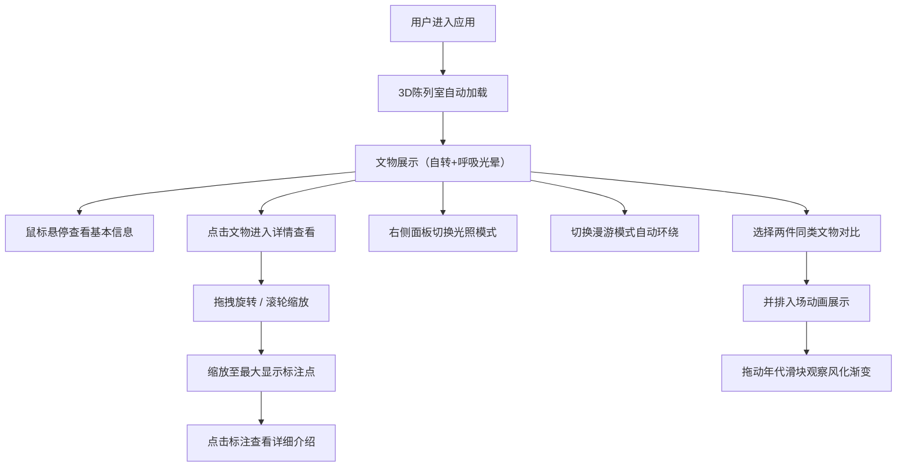

## 1. 产品概述

虚拟文物3D陈列室是一款面向博物馆策展人和教育工作者的Web应用，帮助用户在浏览器中快速搭建、预览和交互探索虚拟历史文物3D陈列室，解决传统实体展览受限于场地与光照、观众难以从任意角度细致观察文物细节、无法对比不同时期文物演变的问题。

- 主要目的：提供沉浸式、交互性强的文物数字化展示体验
- 目标用户：博物馆策展人、历史教育工作者、文物爱好者
- 核心价值：打破时空限制，让文物观察与研究更加便捷深入

## 2. 核心功能

### 2.1 用户角色

| 角色 | 注册方式 | 核心权限 |
|------|----------|----------|
| 策展人/教育工作者 | 无需注册，直接使用 | 浏览文物、交互查看、对比分析、调整光照展示模式 |

### 2.2 功能模块

1. **3D陈列室主场景**：展厅环境、三个虚拟展台、10件古文明文物模型自动加载展示
2. **文物交互查看**：点击文物飞入查看、拖拽旋转、滚轮缩放、标注点详情
3. **年代对比演变**：双文物并排对比、年代刻度滑块、材质动态风化渐变
4. **光照与模式控制**：三种光照预设切换、单人查看/漫游模式切换、漫游暂停/恢复
5. **响应式UI界面**：左侧悬浮菜单、右侧参数面板、移动端底部抽屉

### 2.3 页面详情

| 页面名称 | 模块名称 | 功能描述 |
|----------|----------|----------|
| 主陈列室页面 | 3D展厅环境 | 柔和环境光、轻微雾气、深色灰调背景 |
| 主陈列室页面 | 虚拟展台系统 | 三个展台、半透明基座、呼吸光晕效果 |
| 主陈列室页面 | 文物展示卡片 | 悬停高亮边框、气泡卡片显示名称/年代/材质 |
| 文物详情查看 | 视角飞行过渡 | 缓动曲线平滑飞向文物、放大居中 |
| 文物详情查看 | 多角度观察 | 鼠标拖拽旋转、滚轮缩放、LOD细节保持 |
| 文物详情查看 | 标注点系统 | 最大缩放时显示铭文/修复标注、点击弹出详情 |
| 年代对比模块 | 并排入场动画 | 两件文物水平滑入并排出现在中央 |
| 年代对比模块 | 风化演变滑块 | 拖动滑块动态改变材质模拟从新到旧的风化过程 |
| 参数控制面板 | 光照预设切换 | 日光温润/博物馆射灯/月光冷冽，1秒渐变过渡 |
| 参数控制面板 | 展示模式切换 | 单人查看模式/漫游模式，椭圆路径自动环绕 |
| 侧边导航菜单 | 悬浮按钮组 | 半透明磨砂玻璃质感、折叠/展开、悬停缩放效果 |

## 3. 核心流程

### 3.1 主要用户流程描述

用户打开应用后，3D陈列室自动加载完成，10件文物分布于三个展台上并缓慢自转。用户可以通过鼠标悬停查看文物基本信息，点击文物进入详情观察模式，通过拖拽和缩放查看细节与标注。用户可在右侧面板切换光照模式和展示模式。在漫游模式下，摄像机自动环绕展厅。用户还可以选中两件同类文物进行年代对比，通过滑块观察文物材质的风化演变过程。

### 3.2 核心流程图

## 4. 用户界面设计

### 4.1 设计风格

- **主色调**：深色灰调 `#1a1a2e` 为底色，营造沉浸式博物馆氛围
- **点缀色**：淡金色 `#d4af37` 用于文字、按钮边框与高亮元素，彰显文物尊贵感
- **按钮样式**：圆角矩形按钮，半透明背景，悬停时缩放1.05倍并增强金色边框
- **字体**：衬线字体作为展示文字（如文物名称），无衬线字体作为功能说明文字
- **布局风格**：左右分栏布局，左侧悬浮菜单，右侧参数面板，中央为3D画布
- **视觉特效**：磨砂玻璃（backdrop-filter: blur）、背景虚化、呼吸光晕、平滑过渡动画

### 4.2 页面设计概览

| 页面名称 | 模块名称 | UI元素 |
|----------|----------|--------|
| 主陈列室页面 | 3D画布 | 全幅Canvas、柔和环境光、轻微雾气粒子 |
| 主陈列室页面 | 展台与文物 | 半透明基座、呼吸光效、文物缓慢自转（3°/秒） |
| 主陈列室页面 | 悬停气泡卡片 | 黑色半透明背景、淡金色边框、白色标题文字 |
| 文物详情查看 | 背景层 | 8px模糊虚化效果，突出主体文物 |
| 文物详情查看 | 标注点 | 金色脉动圆点、悬停放大、点击弹出详情面板 |
| 年代对比模块 | 年代刻度线 | 居中水平时间轴、带时期标记、可拖动滑块 |
| 年代对比模块 | 风化程度指示 | 滑块位置实时文字提示（如"西周早期·全新状态"） |
| 参数控制面板 | 光照预设卡片 | 三卡片横向排列、选中态金色边框高亮 |
| 参数控制面板 | 模式切换开关 | 滑动Toggle开关、金色激活态 |
| 参数控制面板 | 漫游控制 | 播放/暂停圆形按钮、进度指示环 |
| 左侧导航菜单 | 折叠按钮 | 圆形悬浮按钮、金色图标、展开动画 |
| 左侧导航菜单 | 功能按钮组 | 分组排列、磨砂玻璃背景、悬停缩放+发光效果 |

### 4.3 响应式设计

- **桌面优先设计**：默认适配 >1200px 宽度，左右分栏布局
- **平板适配（768px - 1200px）**：右侧面板宽度缩减，菜单按钮尺寸调整
- **移动端（<768px）**：
  - 3D画布自适应横竖屏切换
  - 右侧参数面板变为底部滑动抽屉（向上滑动展开）
  - 左侧菜单改为顶部悬浮小尺寸按钮
  - 触摸手势优化：双指缩放、单指旋转
- **过渡动画**：所有布局切换使用600ms easeInOutCubic曲线

### 4.4 3D场景指导

- **环境与氛围**：深色背景配合柔和体积光，轻微指数雾气增加空间纵深感
- **光照设置**：
  - 基础：半球光（天空色深蓝/地面色深灰）+ 环境光
  - 日光模式：方向光模拟天窗自然光，暖色调
  - 射灯模式：多个聚光灯聚焦展台，高对比度
  - 月光模式：冷蓝色方向光，低亮度高氛围
- **摄像机设置**：
  - 默认：PerspectiveCamera，fov 50，位置(0, 5, 12)
  - 漫游：椭圆路径参数方程 x=a*cos(t), z=b*sin(t)，Y轴缓慢上下浮动
  - 查看文物：使用阻尼平滑插值（lerp）过渡位置与目标点
- **构图与焦点**：三角形展台布局，视觉重心偏向画面中心偏下
- **交互与动画**：
  - 文物自转：使用useFrame每帧增加rotation.y
  - 展台呼吸光：正弦函数控制光强度
  - 视角飞行：指数平滑 + 阻尼缓动
- **后处理效果**：轻微Bloom发光、色调映射、抗锯齿（MSAA）
- **性能预算**：
  - 单文物面数 < 50000三角面
  - 使用glTF/GLB压缩格式
  - LOD三级切换，阈值设为距离0.5
  - 中等配置设备稳定30fps以上
