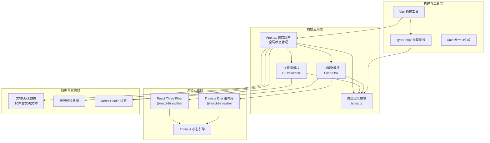
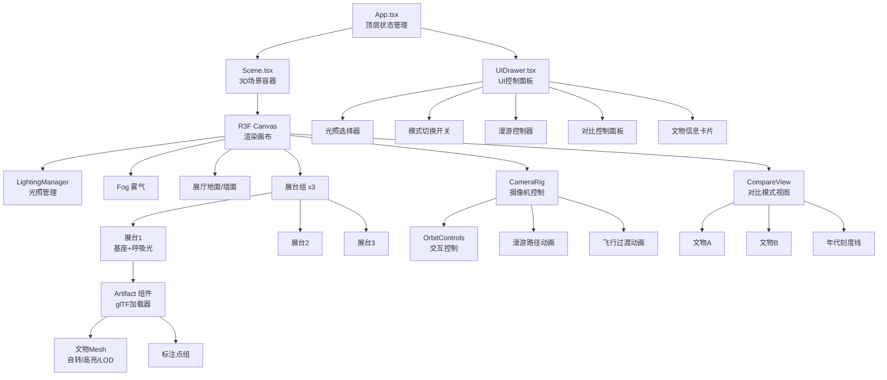

## 1. 架构设计



## 2. 技术说明

- **前端框架**：React@18 + TypeScript@5
- **构建工具**：Vite@5（热更新、快速构建）
- **3D渲染引擎**：Three.js@0.160 + @react-three/fiber@8 + @react-three/drei@9
- **唯一标识**：uuid@9
- **样式方案**：CSS Modules + 内联样式（styled-components风格，避免额外依赖）
- **无后端**：纯前端SPA应用，使用Mock文物数据

## 3. 路由定义

| 路由 | 用途 |
|------|------|
| / | 单页应用入口，包含完整3D陈列室与UI面板 |

本应用为单页面应用，无多路由需求。

## 4. 类型定义（types.ts）

```typescript
// 文物类别枚举
export enum ArtifactCategory {
  BRONZE = 'bronze',      // 青铜器
  POTTERY = 'pottery',    // 陶瓶
  JADE = 'jade',          // 玉器
}

// 光照模式枚举
export enum LightingMode {
  DAYLIGHT = 'daylight',    // 日光温润
  MUSEUM = 'museum',        // 博物馆射灯
  MOONLIGHT = 'moonlight',  // 月光冷冽
}

// 展示模式枚举
export enum DisplayMode {
  SINGLE = 'single',      // 单人查看模式
  ROAMING = 'roaming',    // 漫游模式
}

// 标注点接口
export interface AnnotationPoint {
  id: string;
  position: [number, number, number];
  title: string;
  description: string;
  type: 'inscription' | 'crack' | 'repair' | 'texture';
}

// 文物数据接口
export interface Artifact {
  id: string;
  name: string;
  category: ArtifactCategory;
  era: string;
  year: number;           // 用于年代排序的数值
  material: string;
  description: string;
  modelUrl: string;       // glTF模型URL
  scale: number;          // 模型缩放比例
  position: [number, number, number];  // 展台位置
  pedestalIndex: number;  // 所属展台索引 0-2
  annotations: AnnotationPoint[];
}

// 光照预设配置
export interface LightingPreset {
  mode: LightingMode;
  name: string;
  ambientIntensity: number;
  directionalIntensity: number;
  directionalPosition: [number, number, number];
  directionalColor: string;
  ambientColor: string;
  fogColor: string;
  fogDensity: number;
}

// 展台数据
export interface Pedestal {
  id: number;
  position: [number, number, number];
  artifactIds: string[];
}

// 全局应用状态
export interface AppState {
  selectedArtifactId: string | null;
  selectedForCompare: string[];  // 最多2件
  isCompareMode: boolean;
  lightingMode: LightingMode;
  displayMode: DisplayMode;
  isRoamingPaused: boolean;
  weatheringSlider: number;  // 0-1 风化程度
  hoveredArtifactId: string | null;
  activeAnnotationId: string | null;
}
```

## 5. 组件层次结构图



## 6. 数据模型

### 6.1 Mock 文物数据示例（10件）

```typescript
// 商周青铜器 (4件)
// 古希腊陶瓶 (3件) 
// 玛雅玉器 (3件)
```

### 6.2 文件组织结构

```
auto127/
├── package.json
├── index.html
├── tsconfig.json
├── vite.config.js
└── src/
    ├── main.tsx           # React入口
    ├── App.tsx            # 顶层组件+全局状态
    ├── Scene.tsx          # 3D场景组件
    ├── UIDrawer.tsx       # UI面板组件
    ├── types.ts           # 类型定义
    └── data/              # 文物数据目录
        └── artifacts.ts   # 10件Mock文物数据
```

## 7. 性能优化策略

1. **LOD（细节层次）**：三级LOD切换，距离阈值0.5
2. **模型压缩**：使用Draco压缩的glTF/GLB格式
3. **实例化渲染**：重复几何体使用InstancedMesh
4. **材质复用**：同类文物共享材质实例
5. **帧节流**：useFrame中使用deltaTime，避免过度计算
6. **CSS硬件加速**：UI面板使用transform + will-change
7. **懒加载**：非激活展台文物延迟加载
8. **像素比限制**：maxDpr设为2，防止高分屏性能损耗
