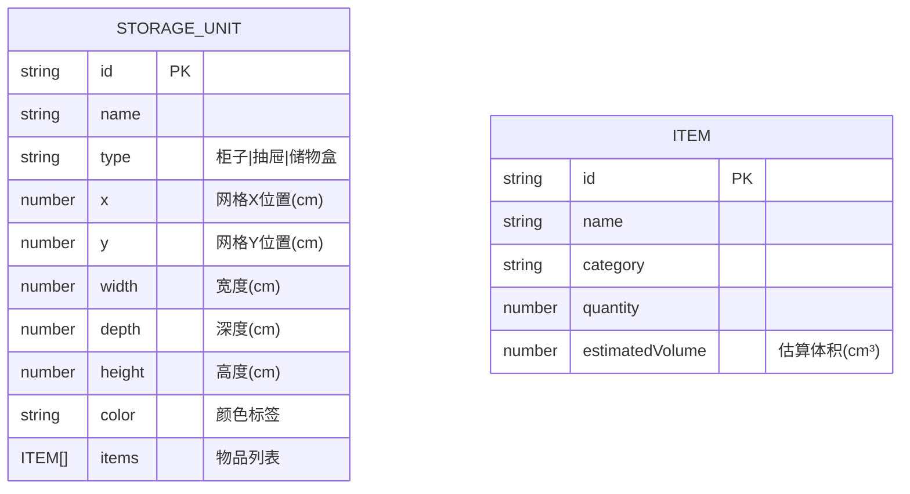

## 1. 架构设计

```mermaid
graph TD
    "浏览器" --> "React 应用层"
    "React 应用层" --> "状态管理层 (Zustand)"
    "状态管理层" --> "本地持久化 (localStorage)"
    "React 应用层" --> "组件层"
    "组件层" --> "App.tsx (主容器/路由)"
    "组件层" --> "StorageEditor.tsx (编辑器)"
    "组件层" --> "ThreeViewer.tsx (3D预览)"
    "组件层" --> "DataPanel.tsx (数据分析)"
    "组件层" --> "D3.js (可视化渲染)"
    "D3.js" --> "SVG 2D画布"
    "D3.js" --> "SVG 3D等轴测投影"
```

## 2. 技术描述
- 前端：React@18 + TypeScript + Vite
- 状态管理：Zustand
- 数据可视化：D3.js
- 图标：lucide-react
- 持久化：localStorage
- 初始化工具：Vite

## 3. 路由定义
| 路由 | 用途 |
|-----|------|
| / (无路由，状态切换) | 编辑视图：储物空间编辑器 |
| / (无路由，状态切换) | 预览视图：3D空间预览 |
| / (无路由，状态切换) | 分析视图：数据分析面板 |

应用使用状态切换代替路由，通过tab切换三个视图。

## 4. 数据模型

### 4.1 数据模型定义



### 4.2 TypeScript 类型定义

```typescript
type StorageType = 'cabinet' | 'drawer' | 'box';

interface Item {
  id: string;
  name: string;
  category: string;
  quantity: number;
  estimatedVolume: number;
}

interface StorageUnit {
  id: string;
  name: string;
  type: StorageType;
  x: number;
  y: number;
  width: number;
  depth: number;
  height: number;
  color: string;
  items: Item[];
}

interface AppState {
  units: StorageUnit[];
  activeTab: 'editor' | 'preview' | 'analysis';
  searchQuery: string;
  highlightedUnitId: string | null;
  addUnit: (unit: Omit<StorageUnit, 'id'>) => void;
  updateUnit: (id: string, updates: Partial<StorageUnit>) => void;
  deleteUnit: (id: string) => void;
  setActiveTab: (tab: 'editor' | 'preview' | 'analysis') => void;
  setSearchQuery: (query: string) => void;
  setHighlightedUnitId: (id: string | null) => void;
  importData: (data: StorageUnit[]) => void;
  exportData: () => StorageUnit[];
}
```

## 5. 项目文件结构

```
auto13/
├── package.json
├── index.html
├── vite.config.js
├── tsconfig.json
└── src/
    ├── App.tsx
    ├── StorageEditor.tsx
    ├── ThreeViewer.tsx
    ├── DataPanel.tsx
    ├── store.ts (Zustand状态管理)
    ├── types.ts (类型定义)
    └── utils.ts (工具函数)
```
