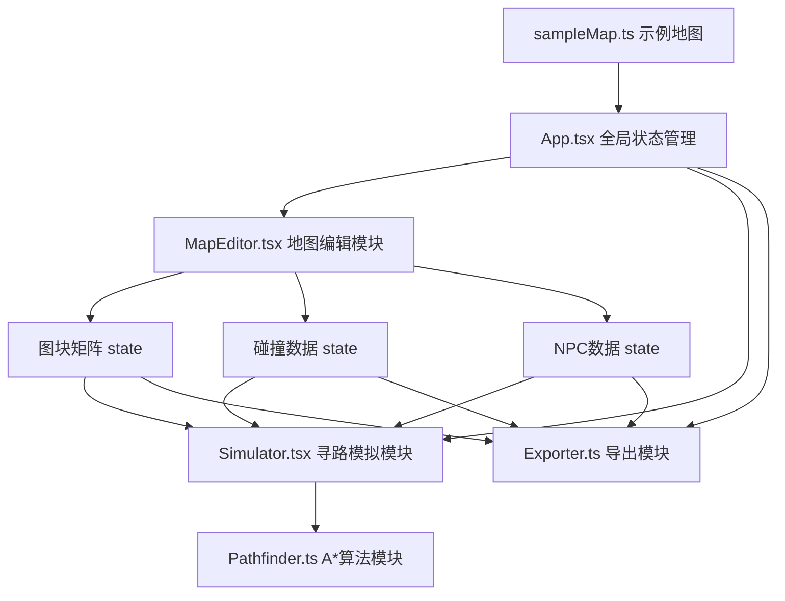

## 1. 架构设计



## 2. 技术描述

- **前端框架**：React 18 + TypeScript 5
- **构建工具**：Vite 5
- **样式方案**：原生CSS + CSS Variables + CSS Modules（避免额外依赖）
- **动画**：CSS Animations/Transitions + requestAnimationFrame
- **状态管理**：React useState + useCallback（局部状态，无需Redux）

## 3. 目录结构

```
d:\P\tasks\auto130\
├── package.json
├── index.html
├── tsconfig.json
├── vite.config.js
└── src\
    ├── App.tsx                    # 主应用组件，全局状态管理
    ├── index.css                  # 全局样式、CSS变量、主题定义
    ├── modules\
    │   ├── MapEditor.tsx          # 地图编辑模块
    │   ├── Pathfinder.ts          # A*寻路算法模块
    │   ├── Simulator.tsx          # 寻路模拟与交互模块
    │   └── Exporter.ts            # JSON导出模块
    └── data\
        └── sampleMap.ts           # 示例地图数据
```

## 4. 核心数据结构定义

### 4.1 图块类型

```typescript
type TileCategory = 'ground' | 'wall' | 'decoration' | 'npc';

interface TileDef {
  id: string;
  name: string;
  category: TileCategory;
  emoji: string;
  color: string;
  walkable: boolean;
}
```

### 4.2 地图数据

```typescript
interface PlacedTile {
  tileId: string;
  x: number;
  y: number;
}

interface CollisionRect {
  x: number;
  y: number;
  width: number;
  height: number;
}

interface NPCData {
  id: string;
  x: number;
  y: number;
  direction: 'up' | 'down' | 'left' | 'right';
  dialog: string;
}

interface MapData {
  tiles: PlacedTile[];
  collisions: CollisionRect[];
  npcs: NPCData[];
  gridWidth: number;
  gridHeight: number;
  cellSize: number;
}
```

### 4.3 全局状态

```typescript
interface AppState {
  tiles: PlacedTile[];
  collisions: CollisionRect[];
  npcs: NPCData[];
  selectedTile: TileDef | null;
  selectedObject: { type: 'tile' | 'npc'; x: number; y: number } | null;
  isPlaying: boolean;
  playerPos: { x: number; y: number };
  playerDirection: 'up' | 'down' | 'left' | 'right';
  activeDialog: { npcId: string; text: string } | null;
}
```

## 5. 模块接口定义

### 5.1 MapEditor 模块

```typescript
interface MapEditorProps {
  tiles: PlacedTile[];
  collisions: CollisionRect[];
  npcs: NPCData[];
  selectedObject: { type: 'tile' | 'npc'; x: number; y: number } | null;
  isPlaying: boolean;
  onTilePlace: (tile: PlacedTile) => void;
  onTilesBulkPlace: (tiles: PlacedTile[]) => void;
  onTileRemove: (x: number, y: number) => void;
  onCollisionAdd: (rect: CollisionRect) => void;
  onNpcAdd: (npc: NPCData) => void;
  onNpcUpdate: (id: string, updates: Partial<NPCData>) => void;
  onSelectObject: (obj: { type: 'tile' | 'npc'; x: number; y: number } | null) => void;
  onCanvasClick: (gridX: number, gridY: number) => void;
}
```

### 5.2 Pathfinder 模块

```typescript
interface PathPoint {
  x: number;
  y: number;
}

function findPath(
  grid: boolean[][],           // walkable grid
  start: PathPoint,
  end: PathPoint
): PathPoint[];
```

### 5.3 Simulator 模块

```typescript
interface SimulatorProps {
  tiles: PlacedTile[];
  collisions: CollisionRect[];
  npcs: NPCData[];
  isPlaying: boolean;
  playerPos: { x: number; y: number };
  activeDialog: { npcId: string; text: string } | null;
  blockedCells: Set<string>;
  onPlayerMove: (pos: { x: number; y: number }) => void;
  onPlayerDirectionChange: (dir: 'up' | 'down' | 'left' | 'right') => void;
  onDialogShow: (dialog: { npcId: string; text: string } | null) => void;
}
```

### 5.4 Exporter 模块

```typescript
function exportToJSON(
  tiles: PlacedTile[],
  collisions: CollisionRect[],
  npcs: NPCData[],
  gridWidth: number,
  gridHeight: number
): string;

function triggerDownload(json: string, filename: string): void;
```
