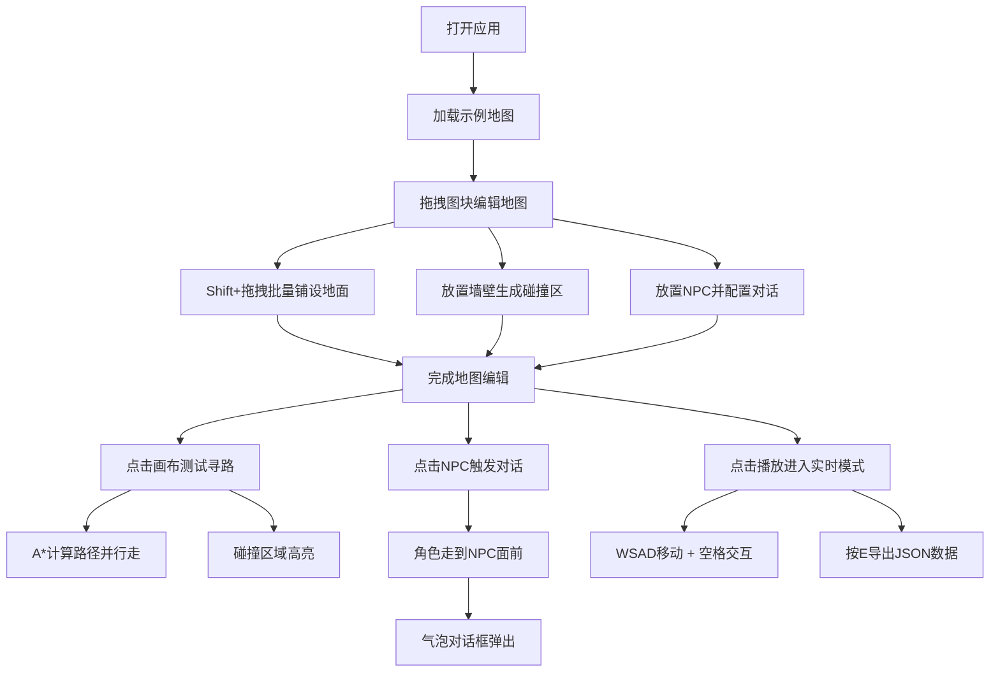

## 1. 产品概述

RPG地图工坊是一款面向独立游戏开发者的2D俯视角RPG地图编辑与模拟工具，解决手动搭建地图、编写寻路逻辑效率低、无法直观调试碰撞点与NPC对话触发区域的痛点。

- 目标用户：独立游戏开发者、像素游戏爱好者、游戏原型设计者
- 核心价值：可视化地图搭建 + 实时寻路模拟 + 一键数据导出，大幅提升RPG游戏原型开发效率

## 2. 核心功能

### 2.1 用户角色

| 角色 | 注册方式 | 核心权限 |
|------|----------|----------|
| 开发者 | 无需注册，本地使用 | 全部功能：地图编辑、寻路模拟、数据导出 |

### 2.2 功能模块

1. **地图编辑模块**：网格画布、素材面板、拖拽放置、区域绘制、碰撞可视化、NPC出生点配置
2. **寻路与交互模拟模块**：A*寻路计算、角色行走动画、碰撞高亮、NPC对话气泡
3. **验证与导出模块**：实时玩家控制模式、视差阴影效果、JSON地图数据导出

### 2.3 页面详情

| 页面名称 | 模块名称 | 功能描述 |
|----------|----------|----------|
| 主工作台 | 左侧素材面板 | 按类别展示图块（地面/墙壁/装饰/NPC），悬停滑出，支持拖拽 |
| 主工作台 | 中央网格画布 | 20x15网格，支持图块放置、区域绘制、碰撞显示、NPC编辑 |
| 主工作台 | 右侧属性面板 | 选中对象的详细信息编辑，响应式折叠 |
| 主工作台 | 顶部工具栏 | 播放/暂停控制、导出按钮、状态指示 |

## 3. 核心流程

开发者从左侧素材面板拖拽图块到中央画布铺设地图 → 配置墙壁碰撞区域与NPC出生点及对话 → 点击画布测试A*寻路与NPC交互 → 切换到实时控制模式验证游戏体验 → 按E键导出JSON地图数据供游戏引擎使用。

## 4. 用户界面设计

### 4.1 设计风格

- **主色调**：深色背景 `#1a1a2e`，面板 `#16213e`，强调色 `#e94560`（交互/碰撞），辅助色 `#0f3460`（选中/高亮）
- **网格线**：浅灰色虚线 `#555`
- **按钮样式**：圆角胶囊按钮，悬停缩放1.05倍，点击凹陷效果
- **字体**：标题使用 Cinzel（复古游戏感衬线体），正文使用 JetBrains Mono（等宽代码字体）
- **布局风格**：三栏式工具布局（左素材-中画布-右属性），顶部浮动工具栏
- **图标风格**：像素风emoji图标，与游戏主题呼应

### 4.2 页面设计概述

| 页面名称 | 模块名称 | UI元素 |
|----------|----------|--------|
| 主工作台 | 左侧素材面板 | 悬停滑出动画(300ms缓动)，分类Tab，图块卡片(hover放大+发光)，拖拽时60%透明度+轻微旋转 |
| 主工作台 | 中央网格画布 | 20x15虚线网格，图块弹性放置动画(缩小→放大)，红色半透明碰撞矩形，角色精灵(4方向行走帧)，NPC头顶对话标识 |
| 主工作台 | 右侧属性面板 | 固定宽度，选中对象卡片式展示，表单式编辑，响应式折叠为按钮(≤1280px) |
| 主工作台 | 顶部工具栏 | 半透明毛玻璃效果，胶囊式播放/暂停按钮，导出按钮，状态指示灯 |
| 主工作台 | 对话气泡 | 底部向上弹出动画，圆角边框，打字机文字效果，阴影层次 |

### 4.3 响应式

桌面优先设计，1280px以下宽度时右侧属性面板自动折叠为图标按钮，点击展开浮层；素材面板始终可通过悬停滑出；画布区域自适应可用空间。

### 4.4 动效设计

- 图块落地：`scale(0.5) → scale(1.1) → scale(1)` 弹性缓动，200ms
- 角色行走：每步 `translateY(±2px)` 上下颠簸，100ms周期
- 对话气泡：`translateY(20px) opacity(0) → translateY(0) opacity(1)`，300ms ease-out
- 面板滑出：`translateX(-80%) → translateX(0)`，300ms cubic-bezier(0.4, 0, 0.2, 1)
- 拖拽反馈：旋转 `±3deg`，opacity 0.6，跟随光标
