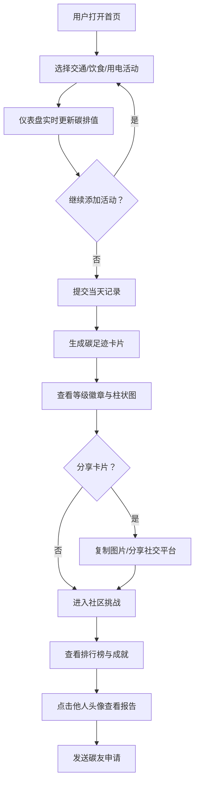

## 1. 产品概述

碳足迹实验室是一款面向个人和小团队的碳排追踪与减碳激励平台，帮助用户量化日常碳排放（交通、饮食、用电），生成可视化碳足迹报告，并通过社区挑战实现减碳互比和经验分享，解决"知道要低碳但不知道碳排了多少、怎么减最有效"的痛点。

## 2. 核心功能

### 2.1 用户角色
| 角色 | 注册方式 | 核心权限 |
|------|----------|----------|
| 普通用户 | 自动分配ID | 记录碳排、查看报告、参与挑战、查看排行榜 |
| 碳友 | 互相申请 | 查看对方公开碳足迹报告 |

### 2.2 功能模块
1. **首页（碳足迹速算器）**：渐变背景、活动选择器、实时累积仪表盘
2. **每日碳足迹卡片页**：等级徽章、柱状图、分享功能
3. **社区挑战模块**：排行榜、成就徽章、碳友互动

### 2.3 页面详情
| 页面名称 | 模块名称 | 功能描述 |
|----------|----------|----------|
| 首页 | 碳足迹速算器 | 圆角矩形卡片，三类别（交通/饮食/用电）活动选择，点击添加活动 |
| 首页 | 碳排累积仪表盘 | 半圆环进度条，环形填充动画，中央数字跳字增长，绿→橙红颜色渐变 |
| 首页 | 提交按钮 | 提交一天记录，触发碳足迹卡片生成 |
| 碳足迹卡片页 | 碳等级徽章 | 左上角显示低碳绿叶/中等黄叶/高碳红叶徽章 |
| 碳足迹卡片页 | 类别柱状图 | 底部缩小版柱状图按交通/饮食/用电显示碳排比例 |
| 碳足迹卡片页 | 分享功能 | 长按复制为图片或分享到社交平台，自动附带AI低碳小建议 |
| 社区挑战页 | 排行榜 | 按一周减碳总量排序，每5秒自动刷新，排名变化跳动动画 |
| 社区挑战页 | 成就徽章 | 连续7天低碳"绿色先锋"，参与5次挑战"挑战达人" |
| 社区挑战页 | 碳友互动 | 点击头像查看公开报告，发送碳友申请 |

## 3. 核心流程

用户打开首页 → 从三类别选择日常活动 → 仪表盘实时更新碳排累积值 → 提交记录 → 生成每日碳足迹卡片（含等级徽章和柱状图）→ 可分享卡片到社交平台 → 进入社区挑战查看排行榜 → 与其他碳友互动互比

## 4. 用户界面设计

### 4.1 设计风格
- 主色调：浅绿(#a8e6cf)到深绿(#1b5e20)竖向渐变，碳排高时渐变至橙红(#ff6b35)
- 按钮：圆角矩形，柔和阴影，hover时微弹动
- 字体：Google Fonts Nunito（圆润友好风格），标题700/36px，正文400/16px，数字700/48px
- 布局：居中卡片式布局，最大宽度480px移动端友好
- 图标/徽章：叶脉风格徽章，简洁线条图标

### 4.2 页面设计概览
| 页面名称 | 模块名称 | UI元素 |
|----------|----------|--------|
| 首页 | 渐变背景 | 浅绿→深绿竖向渐变，全覆盖 |
| 首页 | 速算器卡片 | 圆角矩形(24px)，白色半透明玻璃拟态，居中 |
| 首页 | 类别选择器 | 三列图标+文字按钮，点击选中高亮+弹跳动画 |
| 首页 | 仪表盘 | SVG半圆环，弧形填充动画0.6s ease-out，中央数字countUp动画 |
| 碳足迹卡片页 | 卡片主体 | 渐变背景卡片，圆角20px，阴影0 8px 32px |
| 碳足迹卡片页 | 等级徽章 | 左上角绝对定位，叶脉图标+等级文字 |
| 碳足迹卡片页 | 柱状图 | 三根竖柱(交通/饮食/用电)，渐变填充色 |
| 社区挑战页 | 排行榜 | 列表式，头像+昵称+减碳值+徽章，排名变化时translateY跳动动画 |
| 社区挑战页 | 成就徽章 | 圆形小图标，金色边框，悬停显示说明 |

### 4.3 响应式
- 桌面优先，最大内容宽度480px居中
- 移动端自适应全宽，触摸优化（长按触发分享菜单）
- 平板端适当放大间距和字号

### 4.4 3D场景指导
- 不适用
