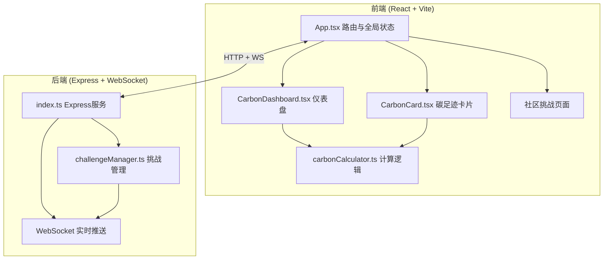
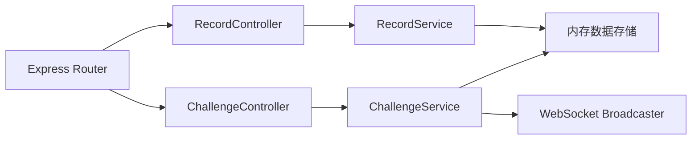
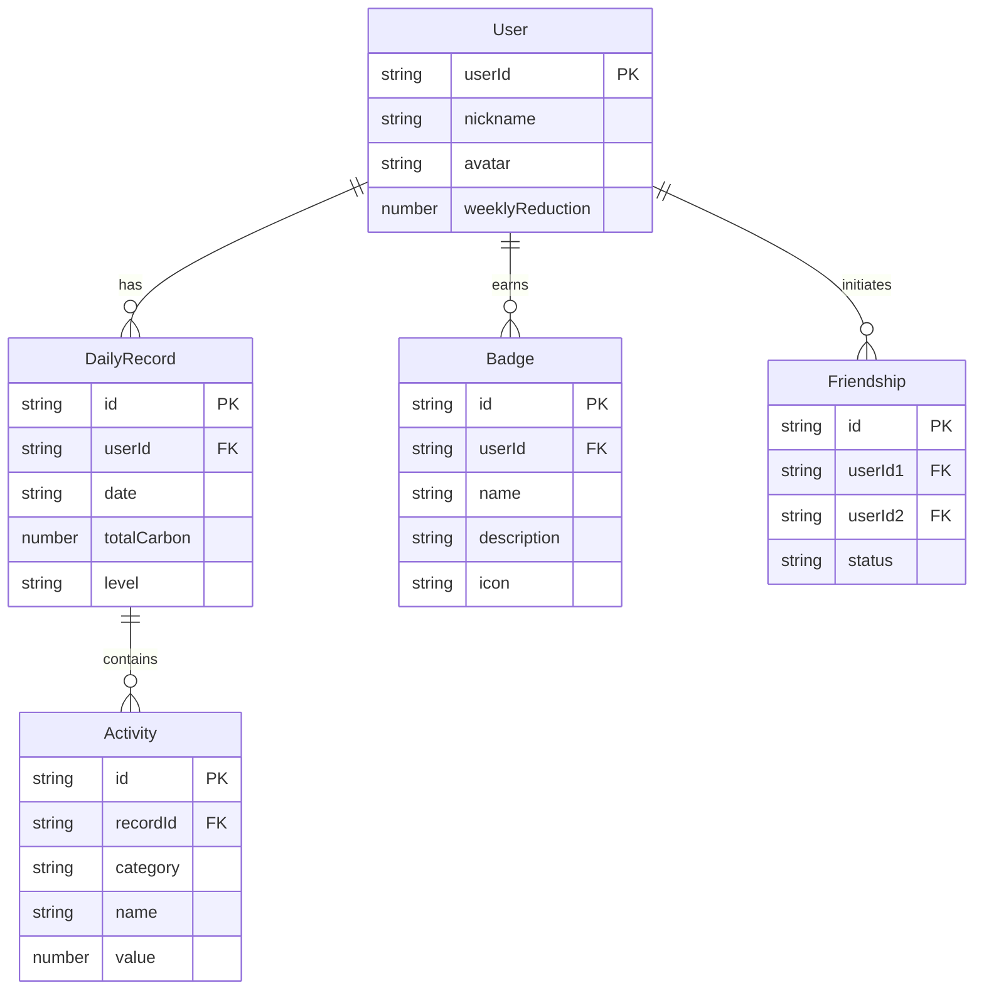

## 1. 架构设计



## 2. 技术说明
- 前端：React@18 + TypeScript + Vite + TailwindCSS
- 初始化工具：vite-init (react-express-ts模板)
- 后端：Express + WebSocket (ws)
- 数据库：内存存储（mock数据），无需外部数据库
- 状态管理：zustand
- 图标：lucide-react
- 动画：CSS transitions + requestAnimationFrame（数字跳字）
- 庆祝效果：canvas-confetti

## 3. 路由定义
| 路由 | 用途 |
|------|------|
| / | 首页 - 碳足迹速算器与仪表盘 |
| /card | 每日碳足迹卡片页 |
| /community | 社区挑战与排行榜 |

## 4. API定义

### 4.1 REST API
```typescript
interface Activity {
  id: string;
  category: 'transport' | 'food' | 'electricity';
  name: string;
  value: number;
}

interface DailyRecord {
  userId: string;
  date: string;
  activities: Activity[];
  totalCarbon: number;
  level: 'low' | 'medium' | 'high';
}

interface UserProfile {
  userId: string;
  nickname: string;
  avatar: string;
  weeklyReduction: number;
  badges: Badge[];
  carbonFriends: string[];
}

interface Badge {
  id: string;
  name: string;
  description: string;
  icon: string;
}

interface LeaderboardEntry {
  userId: string;
  nickname: string;
  avatar: string;
  weeklyReduction: number;
  badges: Badge[];
  rank: number;
}

// POST /api/records - 提交每日记录
// Request: DailyRecord
// Response: { success: boolean, record: DailyRecord, advice: string }

// GET /api/records/:userId - 获取用户记录
// Response: DailyRecord[]

// GET /api/leaderboard - 获取排行榜
// Response: LeaderboardEntry[]

// POST /api/friends/request - 发送碳友申请
// Request: { fromUserId: string, toUserId: string }
// Response: { success: boolean }
```

### 4.2 WebSocket事件
```typescript
// 客户端 → 服务端
interface WSMessage {
  type: 'subscribe_leaderboard' | 'submit_record' | 'friend_request';
  payload: any;
}

// 服务端 → 客户端
interface WSBroadcast {
  type: 'leaderboard_update' | 'rank_change';
  payload: LeaderboardEntry[];
}
```

## 5. 服务端架构图



## 6. 数据模型

### 6.1 数据模型定义



### 6.2 数据定义语言
使用内存Map存储，无需DDL。初始mock数据包含5个示例用户及对应记录。
