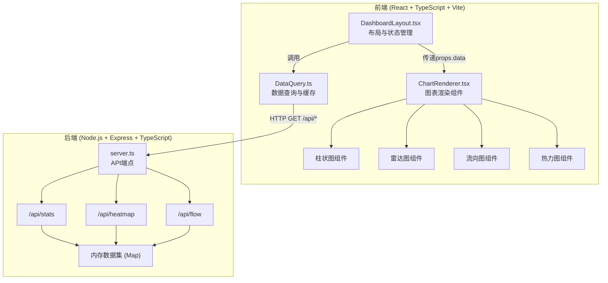
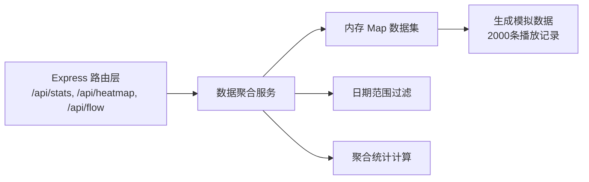

## 1. 架构设计



## 2. 技术描述
- 前端：React 18 + TypeScript 5 + Vite 5 + Recharts 2
- 后端：Express 4 + TypeScript 5 + Node.js
- 数据：内存模拟数据集（随机生成2000条历史播放记录）
- 构建工具：Vite 前端构建 + ts-node 后端运行 + concurrently 同时启动
- 状态管理：React useState/useEffect（无额外状态库）
- 样式：内联样式 + CSS动画（无需额外CSS框架）

## 3. 路由定义
| 路由 | 用途 |
|-------|---------|
| / | 仪表盘主页 |
| /api/stats | 获取统计数据（播放量、受众画像） |
| /api/heatmap | 获取热力地图数据 |
| /api/flow | 获取作品跳转流向数据 |

## 4. API 定义

```typescript
// 日期范围过滤参数
interface DateRange {
  startDate: string; // ISO date string
  endDate: string;   // ISO date string
}

// 每日播放量
interface DailyPlay {
  date: string;
  plays: number;
  topTracks: { name: string; plays: number }[];
}

// 受众年龄分布
interface AudienceAge {
  "18-24": number;
  "25-34": number;
  "35-44": number;
  "45+": number;
  unknown: number;
}

// /api/stats 响应
interface StatsResponse {
  dailyPlays: DailyPlay[];
  audienceAge: AudienceAge;
}

// 热力图单元格
interface HeatmapCell {
  x: number;
  y: number;
  region: string;
  plays: number;
}

// /api/heatmap 响应
interface HeatmapResponse {
  cells: HeatmapCell[];
}

// 作品节点
interface TrackNode {
  id: string;
  name: string;
  plays: number;
}

// 作品跳转连线
interface TrackFlow {
  source: string;
  target: string;
  percentage: number;
}

// /api/flow 响应
interface FlowResponse {
  nodes: TrackNode[];
  flows: TrackFlow[];
}
```

## 5. 服务器架构



## 6. 文件结构与职责

```
auto133/
├── package.json                 # 项目依赖与脚本
├── index.html                   # Vite 入口 HTML
├── tsconfig.json                # TypeScript 配置（前后端路径映射）
├── vite.config.js               # Vite 构建配置（/api 代理）
└── src/
    ├── server.ts                # Express 后端服务
    ├── main.tsx                 # React 入口
    ├── App.tsx                  # 根组件
    └── modules/
        ├── DataQuery.ts         # 前端数据查询模块（axios请求+缓存）
        ├── ChartRenderer.tsx    # 图表渲染模块（4种图表）
        └── DashboardLayout.tsx  # 仪表盘布局模块（过滤器+网格）
```

### 模块调用关系与数据流向

1. **DashboardLayout.tsx**
   - 维护 `filterState` (dateRange)
   - 调用 `DataQuery` 模块获取数据
   - 将数据通过 props 传递给 `ChartRenderer` 子组件
   - 数据流向：filterState → DataQuery.getStats() → Promise → props.data → ChartRenderer

2. **DataQuery.ts**
   - 被 DashboardLayout 调用
   - 内部使用 axios 向后端 /api/* 发起 GET 请求
   - 缓存最近 10 次结果（LRU策略）
   - 数据流向：组件调用 → axios GET /api/stats?startDate=&endDate= → 缓存检查 → 返回 Promise<StatsResponse>

3. **ChartRenderer.tsx**
   - 接收 props.data 从 DashboardLayout
   - 使用 Recharts 渲染柱状图、雷达图
   - 使用 Canvas 渲染热力地图、力导向流向图
   - 数据流向：props.data → 图表组件 → SVG/Canvas 渲染

4. **server.ts**
   - 接收前端 HTTP 请求
   - 从内存 Map 查询模拟数据集
   - 按日期范围过滤并聚合
   - 返回 JSON 响应
   - 数据流向：请求 → 查询内部 Map → 过滤聚合 → JSON Response
