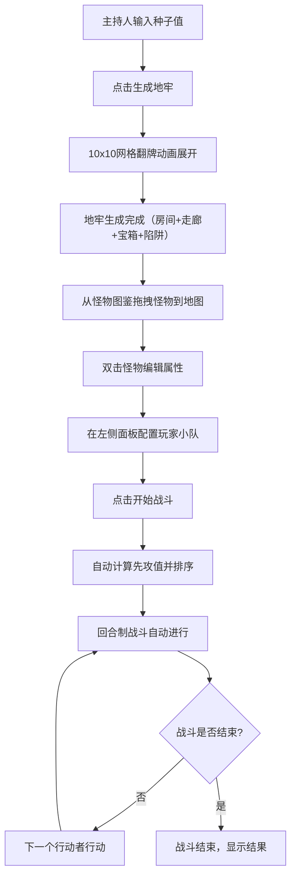

## 1. 产品概述

桌面角色扮演游戏（D&D/COC风格）主持人辅助工具，帮助主持人快速生成随机地牢、放置怪物并模拟回合制战斗，解决手动绘制地图和平衡战斗数据耗时的问题。

- 目标用户：TRPG主持人（DM/KP），需要快速准备地牢场景和战斗模拟
- 核心价值：将传统跑团中耗时的地图绘制与战斗平衡工作自动化，提供直观的视觉预览和交互式操作

## 2. 核心功能

### 2.1 功能模块

1. **地牢生成页面**：种子输入、一键生成10x10网格地图、翻牌动画展示、房间/走廊/宝箱/陷阱自动布局
2. **怪物放置页面**：怪物图鉴面板（按挑战等级折叠）、拖拽放置、属性编辑弹窗、扫描圆环特效
3. **战斗模拟页面**：玩家小队配置、先攻排序行动条、自动/手动回合制战斗、攻击日志与特效

### 2.2 页面详情

| 页面名称 | 模块名称 | 功能描述 |
|---------|---------|---------|
| 地牢生成 | 种子输入区 | 输入任意字符串种子，支持复现同一张地图，右下角显示当前种子哈希值 |
| 地牢生成 | 生成按钮 | 点击后10x10网格以逐格翻牌动画展开（每格从中心扇形翻开） |
| 地牢生成 | 地牢地图 | 自动生成走廊、房间（矩形区域，深灰石纹墙壁）、宝箱（金色闪烁标记）、陷阱（暗红色骷髅标记），所有房间通过走廊连接 |
| 怪物放置 | 怪物图鉴面板 | 右侧面板，按挑战等级CH折叠列出，每个怪物卡片显示缩略剪影和名称，悬停翻转显示HP、攻击力 |
| 怪物放置 | 拖拽放置 | 从图鉴拖拽怪物到地图格子，放置时弹性下坠动画+扫描圆环特效 |
| 怪物放置 | 属性编辑 | 双击已放置怪物唤出毛玻璃效果弹窗，编辑HP、AC和攻击骰 |
| 怪物放置 | 血条显示 | 已放置怪物显示红色HP进度条 |
| 战斗模拟 | 玩家配置面板 | 左侧面板，添加至多6名PC角色（名字、职业、HP、AC、攻击骰） |
| 战斗模拟 | 行动顺序条 | 顶部按先攻值排序，当前行动者高亮+脉冲边框 |
| 战斗模拟 | 战斗地图 | 中央地图怪物和PC格子交替闪烁表示行动中 |
| 战斗模拟 | 战斗日志 | 下方滚动日志面板，逐条输出攻击结果，新条目淡入动画 |
| 战斗模拟 | 战斗特效 | 攻击时屏幕震动+命中粒子爆闪 |
| 战斗模拟 | 战斗控制 | 自动进行（每回合1.5秒间隔），支持暂停和单步前进 |

## 3. 核心流程

模式切换流程：

## 4. 用户界面设计

### 4.1 设计风格

- **主色调**：深灰羊皮纸纹理背景，暗金色细线网格
- **辅助色**：房间地面浅灰与米黄交替马赛克，宝箱金色闪烁，陷阱暗红骷髅
- **按钮风格**：做旧边框，按下凹陷动画，轻微音效反馈（CSS实现）
- **字体**：标题使用中世纪奇幻风格衬线字体，正文使用高可读性无衬线字体
- **布局**：中央地图区域+左右侧边面板，三栏布局
- **卡片风格**：做旧边框+轻微阴影，半透明悬浮，悬停时玻璃磨砂效果

### 4.2 页面设计概览

| 页面名称 | 模块名称 | UI元素 |
|---------|---------|--------|
| 地牢生成 | 种子输入区 | 居中输入框，做旧边框，金色装饰线条 |
| 地牢生成 | 地牢地图 | 10x10暗金色网格，翻牌动画，深灰石纹墙壁，米黄马赛克地面 |
| 地牢生成 | 种子哈希 | 右下角半透明显示，等宽字体 |
| 怪物放置 | 怪物图鉴面板 | 右侧半透明悬浮面板，按CH折叠分组，怪物卡片悬停翻转 |
| 怪物放置 | 编辑弹窗 | 毛玻璃背景，居中弹窗，输入字段带装饰边框 |
| 战斗模拟 | 行动顺序条 | 顶部横向条，当前行动者脉冲金色边框 |
| 战斗模拟 | 战斗日志 | 底部半透明面板，滚动列表，条目淡入 |
| 战斗模拟 | 控制按钮 | 暂停/继续/单步前进按钮，凹陷动画 |

### 4.3 响应式设计

- 桌面优先设计（>900px）：三栏布局，左右侧面板半透明悬浮
- 窄屏适配（<900px）：侧边面板折叠为底部横向滚动条，地图自动缩放适配视口
- 交互优化：拖拽在触屏设备上使用长按拖拽方式

### 4.4 动效设计

- 模式切换：旋转立方体过渡效果
- 地牢生成：逐格扇形翻牌动画
- 怪物放置：弹性下坠+扫描圆环特效
- 攻击命中：屏幕震动+粒子爆闪
- 面板交互：半透明→不透明+玻璃磨砂过渡
- 性能目标：动画帧率≥50fps，地牢生成计算≤0.5秒
