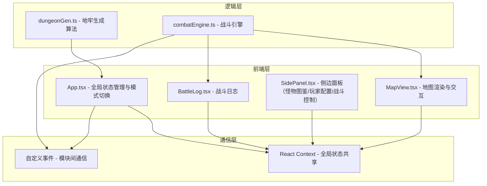

## 1. 架构设计



## 2. 技术说明

- **前端**：React@18 + TypeScript + Vite + Tailwind CSS
- **初始化工具**：vite-init (react-ts模板)
- **后端**：无（纯前端应用）
- **数据库**：无（所有数据存储在内存中）
- **状态管理**：React Context + 自定义事件
- **动画**：CSS Animations + Framer Motion
- **图标**：lucide-react

## 3. 路由定义

本应用为单页面应用，无路由切换，通过状态管理控制三个模式视图的切换：
- 地牢生成模式
- 怪物放置模式
- 战斗模拟模式

## 4. 数据模型

### 4.1 核心类型定义

```typescript
interface DungeonCell {
  type: 'wall' | 'floor' | 'corridor' | 'chest' | 'trap' | 'room_entrance';
  roomId: number | null;
  revealed: boolean;
}

interface DungeonRoom {
  id: number;
  x: number;
  y: number;
  width: number;
  height: number;
}

interface DungeonData {
  grid: DungeonCell[][];
  rooms: DungeonRoom[];
  seed: string;
  seedHash: string;
}

interface Monster {
  id: string;
  name: string;
  challengeRating: number;
  hp: number;
  maxHp: number;
  ac: number;
  attackDice: string;
  initiative: number;
  icon: string;
  gridX: number;
  gridY: number;
}

interface PlayerCharacter {
  id: string;
  name: string;
  class: string;
  hp: number;
  maxHp: number;
  ac: number;
  attackDice: string;
  initiative: number;
  gridX: number;
  gridY: number;
}

interface CombatAction {
  round: number;
  actorId: string;
  actorName: string;
  actorType: 'player' | 'monster';
  targetId: string;
  targetName: string;
  hit: boolean;
  damage: number;
  targetRemainingHp: number;
}
```

### 4.2 模块职责

| 模块文件 | 导出 | 职责 |
|---------|------|------|
| `src/dungeonGen.ts` | `generateDungeon(seed, settings)` | 接收种子和设置参数，返回网格数据和房间列表，保证所有房间通过走廊连接 |
| `src/combatEngine.ts` | `CombatEngine` 类 | 管理回合顺序、先攻计算、攻防判定、伤害计算，通过事件发送行动结果 |
| `src/App.tsx` | `App` 组件 | 管理三个模式视图切换、全局状态（地牢数据、怪物列表、PC列表、战斗状态） |
| `src/components/MapView.tsx` | `MapView` 组件 | 绘制网格/房间/陷阱/宝箱/怪物/PC图标，处理拖拽放置和点击事件 |
| `src/components/SidePanel.tsx` | `SidePanel` 组件 | 怪物图鉴（按CH折叠）、玩家角色配置、战斗控制按钮 |
| `src/components/BattleLog.tsx` | `BattleLog` 组件 | 接收combatEngine日志，滚动列表展示，新条目淡入动画 |

## 5. 文件结构

```
project/
├── package.json
├── index.html
├── tsconfig.json
├── vite.config.js
├── src/
│   ├── App.tsx
│   ├── App.css
│   ├── dungeonGen.ts
│   ├── combatEngine.ts
│   ├── types.ts
│   ├── main.tsx
│   ├── index.css
│   └── components/
│       ├── MapView.tsx
│       ├── SidePanel.tsx
│       └── BattleLog.tsx
```
