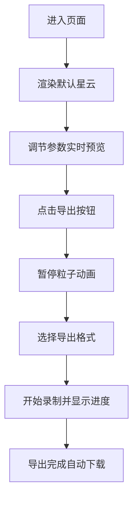

## 1. 产品概述
交互式3D星云粒子系统生成与播放器，用户可在浏览器中实时调节参数生成动态星云粒子效果，并支持导出为视频或GIF。
- 面向创意设计师、视觉艺术家和普通用户，提供沉浸式的粒子艺术创作体验
- 无需专业3D软件，浏览器即可完成创作、预览与导出全流程

## 2. 核心功能

### 2.1 功能模块
1. **3D星云粒子系统**：高性能粒子渲染、动态运动、颜色渐变、拖尾光晕
2. **参数控制面板**：粒子数量、调色盘、旋转速度、扩散半径、粒子大小、拖尾长度
3. **导出系统**：MP4视频/GIF格式导出、进度显示、自动下载
4. **视角交互**：鼠标拖拽旋转、滚轮缩放、惯性平滑
5. **键盘快捷键**：播放/暂停、重置视角、展开/收起面板、导出

### 2.2 页面详情
| 页面名称 | 模块名称 | 功能描述 |
|-----------|-------------|---------------------|
| 主页面 | 3D场景渲染 | 全屏动态星云粒子展示，支持视角交互 |
| 主页面 | 控制面板 | 右侧浮动毛玻璃面板，可展开/收起，参数滑块调节 |
| 主页面 | 导出对话框 | 选择导出格式、进度条展示、自动下载 |
| 主页面 | 快捷键提示 | 左下角半透明提示框，5秒后淡出 |

## 3. 核心流程

用户进入页面 → 自动展示默认星云效果 → 调节参数实时预览 → 点击导出按钮 → 暂停动画 → 选择MP4/GIF → 录制并展示进度 → 导出完成自动下载

## 4. 用户界面设计

### 4.1 设计风格
- **主色调**：深紫(#1a0a2e)→墨蓝(#0a1628)径向渐变背景，霓虹色系粒子（靛蓝、紫红、金橙、青绿）
- **按钮风格**：圆角胶囊按钮，悬停放大1.05倍，点击下沉 translateY(2px)，发光边框
- **字体**：显示字体使用Orbitron（科幻风格），正文使用Roboto
- **布局风格**：全屏沉浸式3D场景，右侧浮动控制面板带光晕边框
- **动效风格**：0.4秒cubic-bezier缓动动画，粒子运动平滑自然

### 4.2 页面设计概述
| 页面名称 | 模块名称 | UI元素 |
|-----------|-------------|-------------|
| 主页面 | 3D场景 | 全屏Canvas，径向渐变背景，光晕粒子点云 |
| 主页面 | 控制面板 | 毛玻璃(backdrop-filter: blur(20px))，暗色半透明背景，霓虹边框光晕，滑块自定义样式 |
| 主页面 | 导出对话框 | 居中模态框，毛玻璃背景，进度条平滑填充动画 |
| 主页面 | 快捷键提示 | 左下角定位，rgba(255,255,255,0.1)背景，5秒淡出 |

### 4.3 响应式
桌面端优先设计，控制面板默认展开宽度320px，收起宽度48px。支持最小窗口宽度1024px。

### 4.4 3D场景指引
- **环境**：纯深色径向渐变背景，无HDRI
- **光照**：粒子自发光材质，无额外光源
- **相机**：PerspectiveCamera，fov 75，初始距离5，最小距离0.5，最大距离5
- **交互**：OrbitControls带阻尼惯性，enableDamping=true，dampingFactor=0.05
- **后处理**：可考虑添加Bloom发光效果增强视觉
