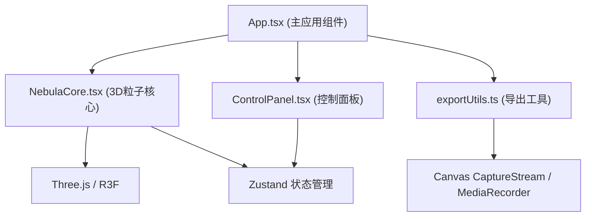

## 1. 架构设计



## 2. 技术描述
- **前端框架**: React@18 + TypeScript@5 + Vite@5
- **3D渲染**: three@0.160 + @react-three/fiber@8 + @react-three/drei@9
- **状态管理**: zustand@4
- **样式方案**: 原生CSS + CSS变量（用户要求不使用tailwind）
- **导出方案**: canvas.captureStream() + MediaRecorder (MP4)，gif.js (GIF)

## 3. 路由定义
| 路由 | 用途 |
|-------|---------|
| / | 主应用页面，包含3D场景和控制面板 |

## 4. 核心模块设计

### 4.1 状态管理 (Zustand Store)
```typescript
interface NebulaState {
  particleCount: number;
  colorPalette: 'nebula' | 'aurora' | 'lava' | 'deepsea' | 'polar';
  rotationSpeed: number;
  spreadRadius: number;
  particleSize: number;
  trailLength: number;
  isPlaying: boolean;
  isPanelOpen: boolean;
  showExportDialog: boolean;
  exportProgress: number;
}
```

### 4.2 粒子系统参数
- **粒子数量**: 500-3000，使用BufferGeometry + Points渲染
- **颜色方案**: 5种预设调色盘，每色盘包含4-5个渐变色
- **运动算法**: 每个粒子具有随机螺旋参数，使用球面坐标系统
- **拖尾效果**: 通过FrameBuffer对象保留历史帧，叠加透明度实现

### 4.3 导出方案
- **MP4**: 使用HTMLCanvasElement.captureStream(fps) → MediaRecorder → Blob下载
- **GIF**: 使用gif.js库逐帧编码（可选，若依赖过重则仅实现MP4）

## 5. 性能优化策略
- 使用BufferGeometry而非Geometry存储粒子数据
- 自定义ShaderMaterial实现粒子颜色和大小的GPU计算
- 粒子运动使用sin/cos预计算缓存
- 导出帧率限制为30fps避免性能问题
