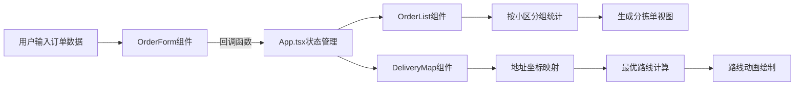

## 1. 产品概述

社区团购订单管理应用，帮助团长自动化处理订单统计、分拣单生成和配送路线规划，解决手动统计繁琐易错的问题。
- 目标用户：社区团购团长
- 核心价值：提升订单管理效率，降低人工错误，简化分拣和配送流程

## 2. 核心功能

### 2.1 功能模块
1. **订单录入模块**：客户信息录入、商品信息录入、表单实时校验、提交成功提示
2. **分拣统计模块**：按小区分组展示、按商品汇总数量、客户明细展开/收起
3. **配送路线模块**：地址可视化展示、最优路线规划、路线动画绘制
4. **到货通知模块**：模拟短信通知、通知模态框展示、淡入动画效果

### 2.2 页面详情
| 页面名称 | 模块名称 | 功能描述 |
|---------|---------|---------|
| 主页面 | 订单录入表单 | 录入客户姓名、手机号、小区、商品名、数量，实时校验格式，提交后显示绿色成功提示 |
| 主页面 | 订单列表 | 按小区分组显示订单汇总，行点击展开客户明细，平滑过渡动画 |
| 主页面 | 配送地图 | SVG地图展示各小区站点，折线连接配送路线，橙色起点标记，路线逐步绘制动画 |
| 主页面 | 通知模态框 | 点击通知按钮弹出，显示模拟发送的短信通知列表，带淡入效果 |

## 3. 核心流程

### 3.1 主用户流程
1. 团长打开应用，查看已有订单和配送路线
2. 在订单录入表单中填写新订单信息
3. 系统实时校验手机号格式和数量正整数
4. 提交订单后显示短暂绿色成功提示
5. 订单自动同步到分拣统计列表和配送地图
6. 团长在订单列表中按小区查看商品汇总，展开查看客户明细
7. 团长查看配送地图，了解最优配送路线
8. 团长点击到货通知按钮，弹出通知列表确认短信已发送

### 3.2 数据流程图

## 4. 用户界面设计

### 4.1 设计风格
- 主色调：清新绿色 #2ecc71
- 背景色：白色 #ffffff
- 辅助色：起点橙色 #e67e22
- 按钮样式：圆角按钮，悬停上浮 + 颜色渐变
- 字体：中文系统字体栈，标题加粗，正文常规
- 布局风格：卡片式布局 + 阴影 + 圆角

### 4.2 页面设计概览
| 页面名称 | 模块名称 | UI元素 |
|---------|---------|-------|
| 主页面 | 订单录入表单 | 卡片容器、圆角阴影、输入框组、提交按钮、成功提示条 |
| 主页面 | 订单列表 | 分组头部（带折叠箭头）、数据表格、行点击展开区域、平滑高度过渡 |
| 主页面 | 配送地图 | SVG画布、站点标记（橙色起点）、折线连接线、逐步绘制动画 |
| 主页面 | 通知模态框 | 半透明遮罩、淡入动画、通知列表、关闭按钮 |

### 4.3 响应式设计
- 桌面端（≥768px）：左右两栏布局，左侧表单右侧列表 + 地图
- 移动端（<768px）：单列布局，表单在上、列表在中、地图在下
- 字体大小随屏幕宽度自适应调整
- 表格在移动端支持横向滚动

## 5. 性能要求
- 订单列表渲染超过50条时，滚动帧率保持60FPS
- 使用React.memo、useMemo、useCallback等优化手段避免不必要的重渲染
