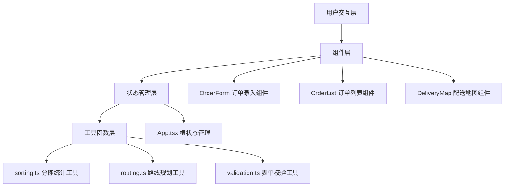

## 1. 架构设计



## 2. 技术描述

- **前端框架**：React@18 + TypeScript
- **构建工具**：Vite
- **样式方案**：原生CSS（CSS Modules风格）+ CSS变量
- **状态管理**：React useState/useReducer（App组件集中管理）
- **地图绘制**：原生SVG实现
- **动画方案**：CSS Transition + Animation
- **性能优化**：React.memo、useMemo、useCallback

## 3. 项目文件结构

```
auto14/
├── package.json
├── vite.config.js
├── tsconfig.json
├── index.html
└── src/
    ├── App.tsx              # 主应用组件，状态管理中心
    ├── OrderForm.tsx        # 订单录入表单组件
    ├── OrderList.tsx        # 订单列表与分拣统计组件
    ├── DeliveryMap.tsx      # 配送地图与路线组件
    ├── types.ts             # TypeScript类型定义
    ├── utils/
    │   ├── sorting.ts       # 分拣统计逻辑
    │   ├── routing.ts       # 路线规划逻辑
    │   └── validation.ts    # 表单校验逻辑
    └── styles/
        ├── App.css          # 全局样式
        ├── OrderForm.css    # 表单样式
        ├── OrderList.css    # 列表样式
        └── DeliveryMap.css  # 地图样式
```

### 文件调用关系与数据流向

```
用户输入
    ↓
OrderForm.tsx (本地状态校验)
    ↓ onSubmit回调
App.tsx (集中状态: orders[])
    ├─→ OrderList.tsx (props接收)
    │      ↓
    │   sorting.ts (统计计算)
    │      ↓
    │   渲染分组表格
    └─→ DeliveryMap.tsx (props接收)
           ↓
        routing.ts (路线计算)
           ↓
        渲染SVG地图与路线
```

## 4. 数据模型

### 4.1 类型定义

```typescript
// 订单实体
interface Order {
  id: string;
  customerName: string;      // 客户姓名
  phone: string;             // 手机号
  community: string;         // 小区名称
  productName: string;       // 商品名称
  quantity: number;          // 数量
  createdAt: number;         // 创建时间戳
}

// 小区分组统计
interface CommunityGroup {
  community: string;         // 小区名称
  products: ProductSummary[]; // 商品汇总列表
  orders: Order[];           // 该小区全部订单
}

// 商品汇总
interface ProductSummary {
  productName: string;       // 商品名称
  totalQuantity: number;     // 总份数
  customers: CustomerDetail[]; // 订购客户明细
}

// 客户明细
interface CustomerDetail {
  customerName: string;
  phone: string;
  quantity: number;
}

// 小区站点坐标（预设）
interface CommunityLocation {
  community: string;
  x: number;                 // SVG x坐标
  y: number;                 // SVG y坐标
}

// 配送路线
interface DeliveryRoute {
  order: CommunityLocation[]; // 按顺序排列的站点列表
  totalDistance: number;      // 总距离
}
```

### 4.2 预设数据

```typescript
// 预设小区坐标（模拟地图位置）
const COMMUNITY_LOCATIONS: CommunityLocation[] = [
  { community: '阳光花园', x: 150, y: 120 },
  { community: '翠湖小区', x: 350, y: 80 },
  { community: '绿城家园', x: 550, y: 150 },
  { community: '金色港湾', x: 450, y: 300 },
  { community: '幸福里', x: 250, y: 280 },
];
```

## 5. 核心算法说明

### 5.1 分拣统计算法
- 输入：Order[]
- 按community字段分组
- 每组内按productName聚合
- 计算每个商品的totalQuantity和customers明细

### 5.2 路线规划算法（最近邻贪心算法）
- 输入：小区坐标列表
- 起点固定（团长位置，橙色标记）
- 每步选择距离当前位置最近的未访问小区
- 输出：最优路线序列和总距离

## 6. 性能优化方案

1. **组件级优化**：OrderList使用React.memo包裹，避免props未变时重渲染
2. **计算级优化**：分拣统计和路线规划使用useMemo缓存计算结果
3. **回调优化**：传递给子组件的回调函数使用useCallback包裹
4. **列表虚拟化**：订单数量超过50时考虑使用CSS优化渲染（固定高度 + transform）
5. **CSS动画**：使用transform和opacity属性触发GPU加速，避免重排重绘
