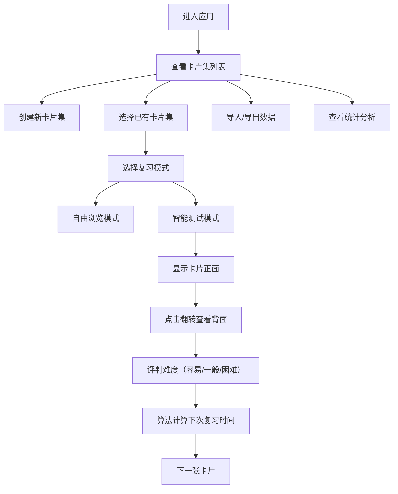

## 1. 产品概述

知识卡片闪卡机是一款基于间隔重复算法的智能记忆辅助工具，帮助用户高效记忆各类知识内容。用户可创建、导入和管理多套知识卡片集，通过自由浏览和智能测试两种复习模式，结合科学的间隔重复算法，最大化记忆效率。

- 核心目标：提供易用、美观、高效的知识卡片记忆工具
- 目标用户：学生、语言学习者、备考人群及所有需要高效记忆知识的用户
- 市场价值：填补轻量化、高颜值、纯前端闪卡应用的空白

## 2. 核心功能

### 2.1 用户角色
| 角色 | 注册方式 | 核心权限 |
|------|----------|----------|
| 普通用户 | 无需注册（本地存储） | 创建、编辑、删除卡片集；导入导出数据；进行复习；查看统计 |

### 2.2 功能模块
1. **卡片集管理页**：卡片集列表展示、创建/删除卡片集、导入/导出JSON、卡片集卡片式布局
2. **复习模式页**：自由浏览模式、智能测试模式、3D卡片翻转、间隔重复算法
3. **统计分析页**：掌握度环形图、复习打卡热力图、7天正确率折线图

### 2.3 页面详情
| 页面名称 | 模块名称 | 功能描述 |
|----------|----------|----------|
| 卡片集管理页 | 卡片集列表 | 卡片式布局展示所有卡片集，显示卡片数量、最近复习时间 |
| 卡片集管理页 | 创建卡片集 | 弹窗形式，魔法放大动画，填写名称、描述 |
| 卡片集管理页 | 导入导出 | JSON格式批量导入导出卡片集数据 |
| 复习模式页 | 自由浏览 | 按顺序翻看卡片，左右滑动切换，进度条和编号显示 |
| 复习模式页 | 智能测试 | 间隔重复算法安排复习，3D翻转动画，三级难度评判 |
| 统计分析页 | 掌握度展示 | 环形进度图显示各卡片集掌握百分比 |
| 统计分析页 | 打卡日历 | 热力图展示每日复习数量，浅绿到深绿渐变 |
| 统计分析页 | 正确率趋势 | 折线图展示最近7天复习正确率 |

## 3. 核心流程

用户进入应用后，首先看到卡片集列表。用户可以选择创建新卡片集或进入已有卡片集复习。复习时可选择自由浏览或智能测试模式。智能测试模式下，系统根据用户的评判（容易/一般/困难）调整下次复习间隔。所有操作数据实时同步至本地存储，统计面板展示学习进度和效果。

## 4. 用户界面设计

### 4.1 设计风格
- **主色调**：莫兰迪色系 - 豆沙绿（#A8C3A0）、雾霾蓝（#A8B5C3）、米灰色（#D4CFC8）
- **卡片正面**：柔和暖白（#FDFBF7）背景配深灰色（#3D3D3D）字体
- **卡片反面**：浅蓝（#B8CCE0）背景配白色（#FFFFFF）文字
- **按钮风格**：圆角磨砂玻璃效果（backdrop-filter: blur），12px圆角
- **字体**：Noto Sans SC（Google Fonts），标题400/500/600权重，正文400权重
- **布局风格**：桌面端侧边导航 + 内容区，移动端底部标签栏 + 全屏内容
- **动效**：页面切换渐入渐出（300ms），新建弹窗魔法放大动画，卡片3D翻转

### 4.2 页面设计概述
| 页面名称 | 模块名称 | UI元素 |
|----------|----------|----------|
| 卡片集管理页 | 卡片集列表 | 网格布局卡片，悬停上浮效果，渐变边框 |
| 卡片集管理页 | 创建弹窗 | 中心放大动画，磨砂背景，表单元素 |
| 复习模式页 | 卡片展示 | 大尺寸卡片，3D翻转动画，手势滑动支持 |
| 复习模式页 | 控制按钮 | 底部操作栏，圆角按钮，悬停反馈 |
| 统计分析页 | 图表区域 | recharts可视化，配色统一，响应式布局 |

### 4.3 响应式设计
- 桌面端（> 768px）：左侧导航栏 + 右侧内容区，卡片集采用3列网格
- 平板端（576px - 768px）：顶部导航，卡片集采用2列网格
- 移动端（< 576px）：底部标签栏导航，卡片集采用单列布局，触摸优化
