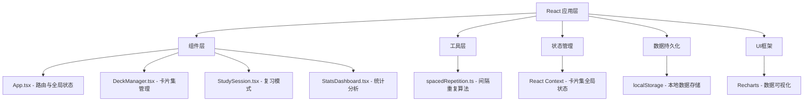
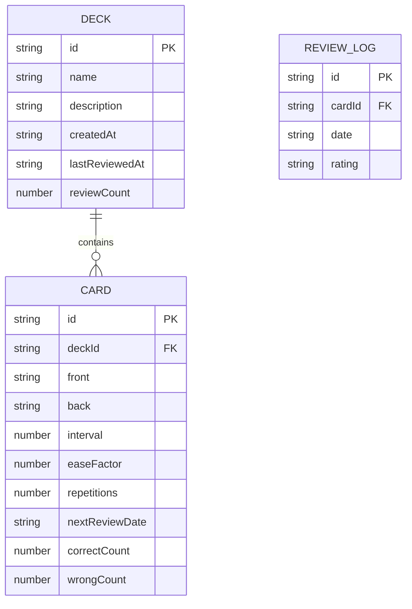

## 1. 架构设计



## 2. 技术说明

- **前端框架**：React 18 + TypeScript 5
- **构建工具**：Vite 5（含路径别名@配置）
- **数据可视化**：Recharts 2
- **状态管理**：React Context API（全局卡片集数据）
- **数据存储**：localStorage（纯前端，无需后端）
- **样式方案**：原生CSS + CSS变量（莫兰迪色系主题）
- **响应式**：CSS Media Queries + Flex/Grid布局

## 3. 路由定义

本应用采用单页应用模式，通过内部状态切换视图，无需外部路由库：

| 视图 | 触发方式 | 用途 |
|------|----------|------|
| 卡片集管理 | 默认视图 / 导航点击 | 展示和管理所有卡片集 |
| 复习模式 | 点击卡片集 | 进行自由浏览或智能测试复习 |
| 统计分析 | 导航点击 | 查看学习数据统计与可视化 |

## 4. 数据模型

### 4.1 数据模型定义



### 4.2 TypeScript 类型定义

```typescript
interface Card {
  id: string;
  deckId: string;
  front: string;
  back: string;
  interval: number;
  easeFactor: number;
  repetitions: number;
  nextReviewDate: string;
  correctCount: number;
  wrongCount: number;
}

interface Deck {
  id: string;
  name: string;
  description: string;
  cards: Card[];
  createdAt: string;
  lastReviewedAt: string | null;
  reviewCount: number;
}

interface ReviewLog {
  date: string;
  correct: number;
  total: number;
}

type Rating = 'easy' | 'normal' | 'hard';
type StudyMode = 'browse' | 'smart';
type ViewType = 'decks' | 'study' | 'stats';
```
