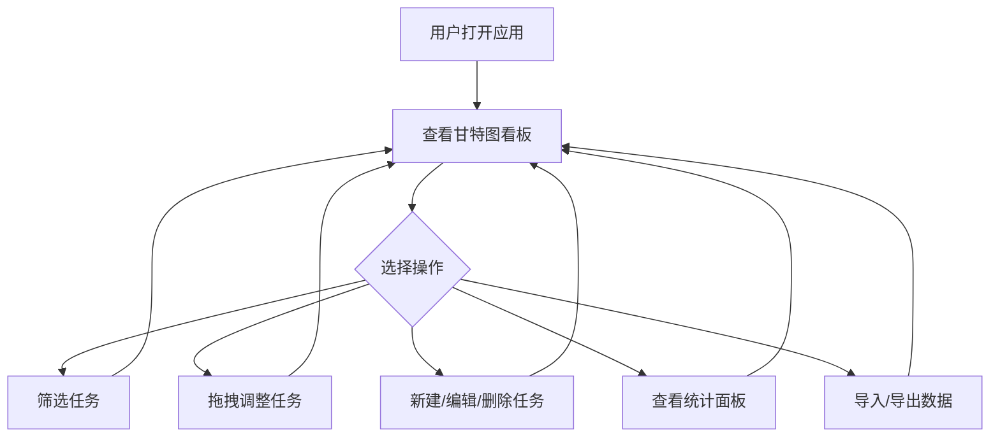

## 1. 产品概述

团队项目时间线看板应用，以甘特图形式让团队成员可视化展示和调整项目任务的时间安排。面向需要协同管理项目进度的团队，解决任务时间线不透明、进度难以追踪、跨成员协作低效的问题。

- 核心目标：让团队在一个深色、沉浸式的看板上直观掌握所有任务的时间分布、负责人分配和进度状态
- 价值：减少沟通成本、避免任务冲突、实时洞察项目健康度

## 2. 核心功能

### 2.1 用户角色

| 角色 | 使用方式 | 核心权限 |
|------|----------|----------|
| 团队成员 | 直接访问 | 查看甘特图、创建/编辑/删除任务、拖拽调整、筛选、导出导入 |
| 项目经理 | 直接访问 | 同上，额外可查看统计面板分析数据 |

### 2.2 功能模块

1. **甘特图看板页**：时间轴网格、任务横条渲染、拖拽交互、筛选栏、统计面板、数据导入导出

### 2.3 页面详情

| 页面名称 | 模块名称 | 功能描述 |
|----------|----------|----------|
| 甘特图看板页 | 甘特图视图 | 以天为最小刻度渲染时间轴，任务显示为可拖拽横条，颜色按优先级区分（红/橙/绿），悬停显示tooltip详情和进度百分比，支持滚轮水平缩放（7-90天），缩放时横条和网格平滑过渡 |
| 甘特图看板页 | 任务CRUD | "新建任务"按钮弹出模态框表单（任务名/负责人/起止日期/优先级/进度），横条右侧编辑/删除图标（悬停出现），编辑回填数据，删除二次确认 |
| 甘特图看板页 | 拖拽调整 | 拖拽横条左右边缘修改起止时间（步长1天），显示虚线辅助线和日期变化提示；上下拖拽调整负责人，自动让位避免重叠，释放后动画重排 |
| 甘特图看板页 | 筛选栏 | 负责人多选下拉、优先级复选框组、状态单选过滤、关键词搜索框，筛选条件组合生效，实时联动时间线和统计面板 |
| 甘特图看板页 | 统计面板 | 总任务数、已完成数、平均延期天数、按负责人任务分布柱状图、整体进度圆环比例图，数据随筛选动态更新，图表有渐进填充动画 |
| 甘特图看板页 | 数据导入导出 | 导出为JSON（含元数据）、导入JSON（ID冲突提示覆盖/跳过）、导入结果顶部通知条 |

## 3. 核心流程

用户打开应用后，看到深色主题的甘特图看板，左侧为负责人列表，右侧为时间轴区域。用户可以：

1. 通过筛选栏缩小查看范围
2. 在甘特图上直观查看任务时间分布
3. 拖拽横条调整任务时间和负责人
4. 悬停横条查看详情
5. 点击新建/编辑/删除管理任务
6. 通过统计面板洞察项目进度
7. 导出/导入数据备份和恢复

## 4. 用户界面设计

### 4.1 设计风格

- 主色调：深蓝紫（背景 #1a1a2e，卡片 #16213e），辅以明快红/橙/绿任务色彩
- 按钮风格：圆角矩形，悬停时0.2秒色彩过渡 + 轻微上浮阴影
- 字体：Inter（Google Fonts），清晰可读的UI字体
- 布局：左侧边栏（负责人列表）+ 右侧主区域（甘特图），顶部筛选栏，右下角统计面板
- 图标风格：线性图标（Lucide React）
- 模态框：从中心展开的缩放动画，背景变暗

### 4.2 页面设计概览

| 页面名称 | 模块名称 | UI元素 |
|----------|----------|--------|
| 甘特图看板页 | 甘特图视图 | 深色背景、时间轴网格刻度线、彩色横条（红/橙/绿渐变）、tooltip浮层、虚线辅助线 |
| 甘特图看板页 | 筛选栏 | 多选下拉框、复选框组、单选按钮、搜索输入框、折叠汉堡菜单（小屏） |
| 甘特图看板页 | 统计面板 | 彩色柱状图（按负责人）、圆环比例图、数字统计卡片 |
| 甘特图看板页 | 任务表单模态框 | 表单输入框、日期选择器、滑块、单选按钮组、缩放动画 |
| 甘特图看板页 | 工具栏 | 新建任务按钮、导出/导入按钮、通知条 |

### 4.3 响应式设计

- 桌面优先设计（≥768px）
- 低于768px时：筛选栏折叠为汉堡菜单、甘特图横条和文本自动缩小字号
- 触摸优化：拖拽操作兼容鼠标和触摸

### 4.4 性能要求

- 50个任务横条 + 30天刻度渲染时，拖拽和缩放保持60fps
- 用户操作响应延迟不超过50毫秒
