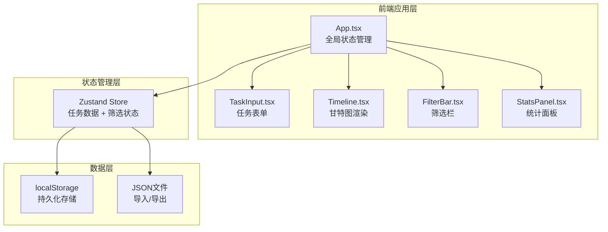
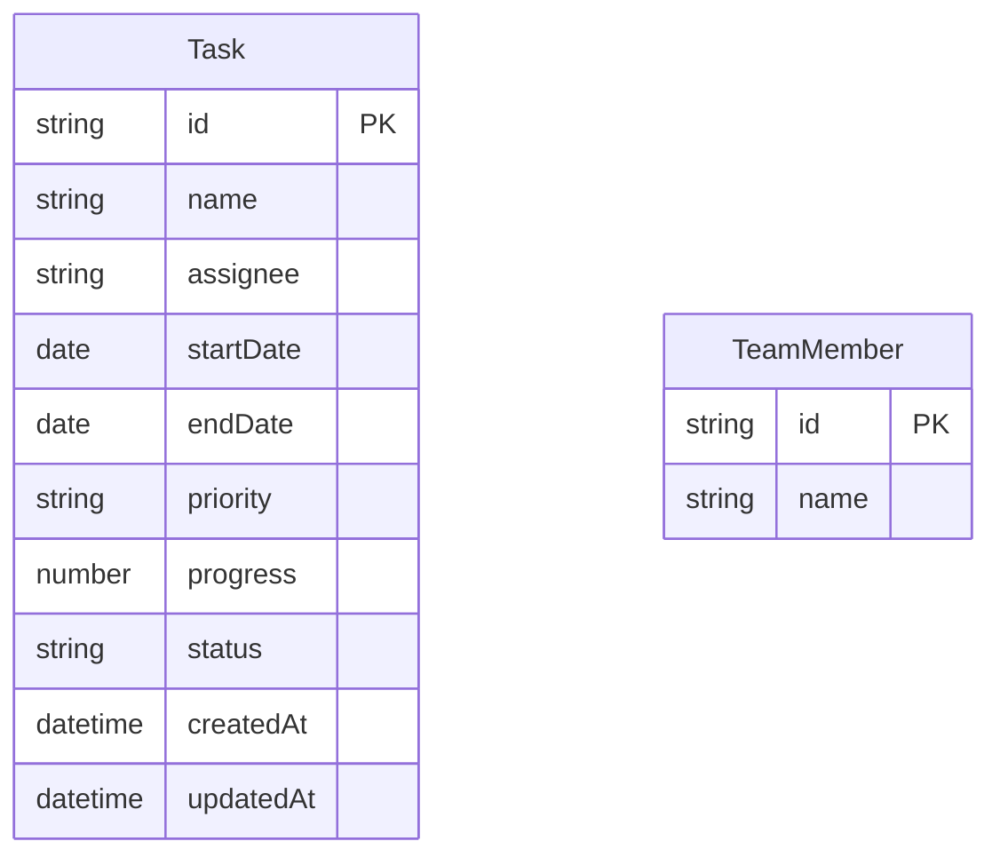

## 1. 架构设计



## 2. 技术说明

- 前端：React 18 + TypeScript + Vite
- 样式：Tailwind CSS 3
- 状态管理：Zustand
- 图标：Lucide React
- 初始化工具：vite-init（react-ts 模板）
- 后端：无（纯前端应用，数据存储在 localStorage）
- 字体：Inter（Google Fonts）

## 3. 路由定义

| 路由 | 用途 |
|------|------|
| / | 甘特图看板主页面（单页应用，无额外路由） |

## 4. 数据模型

### 4.1 数据模型定义



### 4.2 类型定义

```typescript
type Priority = 'high' | 'medium' | 'low';
type TaskStatus = 'not_started' | 'in_progress' | 'completed';

interface Task {
  id: string;
  name: string;
  assignee: string;
  startDate: string;
  endDate: string;
  priority: Priority;
  progress: number;
  status: TaskStatus;
  createdAt: string;
  updatedAt: string;
}

interface TeamMember {
  id: string;
  name: string;
}

interface FilterState {
  assignees: string[];
  priorities: Priority[];
  status: TaskStatus | 'all';
  keyword: string;
}
```

## 5. 组件架构

### 5.1 组件职责

| 组件 | 职责 |
|------|------|
| App.tsx | 全局状态管理、布局编排、任务CRUD操作、视图切换逻辑 |
| TaskInput.tsx | 任务创建/编辑模态框表单，字段验证，触发数据更新 |
| Timeline.tsx | 甘特图核心渲染，时间轴网格，任务横条，拖拽交互，缩放控制 |
| FilterBar.tsx | 筛选栏UI，多选下拉/复选框/搜索框，实时联动 |
| StatsPanel.tsx | 统计计算，柱状图，圆环图，渐进动画 |

### 5.2 状态流

```
App (Zustand Store)
 ├── tasks: Task[]
 ├── filters: FilterState
 ├── zoomLevel: number (7-90天)
 ├── modalState: { open, mode, taskId? }
 └── CRUD actions: addTask, updateTask, deleteTask
      │
      ├──→ Timeline: filtered tasks + zoom → 渲染横条
      ├──→ FilterBar: filter state → 筛选UI
      └──→ StatsPanel: filtered tasks → 统计图表
```

## 6. 关键技术决策

1. **拖拽实现**：使用原生鼠标事件（mousedown/mousemove/mouseup）+ requestAnimationFrame 实现60fps拖拽，避免引入重型拖拽库
2. **缩放实现**：CSS transform: scaleX() + CSS transition 实现平滑缩放过渡
3. **图表渲染**：使用 SVG + CSS 动画实现柱状图和圆环图，无需第三方图表库
4. **性能优化**：React.memo、useMemo、useCallback 避免不必要的重渲染；虚拟滚动处理大量任务
5. **数据持久化**：Zustand + localStorage 中间件自动持久化任务数据
6. **日期处理**：使用原生 Date API + dayjs 轻量处理日期计算
