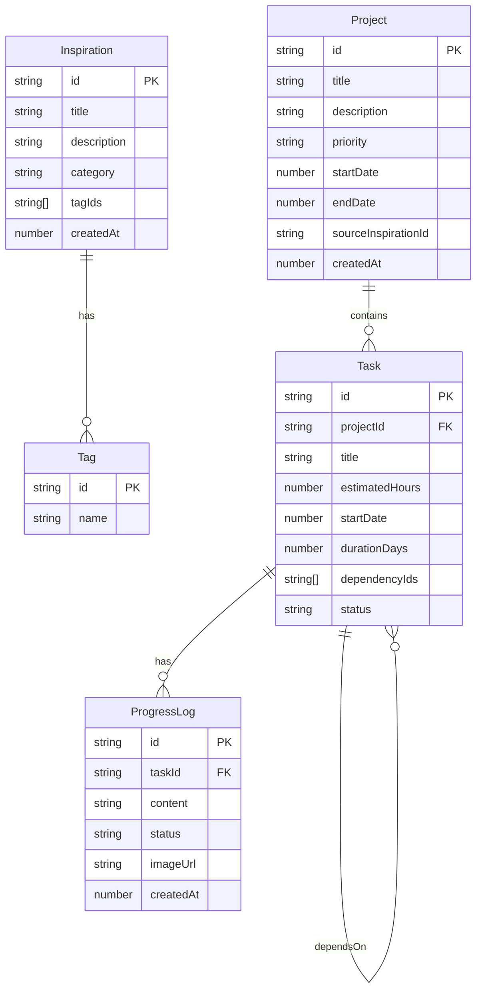

## 1. 架构设计

```mermaid
graph TB
    subgraph "前端层"
        "App.tsx" --> "灵感模块"
        "App.tsx" --> "项目模块"
        "App.tsx" --> "报告模块"
        "灵感模块" --> "InspirationBoard"
        "灵感模块" --> "InspirationInput"
        "项目模块" --> "ProjectView"
        "项目模块" --> "TaskTimeline"
        "报告模块" --> "ReportGenerator"
    end
    subgraph "数据层"
        "store.ts" --> "IndexedDB"
        "store.ts" --> "导出/导入"
    end
    "前端层" --> "数据层"
end
```

## 2. 技术说明

- **前端框架**：React 18 + TypeScript（严格模式）
- **构建工具**：Vite
- **样式方案**：Tailwind CSS 3 + CSS Modules（毛玻璃等高级效果）
- **状态管理**：Zustand
- **数据持久化**：IndexedDB（通过 idb 库封装）
- **甘特图渲染**：Canvas 自绘（确保50+任务20+依赖下<100ms响应）
- **导出压缩**：JSZip
- **图标库**：lucide-react

## 3. 路由定义

| 路由 | 用途 |
|------|------|
| `/` | 灵感看板主页面 |
| `/project/:id` | 项目详情页（含甘特图+进度时间线） |
| `/report/:id` | 项目复盘报告页面 |

## 4. 数据模型

### 4.1 数据模型定义



### 4.2 数据定义

**Inspiration（灵感）**
- `id`: string，UUID
- `title`: string，灵感标题
- `description`: string，一句话描述
- `category`: 'text' | 'image' | 'music' | 'video' | 'other'，分类
- `tagIds`: string[]，关联标签ID列表
- `createdAt`: number，创建时间戳

**Project（项目）**
- `id`: string，UUID
- `title`: string，项目标题
- `description`: string，目标描述
- `priority`: 'high' | 'medium' | 'low'，优先级
- `startDate`: number，项目开始日期时间戳
- `endDate`: number，项目结束日期时间戳
- `sourceInspirationId`: string | null，来源灵感ID
- `createdAt`: number，创建时间戳

**Task（任务）**
- `id`: string，UUID
- `projectId`: string，所属项目ID
- `title`: string，任务名称
- `estimatedHours`: number，预计工时
- `startDate`: number，任务开始日期时间戳
- `durationDays`: number，持续天数
- `dependencyIds`: string[]，依赖的任务ID列表
- `status`: 'pending' | 'in_progress' | 'completed'，任务状态

**ProgressLog（进度日志）**
- `id`: string，UUID
- `taskId`: string，所属任务ID
- `content`: string，日志内容
- `status`: 'completed' | 'progress' | 'blocked'，进度状态
- `imageUrl`: string | null，可选图片URL（base64）
- `createdAt`: number，创建时间戳

## 5. 文件组织

```
├── package.json
├── index.html
├── vite.config.js
├── tsconfig.json
├── src/
│   ├── App.tsx                    # 主应用组件，路由+全局状态
│   ├── main.tsx                   # 入口
│   ├── index.css                  # 全局样式+Tailwind
│   ├── modules/
│   │   ├── inspiration/
│   │   │   ├── InspirationBoard.tsx    # 灵感看板
│   │   │   └── InspirationInput.tsx    # 浮动输入框
│   │   ├── project/
│   │   │   ├── ProjectView.tsx         # 项目详情+甘特图
│   │   │   └── TaskTimeline.tsx        # 进度时间线
│   │   └── report/
│   │       └── ReportGenerator.tsx     # 复盘报告
│   └── shared/
│       ├── store.ts                    # IndexedDB封装+Zustand状态
│       └── types.ts                    # 类型定义
```

## 6. 性能策略

- 甘特图使用 Canvas 绘制而非 DOM 节点，确保50+任务+20+依赖关系下拖拽响应<100ms
- IndexedDB 读写操作异步化，不阻塞 UI 渲染
- 卡片列表使用虚拟滚动（当卡片超过100张时）
- 任务条拖拽使用 requestAnimationFrame 节流渲染
