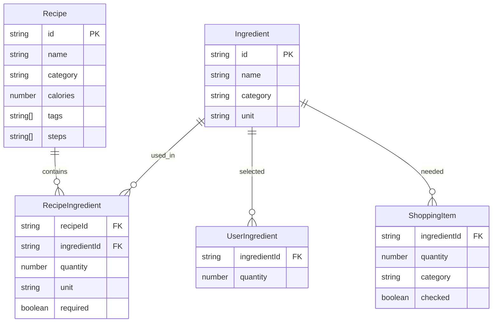

## 1. 架构设计

```mermaid
flowchart TD
    "前端 React + TypeScript" --> "Vite 构建工具"
    "前端 React + TypeScript" --> "状态管理 Zustand"
    "前端 React + TypeScript" --> "CSS Grid + CSS Variables"
    "状态管理 Zustand" --> "食材数据"
    "状态管理 Zustand" --> "偏好数据"
    "状态管理 Zustand" --> "购物清单数据"
    "前端 React + TypeScript" --> "菜谱库 data.ts"
    "菜谱库 data.ts" --> "推荐算法"
```

纯前端架构，无后端服务。所有菜谱数据和推荐算法均在前端 `data.ts` 中实现，状态管理使用 Zustand。

## 2. 技术说明
- 前端：React@18 + TypeScript + Vite
- 初始化工具：vite-init（react-ts 模板）
- 样式方案：CSS Variables + CSS Grid + CSS Modules（内联样式）
- 状态管理：Zustand
- 路由：react-router-dom（底部Tab切换，水平滑动过渡）
- 后端：无
- 数据库：无（前端预设菜谱库，至少20道菜）

## 3. 路由定义
| 路由 | 用途 |
|------|------|
| / | 食材管理页（默认页） |
| /recommend | 食谱推荐页 |
| /shopping | 购物清单页 |

## 4. API定义
不适用（纯前端，无后端API）

## 5. 服务器架构图
不适用（纯前端项目）

## 6. 数据模型

### 6.1 数据模型定义



### 6.2 数据定义语言
- `Ingredient`：食材基础数据，包含id、名称、分类、默认单位
- `UserIngredient`：用户选择的食材，关联食材id和数量
- `Recipe`：菜谱数据，包含id、名称、分类、热量、标签（低卡/高蛋白等）、步骤
- `RecipeIngredient`：菜谱所需食材，关联菜谱和食材，含数量、单位、是否必须
- `ShoppingItem`：购物清单项，关联食材、数量、分类、是否已购买

### 6.3 推荐算法逻辑
1. **食材匹配度**：计算菜谱所需食材与用户已有食材的重叠比例（0-100%）
2. **营养目标匹配**：用户选择的饮食偏好标签与菜谱标签的匹配度（0-100%）
3. **综合评分**：`score = matchWeight * 食材匹配度 + nutritionWeight * 营养匹配度`
4. **排序**：按综合评分从高到低，取前5个推荐
