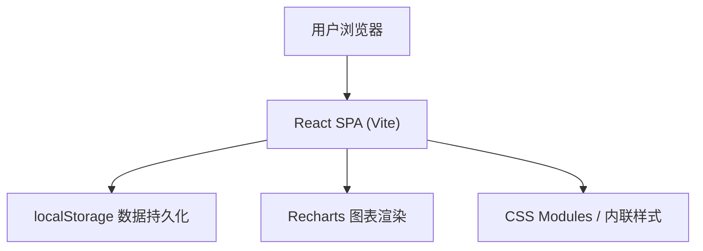
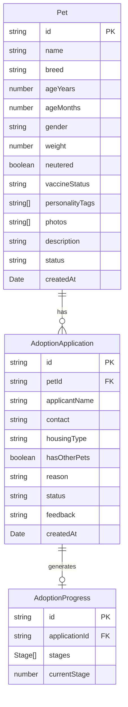

## 1. 架构设计



## 2. 技术说明

- **前端框架**：React@18 + TypeScript@5
- **构建工具**：Vite@5
- **图表库**：Recharts@2
- **状态管理**：React useState/useContext（轻量级，无需额外状态库）
- **数据持久化**：localStorage（浏览器本地存储）
- **数据导入导出**：JSON格式

## 3. 路由定义

| 路由 | 用途 |
|-------|---------|
| / | 宠物档案列表页（默认首页） |
| /pet/:id | 宠物详情与领养申请页 |
| /stats | 统计看板页 |
| /admin | 管理员审核页（可内嵌于列表页） |

## 4. 数据模型

### 4.1 数据模型定义



### 4.2 常量枚举定义

- **Gender**: MALE | FEMALE | UNKNOWN
- **VaccineStatus**: FULLY_VACCINATED | PARTIALLY_VACCINATED | NOT_VACCINATED
- **ApplicationStatus**: PENDING | APPROVED | REJECTED
- **Stage**: SUBMISSION | REVIEW | HOME_VISIT | CONTRACT | COMPLETION

## 5. 文件结构

```
src/
├── App.tsx              # 主应用组件，路由+全局状态
├── types.ts             # 类型定义与常量枚举
├── data.ts              # 模拟数据+localStorage管理+CRUD
├── components/
│   ├── PetCard.tsx      # 宠物卡片组件
│   ├── PetDetail.tsx    # 宠物详情+申请表+进度面板
│   └── FilterPanel.tsx  # 筛选面板组件
└── pages/
    └── Stats.tsx        # 统计看板页面
```

## 6. 性能优化

- 搜索筛选使用useMemo缓存，响应时间<200ms
- 照片使用懒加载，轮播使用CSS transform实现流畅切换
- 列表使用CSS will-change优化滚动帧率>50fps
- 大组件拆分，避免不必要的重渲染
