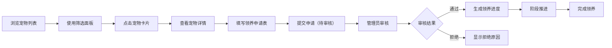

## 1. 产品概述

宠物领养管理应用是一款帮助宠物主人和动物救助站高效管理待领养宠物信息的轻量级Web应用，解决领养信息分散、领养流程不透明、救助站和领养者之间沟通效率低的问题。目标用户包括动物救助站管理员和潜在领养者，旨在提升领养流程的数字化和透明度。

## 2. 核心功能

### 2.1 用户角色

| 角色 | 注册方式 | 核心权限 |
|------|----------|----------|
| 救助站管理员 | 本地应用管理员 | 管理宠物档案、审核领养申请、查看统计数据 |
| 潜在领养者 | 无需注册，匿名浏览 | 浏览宠物信息、提交领养申请、查看申请进度 |

### 2.2 功能模块

1. **宠物档案列表页**：卡片网格展示、筛选面板、宠物卡片
2. **宠物详情与领养申请页**：照片轮播、宠物详情、申请表单、领养进度面板
3. **统计看板页**：数据概览、品种柱状图、领养趋势折线图

### 2.3 页面详情

| 页面名称 | 模块名称 | 功能描述 |
|-----------|-------------|---------------------|
| 宠物档案列表页 | 筛选面板 | 固定左侧，支持按品种、年龄、性格标签多选组合筛选，选中标签高亮动画 |
| 宠物档案列表页 | 卡片网格 | 响应式网格布局，卡片圆角+投影悬浮效果，悬停上移2px+加深阴影 |
| 宠物详情页 | 照片轮播 | 左右滑动切换，最多5张，支持预览 |
| 宠物详情页 | 信息展示区 | 左右两栏布局，字段使用等宽字体显示 |
| 宠物详情页 | 领养申请表 | 包含姓名、联系方式、居住类型、其他宠物、领养理由字段 |
| 宠物详情页 | 进度面板 | 横向时间轴，5个阶段，绿/灰/高亮闪烁状态，悬浮显示备注 |
| 统计看板页 | 数据概览 | 待领养总数、本月新增、本月领养成功数卡片 |
| 统计看板页 | 图表区域 | 最受欢迎品种TOP5柱状图、月度领养趋势折线图 |

## 3. 核心流程

用户浏览宠物列表，通过筛选面板缩小范围，点击卡片进入详情页查看照片和完整信息。填写领养申请表提交后，状态变为"待审核"。管理员在后台审核通过或拒绝，申请人可实时查看状态和评语。通过申请后自动生成领养进度记录，按阶段推进直至完成领养。

## 4. 用户界面设计

### 4.1 设计风格
- **主色调**：温暖米白色(#FDF8F3) + 浅绿色(#A8D5BA)主色调，搭配深绿色(#5A8F6E)作为强调色
- **卡片风格**：圆角16px，轻微投影，悬停上移2px加深阴影
- **字体**：标题使用Merriweather，正文使用Inter，字段值使用等宽字体JetBrains Mono
- **布局**：桌面端左侧固定筛选面板+右侧网格，移动端筛选面板收起为抽屉
- **图标风格**：使用lucide-react线性图标

### 4.2 页面设计概览

| 页面名称 | 模块名称 | UI元素 |
|-----------|-------------|-------------|
| 列表页 | 筛选面板 | 固定左侧280px，标签圆角chip，选中高亮边框+淡入动画 |
| 列表页 | 卡片网格 | grid响应式，卡片圆角16px，阴影hover:translateY(-2px) |
| 详情页 | 照片轮播 | 左右切换按钮，指示器圆点，触摸滑动支持 |
| 详情页 | 进度时间轴 | 带数字圆形指示器，平滑进度条滑动，闪烁动画 |
| 统计页 | 图表 | 渐变透明背景，底部微阴影，统一绿色系配色 |

### 4.3 响应式设计
- **桌面端(>=1024px)**：三栏布局(筛选+内容+详情)，卡片3-4列
- **平板(768-1023px)**：两栏布局，卡片2列
- **移动端(<768px)**：单列布局，筛选面板变抽屉按钮，卡片单列
