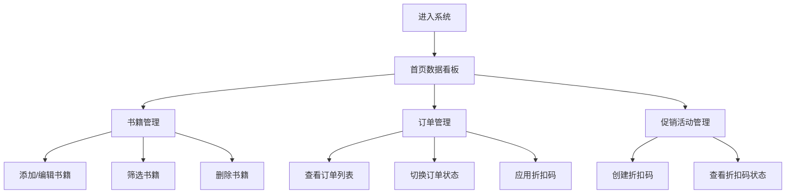

## 1. 产品概述
社区微书店管理系统是一款面向小型社区书店店主的一站式管理工具，解决市面上工具价格昂贵、功能冗余的问题。
- 目标用户：社区微书店店主，需要管理库存、处理订单、进行营销推广
- 产品价值：提供轻量级、易用、功能精准的书店管理解决方案，降低运营成本

## 2. 核心功能

### 2.1 用户角色
| 角色 | 注册方式 | 核心权限 |
|------|----------|----------|
| 店主 | 本地使用，无需注册 | 书籍管理、订单处理、促销活动创建、数据查看 |

### 2.2 功能模块
1. **数据统计看板（首页）**：总销售额、总订单数、库存总价值数字卡片，近7天销售额趋势图
2. **书籍管理模块**：书籍增删改查、分类筛选、价格筛选、卡片网格展示
3. **订单管理模块**：订单列表展示、状态切换、逾期订单标红置顶、进度条动画
4. **促销活动模块**：折扣码创建、使用次数限制、有效期设置、订单结算校验

### 2.3 页面详情
| 页面名称 | 模块名称 | 功能描述 |
|----------|----------|----------|
| 首页看板 | 数据统计卡片 | 显示总销售额、总订单数、库存总价值，数字从0滚动到真实值 |
| 首页看板 | 销售额趋势图 | 使用SVG绘制近7天销售额柱状图 |
| 书籍管理 | 书籍列表 | 卡片网格展示，封面占位色块，悬停阴影加强上浮 |
| 书籍管理 | 书籍表单 | 添加/编辑书籍信息（书名、作者、ISBN、价格、库存、分类） |
| 书籍管理 | 筛选功能 | 按分类（文学/科技/生活/教育）和价格范围筛选，淡入淡出过渡 |
| 订单管理 | 订单列表 | 显示客户姓名、金额、商品清单、状态进度条 |
| 订单管理 | 状态切换 | 按钮切换订单状态（待支付→已支付→已发货→已完成/已取消），进度条平滑过渡 |
| 订单管理 | 逾期处理 | 超过7天未支付订单标红置顶 |
| 促销活动 | 折扣码管理 | 创建折扣码（满减规则），设定使用次数上限和有效期 |
| 促销活动 | 折扣码应用 | 订单结算时校验折扣码，过期或次数耗尽Toast提示 |

## 3. 核心流程
店主登录系统后，在首页查看经营数据概览。可进入书籍管理模块维护库存，在订单模块处理客户订单，通过促销模块创建优惠活动。订单结算时可应用折扣码，系统自动校验有效性并计算折后价。

## 4. 用户界面设计

### 4.1 设计风格
- **主色调**：柔和蓝灰（#4A6FA5）与米白色（#F8F5F0）搭配
- **标题栏**：渐变蓝色背景（#4A6FA5 → #6B8CC4）
- **卡片风格**：圆角（8px）、柔和阴影、悬停时阴影加深并轻微上浮（translateY(-2px)）
- **字体**：标题使用优雅衬线字体，正文使用清晰易读的无衬线字体
- **图标风格**：简洁线性图标，颜色与主题一致

### 4.2 页面设计概述
| 页面名称 | 模块名称 | UI元素 |
|----------|----------|----------|
| 首页看板 | 数字卡片 | 白色卡片、大字号数字、滚动动画、柔和阴影 |
| 首页看板 | 柱状图 | SVG绘制、蓝色渐变柱体、坐标轴标签 |
| 书籍管理 | 书籍卡片 | 封面色块、书籍信息、删除缩小淡出动画 |
| 订单管理 | 进度条 | 平滑过渡动画、不同状态不同颜色 |
| 通用 | Toast提示 | 右上角滑入、自动消失、成功/错误不同样式 |
| 通用 | 表单输入 | 焦点时蓝色边框、轻微放大（scale 1.02） |

### 4.3 响应式设计
- **桌面端**：书籍卡片网格布局（3-4列），订单列表完整展示
- **移动端**：书籍卡片单列瀑布流，订单列表折叠式手风琴，导航变为底部Tab或汉堡菜单
- **触摸优化**：按钮最小尺寸44px，触摸反馈明显

## 5. 性能要求
- 列表渲染超过50条数据时，切换筛选条件响应时间 ≤ 800ms
- 动画帧率 ≥ 60fps
- 首次加载时间 ≤ 3s
