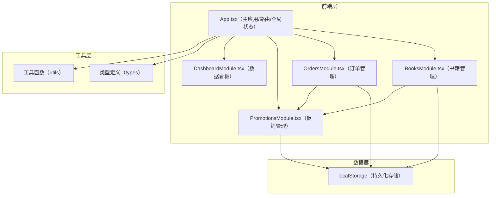

## 1. 架构设计



**数据流向说明：**
- App.tsx 管理全局状态（书籍、订单、促销码），通过 props 向各模块传递增删改查回调函数
- 各模块接收回调函数，不直接操作 localStorage，由 App 统一处理数据持久化
- BooksModule 和 OrdersModule 在需要时调用 PromotionsModule 的校验逻辑来应用折扣
- 所有数据最终通过 App.tsx 存储到 localStorage

## 2. 技术描述
- **前端框架**：React 18 + TypeScript
- **构建工具**：Vite
- **状态管理**：React useState/useReducer（局部状态），props 传递（跨模块）
- **数据存储**：localStorage（浏览器本地持久化）
- **图表绘制**：原生 SVG（无三方图表库依赖）
- **样式方案**：CSS Modules + 原生 CSS（不使用 Tailwind，按用户指定的文件结构）
- **动画**：CSS Transitions/Animations

## 3. 模块文件与调用关系

| 文件 | 职责 | 被谁调用 | 调用谁 |
|------|------|----------|--------|
| `src/App.tsx` | 主应用入口，管理路由（Tab切换）、全局状态、localStorage 同步 | index.html | BooksModule, OrdersModule, PromotionsModule, DashboardModule |
| `src/BooksModule.tsx` | 书籍管理：列表渲染、增删改查表单、筛选过滤、卡片动画 | App.tsx | App传递的回调函数, 促销校验函数 |
| `src/OrdersModule.tsx` | 订单管理：订单列表、状态切换、进度条、逾期处理、折扣码应用 | App.tsx | App传递的回调函数, 促销校验函数 |
| `src/PromotionsModule.tsx` | 促销管理：折扣码创建、列表展示、校验逻辑导出 | App.tsx | App传递的回调函数 |
| `src/types.ts` | 全局 TypeScript 类型定义 | 所有模块 | - |
| `src/utils.ts` | 工具函数（日期格式化、金额计算、折扣校验、数据生成） | 所有模块 | - |
| `src/styles/` | 全局样式和各模块样式文件 | 各模块 | - |

## 4. 数据模型

### 4.1 类型定义

```typescript
// 书籍分类
type BookCategory = '文学' | '科技' | '生活' | '教育';

// 书籍
interface Book {
  id: string;
  title: string;
  author: string;
  isbn: string;
  price: number;
  stock: number;
  category: BookCategory;
  coverColor: string; // 封面占位色块颜色
  createdAt: number;
}

// 订单状态
type OrderStatus = '待支付' | '已支付' | '已发货' | '已完成' | '已取消';

// 订单项
interface OrderItem {
  bookId: string;
  bookTitle: string;
  price: number;
  quantity: number;
}

// 订单
interface Order {
  id: string;
  customerName: string;
  items: OrderItem[];
  totalAmount: number;
  discountAmount: number;
  finalAmount: number;
  promoCode?: string;
  status: OrderStatus;
  createdAt: number;
}

// 促销码
interface Promotion {
  id: string;
  code: string;
  minAmount: number;  // 满足金额
  discountAmount: number; // 减免金额
  maxUsage: number;  // 最大使用次数
  usedCount: number; // 已使用次数
  expiresAt: number; // 过期时间戳
  createdAt: number;
}

// 应用全局状态
interface AppState {
  books: Book[];
  orders: Order[];
  promotions: Promotion[];
}
```

### 4.2 localStorage 存储键
- `bookstore_books`：书籍列表
- `bookstore_orders`：订单列表
- `bookstore_promotions`：促销码列表

## 5. 关键技术实现点

### 5.1 性能优化
- 列表筛选使用 useMemo 缓存计算结果
- 删除动画使用 CSS transition，延迟数据移除
- 数字滚动动画使用 requestAnimationFrame 控制帧率
- 超过50条数据时考虑虚拟滚动（按性能要求）

### 5.2 动画实现
- 书籍删除：`transform: scale(0)` + `opacity: 0`，300ms 过渡
- 状态进度条：`width` 属性 transition，500ms 缓动
- 筛选切换：opacity 淡入淡出，200ms 过渡
- 输入框焦点：`border-color` + `transform: scale(1.02)`，150ms 过渡

### 5.3 折扣校验逻辑
```typescript
// 校验流程
// 1. 检查折扣码是否存在
// 2. 检查是否过期（expiresAt > Date.now()）
// 3. 检查使用次数是否耗尽（usedCount < maxUsage）
// 4. 检查订单金额是否满足门槛（totalAmount >= minAmount）
// 全部通过则应用折扣，否则返回对应错误信息用于Toast提示
```

### 5.4 响应式断点
- 桌面端：≥ 1024px，网格3-4列
- 平板端：768px - 1023px，网格2列
- 移动端：< 768px，单列瀑布流，手风琴订单列表
