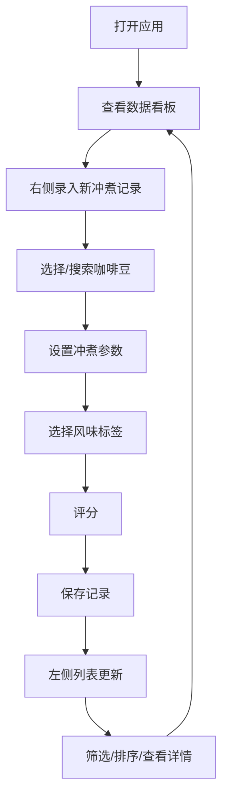

## 1. 产品概述

个人咖啡冲煮日志应用——为咖啡爱好者打造的专业冲煮记录与风味评估工具，帮助用户系统化记录每次冲煮参数、追踪风味偏好变化，通过数据洞察提升冲煮技艺。

## 2. 核心功能

### 2.1 用户角色
| 角色 | 注册方式 | 核心权限 |
|------|----------|----------|
| 咖啡爱好者 | 无需注册（本地应用） | 记录冲煮日志、查看统计分析、筛选排序 |

### 2.2 功能模块
1. **冲煮记录页**: 冲煮表单录入、风味标签选择、实时校验反馈
2. **数据看板页**: 统计概览、评分趋势折线图、风味分布
3. **记录列表页**: 时间线卡片、展开详情、多条件筛选排序

### 2.3 页面详情
| 页面名称 | 模块名称 | 功能描述 |
|----------|----------|----------|
| 主页面 | 冲煮记录表单 | 选择/搜索咖啡豆、冲煮方式、研磨度/水温/粉水比滑块、冲煮时间输入、星级评分、风味标签选择、自定义描述 |
| 主页面 | 数据看板 | 总冲煮次数（脉动动画）、平均评分、最常用豆子/方式、评分趋势折线图（渐变填充） |
| 主页面 | 记录列表 | 时间倒序卡片、缩略参数、展开完整详情（平滑过渡动画）、多条件筛选排序、空状态插画 |
| 主页面 | Toast通知 | 保存成功绿色Toast、校验提示 |

## 3. 核心流程

用户打开应用 → 查看数据看板了解整体冲煮情况 → 右侧表单录入新冲煮记录 → 选择咖啡豆（模糊搜索/手动输入）→ 设置冲煮参数（方式/研磨度/水温/粉水比/时间）→ 点击风味标签+自定义描述 → 评分 → 保存 → 左侧列表实时更新 → 可筛选/排序/展开查看详情

## 4. 用户界面设计

### 4.1 设计风格
- 主色：深咖色 (#3E2723) 用于文字和标题
- 背景：米白色 (#FFF8F0) 
- 卡片底色：浅咖色 (#F5E6D3)
- 强调色：琥珀色 (#FFBF00) 用于按钮和交互元素
- 辅助色：焦糖色 (#8D6E63) 用于次要文字和边框
- 按钮风格：圆角按钮，琥珀色填充，点击触感波纹效果
- 字体：Playfair Display（标题展示字体）+ Inter（正文UI字体）
- 布局：两栏结构（左侧看板/列表 + 右侧表单），窄屏单列自适应
- 图标：统一色系SVG插画（手冲/意式/法压/爱乐压）

### 4.2 页面设计概览
| 页面名称 | 模块名称 | UI元素 |
|----------|----------|--------|
| 主页面 | 数据看板 | 超大统计数字+脉动动画、折线图渐变填充、悬浮详情卡片 |
| 主页面 | 冲煮记录表单 | 咖啡豆搜索下拉、滑块控件、星级点击、风味标签（放大回弹动画）、校验提示 |
| 主页面 | 记录列表 | 卡片悬停上浮阴影、展开/收起高度过渡、筛选淡入动画、空状态插画 |
| 主页面 | Toast通知 | 绿色成功Toast、自动消失 |

### 4.3 响应式设计
- 桌面端（≥768px）：两栏布局，左侧看板/列表，右侧表单
- 移动端（<768px）：单列上下布局，表单可收起/展开
- 所有交互元素支持键盘操作（Tab/Enter/Space）
- 触控优化：滑块和按钮尺寸适配触控

### 4.4 动效规范
- 统计数字：轻微脉动动画（scale 1→1.03→1，2s循环）
- 风味标签：点击放大回弹（scale 1→1.2→1，300ms）
- 卡片展开：高度平滑过渡（max-height + opacity，400ms ease）
- 筛选列表：淡入动画（opacity 0→1，300ms）
- 卡片悬停：上浮+阴影（translateY -4px + shadow，200ms）
- 按钮点击：触感波纹效果
- Toast：滑入+自动消失（3s）
