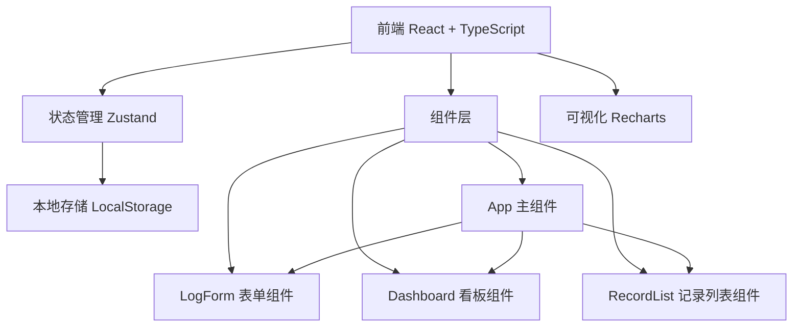
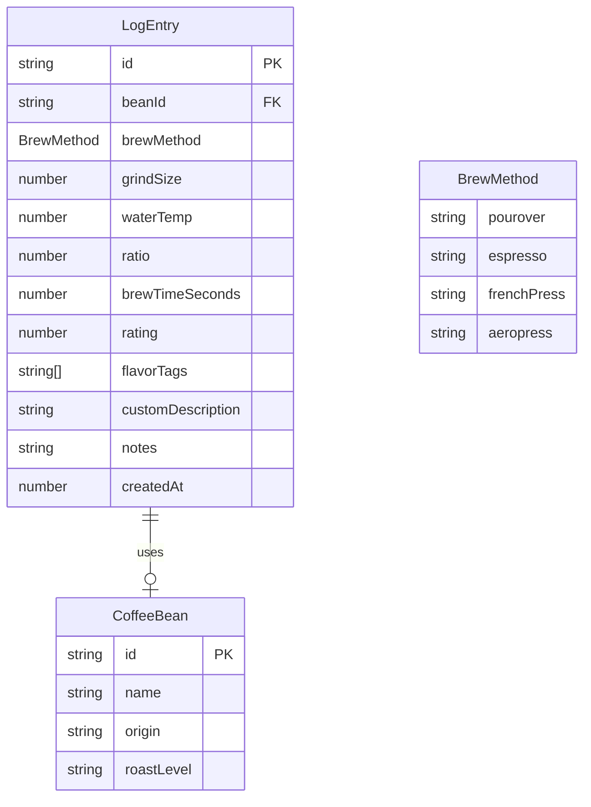

## 1. 架构设计



## 2. 技术说明
- 前端：React@18 + TypeScript + Vite + TailwindCSS
- 初始化工具：vite-init (react-ts 模板)
- 状态管理：Zustand（全局日志数据、筛选条件）
- 数据持久化：LocalStorage
- 可视化：Recharts（折线图、渐变填充）
- 路由：单页面应用，无路由切换（看板/列表/表单同屏）
- 后端：无
- 数据库：无（LocalStorage 模拟持久化）

## 3. 路由定义
| 路由 | 用途 |
|------|------|
| / | 主页面（看板+列表+表单同屏展示） |

## 4. 数据模型

### 4.1 数据模型定义



### 4.2 类型定义

```typescript
type BrewMethod = 'pourover' | 'espresso' | 'frenchPress' | 'aeropress';

interface CoffeeBean {
  id: string;
  name: string;
  origin: string;
  roastLevel: string;
}

interface FlavorTag {
  id: string;
  label: string;
  color: string;
}

interface LogEntry {
  id: string;
  bean: CoffeeBean;
  brewMethod: BrewMethod;
  grindSize: number;
  waterTemp: number;
  ratio: number;
  brewTimeSeconds: number;
  rating: number;
  flavorTags: string[];
  customDescription: string;
  notes: string;
  createdAt: number;
}

interface FilterState {
  beanId: string | null;
  brewMethod: BrewMethod | null;
  minRating: number | null;
  timeRange: '7d' | '30d' | 'all';
}
```

## 5. 文件结构

```
├── index.html              # 入口页面，引入Google Fonts
├── package.json            # 依赖管理
├── vite.config.js          # Vite配置，路径别名@→src
├── tsconfig.json           # TypeScript严格模式+路径映射
├── src/
│   ├── main.tsx            # 应用入口
│   ├── App.tsx             # 主应用组件，全局状态+布局
│   ├── types.ts            # 共享类型定义
│   ├── store.ts            # Zustand状态管理
│   ├── LogForm.tsx         # 冲煮记录表单组件
│   ├── Dashboard.tsx       # 数据看板组件
│   ├── RecordList.tsx      # 记录列表组件
│   ├── components/
│   │   ├── FlavorTags.tsx  # 风味标签组件
│   │   ├── StarRating.tsx  # 星级评分组件
│   │   ├── BrewMethodIcon.tsx # 冲煮方式SVG图标
│   │   ├── Toast.tsx       # Toast通知组件
│   │   └── EmptyState.tsx  # 空状态组件
│   ├── data/
│   │   └── presetBeans.ts  # 预设咖啡豆列表
│   └── index.css           # TailwindCSS + 全局样式
```

## 6. 性能策略
- 列表渲染使用虚拟化：超过100条记录时仅渲染可视区域（React窗口化技术）
- 筛选/排序使用 useMemo 缓存计算结果，响应时间 < 100ms
- 状态更新使用 Zustand 的选择性订阅，避免不必要的重渲染
- 动画使用 CSS transform/opacity（GPU加速），避免触发布局重排
- LocalStorage 读写使用防抖，避免频繁IO
