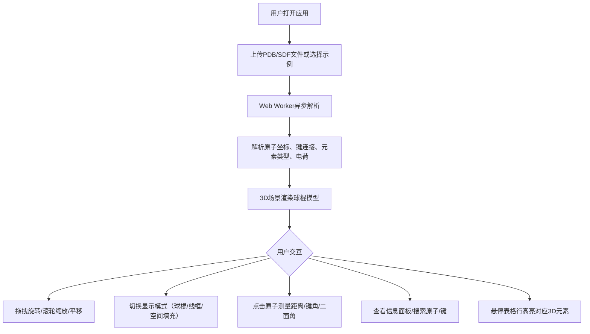

## 1. 产品概述

MolView 是一款面向化学教学和科研场景的轻量级、免安装分子结构3D可视化工具。用户上传 PDB/SDF 格式分子文件后，应用自动解析并在3D场景中以球棍模型展示分子结构，支持多种显示模式切换、原子测量标注、结构信息查看等交互功能，解决传统分子观察工具笨重、需安装、门槛高的问题。

- 目标用户：化学教师、学生、科研人员
- 核心价值：零安装、即时可用、交互丰富的分子3D观察体验

## 2. 核心功能

### 2.1 功能模块

1. **主页面**：3D分子视口 + 信息面板 + 文件上传

### 2.2 页面详情

| 页面名称 | 模块名称 | 功能描述 |
|---------|---------|---------|
| 主页面 | 文件上传区 | 支持拖拽/点击上传PDB/SDF文件，虚线边框呼吸光晕动画，拖入时高亮反馈 |
| 主页面 | 3D视口 | 占70%宽度，渲染分子球棍/线框/空间填充模型，支持鼠标拖拽旋转、滚轮缩放、平移视角 |
| 主页面 | 悬浮工具栏 | 毛玻璃效果，包含显示模式切换（球棍/线框/空间填充）、背景色切换、重置视角按钮 |
| 主页面 | 测量功能 | 点击两个原子测距离，三个原子测键角，四个原子测二面角，结果实时显示在场景中 |
| 主页面 | 信息面板 | 占30%宽度，展示分子概要（原子数、键数、分子式、分子量、电荷）+ 可展开原子/键表格 |
| 主页面 | 原子/键表格 | 列出所有原子和键信息，支持列排序、搜索，行悬停时3D模型同步高亮闪烁 |

## 3. 核心流程

用户打开应用 → 拖拽/点击上传分子文件（或选择示例分子） → Web Worker 异步解析文件 → 主线程渲染3D模型 → 用户可交互操作（旋转/缩放/平移/测量/切换显示模式/查看信息面板）。

## 4. 用户界面设计

### 4.1 设计风格

- 主背景色：`#1a1a2e`（深蓝黑）
- 面板底色：`#16213e`（深蓝）
- 强调色：`#0f3460`（中蓝）
- 交互高亮色：`#e94560`（红粉色）
- 按钮样式：圆角矩形，悬停0.2秒ease-out背景色过渡
- 字体：Inter（主UI字体）
- 布局：左右分栏（70%视口 + 30%面板）

### 4.2 页面设计概览

| 页面名称 | 模块名称 | UI元素 |
|---------|---------|--------|
| 主页面 | 3D视口 | 深色背景，球棍模型渲染，悬浮毛玻璃工具栏 |
| 主页面 | 上传区 | 虚线边框，呼吸光晕动画（@keyframes pulse），拖入高亮 |
| 主页面 | 悬浮工具栏 | backdrop-filter: blur(8px)，半透明背景，模式切换/背景色/重置按钮 |
| 主页面 | 信息面板 | 深蓝底色，分子概要卡片，可展开表格，搜索框 |
| 主页面 | 测量标签 | 3D场景中连接线+数字标签，浮动面板显示结果可复制 |

### 4.3 响应式适配

- 桌面端（≥768px）：左（3D视口70%）右（信息面板30%）分栏布局
- 移动端（<768px）：3D视口和信息面板上下堆叠，工具栏变为底部固定栏

### 4.4 3D场景指引

- 环境：深色/浅色/自定义纯色背景，无HDRI
- 灯光：环境光 + 定向光，确保分子结构清晰可见
- 相机：透视相机，OrbitControls 交互控制
- 原子渲染：球体几何体，按元素类型着色（CPK配色方案）
- 化学键渲染：圆柱体几何体，连接两原子中心
- 显示模式切换：0.3秒平滑形变动画过渡
- 交互：点击原子高亮选中，支持测量标注
