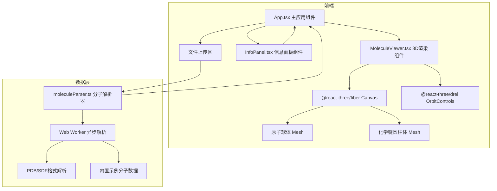

## 1. 架构设计



## 2. 技术说明

- 前端：React@18 + TypeScript + Vite
- 3D渲染：Three.js + @react-three/fiber + @react-three/drei
- 状态管理：Zustand
- 样式：Tailwind CSS
- 初始化工具：vite-init (react-ts 模板)
- 后端：无
- 数据库：无（纯前端应用，内置示例数据）

## 3. 路由定义

| 路由 | 用途 |
|------|------|
| / | 主页面，包含3D视口、信息面板、文件上传 |

## 4. 文件组织

| 文件 | 职责 |
|------|------|
| package.json | 依赖管理：react, react-dom, typescript, vite, @react-three/fiber, @react-three/drei, three, @types/react, @types/react-dom, @types/three |
| index.html | 入口页面，引入Google Fonts Inter字体 |
| vite.config.js | Vite构建配置 |
| tsconfig.json | TypeScript严格模式配置 |
| src/App.tsx | 主应用组件，管理上传、3D视口与信息面板布局和状态 |
| src/MoleculeViewer.tsx | 3D分子渲染组件，球棍/线框/空间填充模型+交互控制 |
| src/InfoPanel.tsx | 右侧信息面板，分子概要+原子/键表格+搜索排序+悬停高亮 |
| src/moleculeParser.ts | 分子文件解析器，PDB/SDF解析+内置示例数据+Web Worker异步执行 |
| src/store.ts | Zustand状态管理（分子数据、显示模式、测量状态、高亮状态等） |

## 5. 数据模型

### 5.1 核心类型定义

```typescript
interface Atom {
  id: number;
  element: string;
  x: number;
  y: number;
  z: number;
  charge?: number;
}

interface Bond {
  id: number;
  atom1Id: number;
  atom2Id: number;
  type: 'single' | 'double' | 'triple';
}

interface MoleculeData {
  atoms: Atom[];
  bonds: Bond[];
  formula: string;
  molecularWeight: number;
  totalCharge: number;
}

type DisplayMode = 'ball-stick' | 'wireframe' | 'space-filling';
type MeasureMode = 'none' | 'distance' | 'angle' | 'dihedral';
```

### 5.2 元素着色方案（CPK）

| 元素 | 颜色 |
|------|------|
| H | #FFFFFF (白) |
| C | #909090 (灰) |
| N | #3050F8 (蓝) |
| O | #FF0D0D (红) |
| S | #FFFF30 (黄) |
| P | #FF8000 (橙) |
| 其他 | #FF1493 (粉) |

## 6. 性能策略

- Web Worker 异步解析文件，不阻塞主线程
- 首次解析+渲染目标 < 2秒（1000原子内）
- 3D渲染帧率 ≥ 40FPS（1000原子内）
- InstancedMesh 批量渲染原子和键以提升性能
- 使用 React.memo 和 useMemo 减少不必要的重渲染
