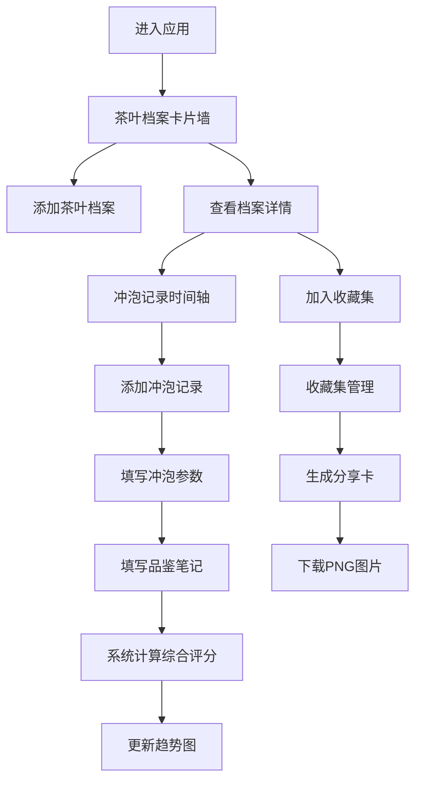

## 1. 产品概述

茶鉴 - 轻量级茶叶品鉴管理工具，帮助普通用户和小型茶室系统化管理茶叶库存、记录冲泡参数并生成个性化品鉴笔记。
- 解决茶叶种类繁多、冲泡参数难记忆、品鉴记录零散、无法系统化回溯和分享的痛点问题
- 目标用户：茶叶爱好者、家庭用户、小型茶室经营者

## 2. 核心功能

### 2.1 用户角色
| 角色 | 注册方式 | 核心权限 |
|------|----------|----------|
| 普通用户 | 无需注册，本地存储 | 完整的茶叶档案管理、冲泡记录、品鉴笔记、收藏集和分享功能 |

### 2.2 功能模块
1. **茶叶档案管理**：CRUD操作、卡片墙展示、多级筛选、照片上传预览
2. **冲泡记录与参数追踪**：参数表单、时间轴展示、评分柱状图
3. **品鉴笔记与评分系统**：多维度评分、自动计算综合评分、趋势图展示
4. **收藏集与分享功能**：收藏集管理、拖拽排序、品鉴分享卡生成下载

### 2.3 页面详情
| 页面名称 | 模块名称 | 功能描述 |
|---------|----------|----------|
| 茶叶档案页 | 卡片墙展示 | 茶叶卡片网格布局，支持按品种、产地、年份组合筛选，筛选切换淡入淡出动画 |
| 茶叶档案页 | 档案表单 | 添加/编辑茶叶档案，包含产地三级联动、品种选择、照片上传（最多3张） |
| 冲泡记录页 | 参数表单 | 水温滑块、投茶量精确输入、冲泡时间、注水方式、品鉴容器选择 |
| 冲泡记录页 | 时间轴展示 | 按时间倒序展示所有冲泡记录，新记录从右侧滑入动画 |
| 冲泡记录页 | 评分趋势图 | 柱状图展示各次综合评分波动，高度变化平滑过渡 |
| 品鉴笔记页 | 评分表单 | 汤色、滋味下拉选择，回甘星级评分（缩放弹跳动画），叶底评分 |
| 收藏集页 | 收藏集列表 | 文件夹样式展示收藏集，支持拖拽排序 |
| 收藏集页 | 分享卡生成 | 一键生成品鉴分享卡，支持下载为PNG图片 |

## 3. 核心流程

用户进入应用后，首先浏览茶叶档案卡片墙，可添加新档案或点击已有档案查看详情。在档案详情页可查看历史冲泡记录时间轴，点击添加冲泡记录进入参数表单，填写后进入品鉴笔记评分，系统自动计算综合评分并更新趋势图。用户可将茶叶加入不同收藏集，并生成分享卡下载分享。

## 4. 用户界面设计

### 4.1 设计风格
- **主色调**：柔和米白色 #F9F6F0
- **辅助色**：木质棕 #8B5E3C
- **点缀色**：茶绿色 #6B8E23
- **卡片样式**：圆角矩形 border-radius: 12px，轻微投影 box-shadow: 0 2px 8px rgba(0,0,0,0.08)
- **悬停效果**：卡片轻微上浮 translateY(-4px)，增大投影
- **过渡动画**：所有操作300ms ease-in-out 过渡
- **字体**：标题使用 Noto Serif SC，正文使用 Inter

### 4.2 页面设计概述
| 页面名称 | 模块名称 | UI元素 |
|---------|----------|--------|
| 茶叶档案页 | 顶部导航栏 | 固定定位，三模块入口，移动端汉堡菜单 |
| 茶叶档案页 | 筛选栏 | 品种、产地、年份下拉筛选器，横向排列 |
| 茶叶档案页 | 卡片墙 | 响应式网格，桌面3列、平板2列、手机1列，虚拟滚动 |
| 档案详情页 | 照片轮播 | 干茶照片轮播展示 |
| 档案详情页 | 信息面板 | 茶叶基本信息展示，木质棕强调边框 |
| 档案详情页 | 时间轴 | 左侧竖线连接，右侧记录卡片，新记录滑入动画 |
| 档案详情页 | 趋势图 | Recharts柱状图，茶绿色柱子，平滑过渡动画 |
| 表单弹窗 | 参数表单 | 滑块组件、步进器、图标选择器，木质棕按钮 |
| 收藏集页 | 文件夹网格 | 文件夹图标，茶绿色点缀，拖拽高亮效果 |
| 分享卡预览 | 分享卡 | 米白色背景，木质棕文字，茶绿色评分星标 |

### 4.3 响应式
- **桌面端**（>1024px）：卡片墙3列，完整导航栏
- **平板端**（768px-1024px）：卡片墙2列，导航栏紧凑布局
- **手机端**（<768px）：卡片墙1列，导航栏折叠为汉堡菜单，触控优化

### 4.4 动画与交互
- 页面加载：卡片依次淡入，staggered 动画
- 筛选切换：卡片淡出淡入，300ms 过渡
- 新记录添加：时间轴条目从右侧滑入
- 星级评分：点击时星形图标缩放弹跳动画
- 柱状图更新：柱子高度平滑过渡动画
- 卡片悬停：上浮+阴影增强
