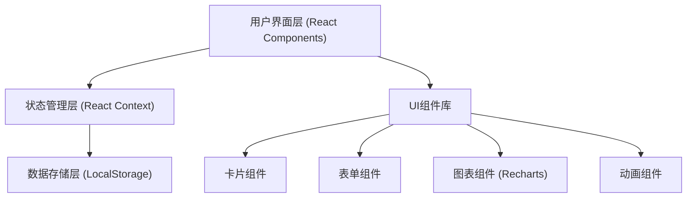
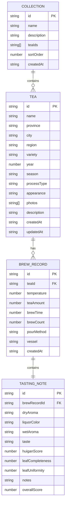

## 1. 架构设计



## 2. 技术描述
- **前端框架**：React 18 + TypeScript
- **构建工具**：Vite 5（路径别名@指向src，懒加载，预渲染）
- **状态管理**：React Context API，三个独立Store（TeaStore、BrewStore、CollectionStore）
- **数据持久化**：localStorage，模拟异步接口
- **图表库**：Recharts 2
- **样式方案**：CSS Modules + CSS Variables
- **虚拟滚动**：自定义虚拟滚动组件（性能优化）
- **图片处理**：Canvas API 生成分享卡，支持PNG下载

## 3. 路由定义
| 路由 | 用途 |
|------|------|
| / | 首页，重定向到/teas |
| /teas | 茶叶档案列表页 |
| /teas/:id | 茶叶档案详情页（包含冲泡记录、品鉴笔记、趋势图） |
| /collections | 收藏集列表页 |
| /collections/:id | 收藏集详情页 |

## 4. 数据模型

### 4.1 数据模型定义


### 4.2 类型定义（TypeScript）
```typescript
interface Tea {
  id: string;
  name: string;
  province: string;
  city: string;
  region: string;
  variety: TeaVariety;
  year: number;
  season: Season;
  processType: string;
  appearance: string;
  photos: string[];
  description: string;
  lastBrewDate?: string;
  createdAt: string;
  updatedAt: string;
}

interface BrewRecord {
  id: string;
  teaId: string;
  temperature: number;
  teaAmount: number;
  brewTime: number;
  brewCount: number;
  pourMethod: PourMethod;
  vessel: Vessel;
  createdAt: string;
}

interface TastingNote {
  id: string;
  brewRecordId: string;
  dryAroma: string;
  liquorColor: LiquorColor;
  wetAroma: string;
  taste: Taste;
  huiganScore: 1 | 2 | 3 | 4 | 5;
  leafCompleteness: 1 | 2 | 3 | 4 | 5;
  leafUniformity: 1 | 2 | 3 | 4 | 5;
  notes: string;
  overallScore: number;
}

interface Collection {
  id: string;
  name: string;
  description: string;
  teaIds: string[];
  createdAt: string;
}
```

## 5. 文件结构
```
src/
├── App.tsx                 # 主应用组件，路由和全局状态
├── TeaArchive.tsx          # 茶叶档案管理模块
├── TeaDetail.tsx           # 茶叶档案详情页
├── BrewLog.tsx             # 冲泡记录与品鉴笔记模块
├── Collection.tsx          # 收藏集管理模块
├── types.ts                # TypeScript类型定义
├── data/
│   ├── teaStore.ts         # 茶叶数据管理
│   ├── brewStore.ts        # 冲泡记录数据管理
│   └── collectionStore.ts  # 收藏集数据管理
├── components/
│   ├── TeaCard.tsx         # 茶叶卡片组件
│   ├── TeaForm.tsx         # 茶叶表单组件
│   ├── BrewForm.tsx        # 冲泡参数表单
│   ├── TastingForm.tsx     # 品鉴笔记表单
│   ├── Timeline.tsx        # 时间轴组件
│   ├── ScoreChart.tsx      # 评分趋势图
│   ├── VirtualScroll.tsx   # 虚拟滚动组件
│   ├── ShareCard.tsx       # 分享卡组件
│   └── Navbar.tsx          # 导航栏组件
├── context/
│   ├── TeaContext.tsx      # 茶叶状态上下文
│   ├── BrewContext.tsx     # 冲泡记录状态上下文
│   └── CollectionContext.tsx # 收藏集状态上下文
├── hooks/
│   └── useLocalStorage.ts  # localStorage Hook
└── styles/
    └── variables.css       # CSS变量定义
```

## 6. 性能优化策略
1. **虚拟滚动**：茶叶档案列表超过20条时启用虚拟滚动，保证100条数据滚动帧率≥50FPS
2. **懒加载**：使用React.lazy和Suspense实现路由级懒加载
3. **图片优化**：照片上传时自动压缩，生成缩略图
4. **防抖节流**：筛选器输入防抖，滚动事件节流
5. **Memo优化**：使用React.memo、useMemo、useCallback避免不必要重渲染
6. **CSS优化**：使用CSS Variables，避免昂贵CSS属性频繁重绘
