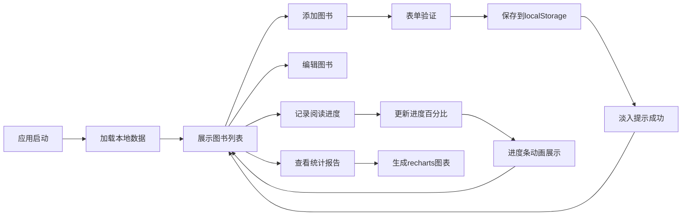

## 1. 产品概述

个人藏书管理与阅读记录应用，帮助用户管理纸质书和电子书库存，记录阅读进度并生成可视化阅读报告。
- 主要目的：为爱书人士提供一站式图书管理和阅读追踪解决方案，解决个人藏书零散、阅读进度难追踪的问题
- 目标用户：喜爱阅读、拥有一定数量藏书的个人用户
- 产品价值：提升阅读效率，培养阅读习惯，直观展示阅读成果

## 2. 核心功能

### 2.1 功能模块

1. **图书管理**：图书增删改查、分类筛选、搜索排序、封面展示
2. **阅读进度追踪**：阅读记录、进度条展示、自动计算阅读百分比
3. **统计报告**：分类分布环形图、月度阅读时长柱状图、每日阅读页数趋势折线图
4. **数据管理**：localStorage 持久化、JSON 批量导入导出、重复数据去重

### 2.2 页面详情

| 页面名称 | 模块名称 | 功能描述 |
|-----------|-------------|---------------------|
| 图书列表页 | 搜索筛选栏 | 关键词搜索、分类筛选、阅读状态筛选、排序选择 |
| 图书列表页 | 图书卡片网格 | 封面缩略图、书名作者、阅读状态标签、悬停动效 |
| 图书详情/编辑页 | 图书表单 | ISBN格式验证、必填字段验证、提交成功提示 |
| 阅读记录页 | 进度追踪器 | 起止页数、阅读时长、日期、笔记输入、进度条动画 |
| 统计报告页 | 数据可视化 | 环形图、柱状图、折线图、切换淡入动画 |

## 3. 核心流程

### 主业务流程
用户打开应用 → 查看图书列表 → 点击添加图书 → 填写表单提交 → 选择图书记录阅读进度 → 查看统计报告 → 导出/导入数据

## 4. 用户界面设计

### 4.1 设计风格
- **主色调**：米白色（#FAF7F2）背景，浅棕色（#8B7355）作为主色调
- **辅助色**：未读灰色（#9CA3AF）、在读蓝色（#3B82F6）、已读绿色（#10B981）
- **卡片样式**：白色卡片、8px圆角、轻微阴影、悬停时阴影加深上浮
- **按钮样式**：圆角矩形、浅棕色填充、白色文字、悬停时微深
- **字体**：标题使用 Playfair Display（衬线体），正文使用 Inter（无衬线体）
- **图标风格**：简约线性图标，统一24px尺寸

### 4.2 页面设计概述

| 页面名称 | 模块名称 | UI元素 |
|-----------|-------------|-------------|
| 图书列表页 | 搜索筛选栏 | 固定顶部、平滑展开收起、搜索框圆角、筛选标签胶囊形 |
| 图书列表页 | 图书卡片 | 网格布局、封面图圆角、状态标签角标、悬停上浮动画 |
| 图书表单 | 模态框 | 居中放大进入、缩小消失、表单字段左对齐、错误提示红色 |
| 阅读记录页 | 进度条 | 从0%平滑填充至当前进度、动画时长0.8秒、ease-out缓动 |
| 统计报告页 | 图表区 | 柔和配色、悬停显示详情、数据切换淡入动画0.5秒 |

### 4.3 响应式设计
- **桌面端**：左右两栏布局，左侧240px固定导航，右侧自适应内容区
- **平板端**：导航宽度缩小至200px，卡片网格3列
- **移动端**：顶部导航栏，卡片堆叠单列布局，文字和图片自适应缩放，触控区域不小于44px

### 4.4 动效设计
- 页面切换：淡入淡出 200ms
- 卡片悬停：translateY(-4px) + 阴影加深 200ms
- 模态框：scale(0.9→1) + opacity(0→1) 300ms
- 进度条：width(0→current) 800ms ease-out
- 图表切换：opacity(0→1) 500ms
- 成功提示：淡入 300ms，停留2秒后淡出 500ms
