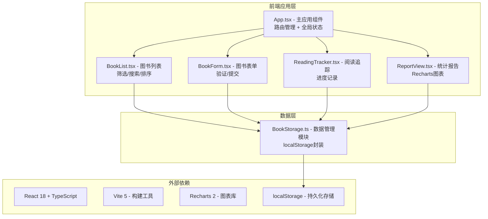
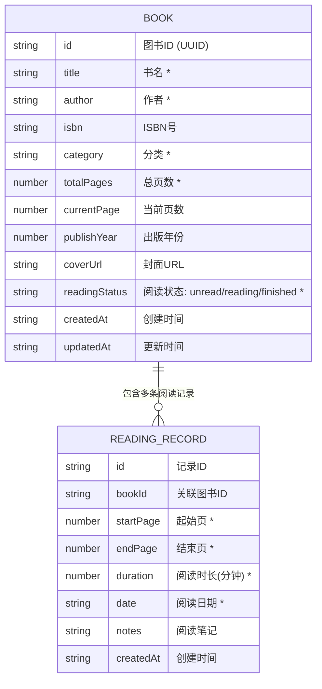

## 1. 架构设计



## 2. 技术描述

- **前端框架**：React 18 + TypeScript 5
- **构建工具**：Vite 5（含路径别名 @ 指向 src）
- **图表库**：Recharts 2
- **状态管理**：React useState + useContext（轻量级全局状态）
- **路由**：React Router DOM 6（hash路由，适配静态部署）
- **样式方案**：CSS Modules + CSS Variables（无需额外CSS框架）
- **数据持久化**：localStorage API 封装
- **数据验证**：自定义验证函数（ISBN格式、必填字段）

## 3. 路由定义

| 路由 | 页面 | 组件 |
|-------|---------|-------|
| / | 图书列表页 | BookList |
| /books/new | 添加图书 | BookForm |
| /books/:id/edit | 编辑图书 | BookForm |
| /books/:id/track | 阅读记录 | ReadingTracker |
| /report | 统计报告 | ReportView |

## 4. 数据模型

### 4.1 数据模型定义



### 4.2 TypeScript 类型定义

```typescript
// 图书类型
interface Book {
  id: string;
  title: string;
  author: string;
  isbn: string;
  category: string;
  totalPages: number;
  currentPage: number;
  publishYear: number;
  coverUrl: string;
  readingStatus: 'unread' | 'reading' | 'finished';
  createdAt: string;
  updatedAt: string;
}

// 阅读记录类型
interface ReadingRecord {
  id: string;
  bookId: string;
  startPage: number;
  endPage: number;
  duration: number;
  date: string;
  notes: string;
  createdAt: string;
}

// 表单验证结果
interface ValidationResult {
  isValid: boolean;
  errors: Record<string, string>;
}

// 统计数据类型
interface CategoryStats {
  name: string;
  value: number;
  percentage: number;
}

interface MonthlyReadingStats {
  month: string;
  hours: number;
}

interface DailyPageStats {
  date: string;
  pages: number;
}
```

## 5. 核心模块说明

### 5.1 BookStorage.ts - 数据管理模块
- `getBooks(): Book[]` - 获取所有图书
- `getBook(id: string): Book | undefined` - 获取单本图书
- `addBook(book: Omit<Book, 'id' | 'createdAt' | 'updatedAt'>): Book` - 添加图书
- `updateBook(id: string, updates: Partial<Book>): Book | undefined` - 更新图书
- `deleteBook(id: string): boolean` - 删除图书
- `searchBooks(keyword: string, filters?: { category?: string; status?: string }): Book[]` - 搜索筛选
- `getReadingRecords(bookId: string): ReadingRecord[]` - 获取图书阅读记录
- `addReadingRecord(record: Omit<ReadingRecord, 'id' | 'createdAt'>): ReadingRecord` - 添加阅读记录
- `exportData(): string` - 导出JSON数据
- `importData(json: string): { imported: number; duplicates: string[]; errors: string[] }` - 导入JSON数据

### 5.2 App.tsx - 主应用组件
- 路由配置与管理
- 全局状态（图书数据、当前筛选条件）
- 侧边导航栏（桌面端）/ 顶部导航栏（移动端）
- Toast 提示组件

### 5.3 BookForm.tsx - 图书表单组件
- 表单字段渲染与双向绑定
- ISBN格式验证（正则：/^(?:ISBN(?:-1[03])?:? )?(?=[0-9X]{10}$|(?=(?:[0-9]+[- ]){3})[- 0-9X]{13}$|97[89][0-9]{10}$|(?=(?:[0-9]+[- ]){4})[- 0-9]{17}$)/）
- 必填字段验证
- 提交成功淡入提示

### 5.4 BookList.tsx - 图书列表组件
- 卡片网格布局
- 搜索框（模糊搜索书名/作者）
- 分类筛选下拉
- 阅读状态筛选下拉
- 卡片点击跳转编辑
- 状态标签样式区分

### 5.5 ReadingTracker.tsx - 阅读进度组件
- 阅读记录表单
- 阅读记录列表
- 进度条动画（CSS transition）
- 自动计算阅读百分比

### 5.6 ReportView.tsx - 统计报告组件
- 环形图（PieChart + Pie + ResponsiveContainer）
- 柱状图（BarChart + Bar + Gradient）
- 折线图（LineChart + Line + Area）
- 数据切换淡入动画

## 6. 性能优化策略

1. **列表渲染优化**：使用 React.memo 包裹图书卡片组件，避免不必要重渲染
2. **搜索防抖**：搜索输入使用 200ms 防抖，减少过滤计算
3. **图表懒加载**：报告页图表使用动态 import，进入页面后再加载
4. **localStorage 优化**：批量操作合并写入，避免频繁IO
5. **CSS 动画优化**：使用 transform 和 opacity 属性实现硬件加速动画
6. **代码分割**：按路由级别进行代码分割，减少首屏加载体积
