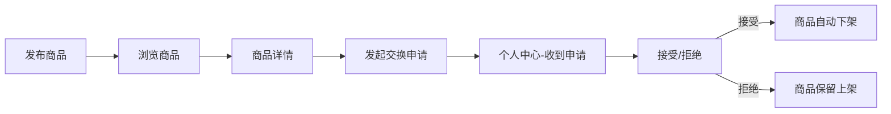

## 1. 产品概述

二手好物是一个面向普通家庭用户的闲置物品物物交换平台，解决家里东西堆积但直接扔掉可惜、又想换点别的东西回来的小烦恼。用户可以快速发布闲置物品、浏览他人发布的商品、并发起简单的物物交换请求。

- **目标用户**：家中有闲置物品、希望以物换物的普通用户
- **核心价值**：零成本闲置流转，物尽其用，环保又实惠
- **产品定位**：轻量级、社区化的物物交换平台

## 2. 核心功能

### 2.1 用户角色
| 角色 | 注册方式 | 核心权限 |
|------|----------|----------|
| 普通用户 | 无需注册（本地模拟） | 发布商品、浏览商品、发起交换、管理发布和申请 |

### 2.2 功能模块
1. **发布商品页**：多图上传、拖拽排序、新旧程度滑块、交换意向
2. **商品浏览页**：瀑布流布局、多条件筛选、商品卡片
3. **商品详情页**：轮播图展示、商品信息、交换申请弹窗
4. **个人中心页**：我的发布管理、收到的交换申请管理

### 2.3 页面详情
| 页面名称 | 模块名称 | 功能描述 |
|---------|----------|----------|
| 发布商品页 | 图片上传区 | 支持拖拽上传、点击上传，最多6张，支持预览和拖拽排序 |
| 发布商品页 | 表单输入区 | 物品名称、新旧程度滑块（1-10）、交换意向（不限/具体指定） |
| 发布商品页 | 提交与反馈 | 提交后生成商品卡片，卡片从底部滑入的动画效果 |
| 商品浏览页 | 筛选区 | 按类别（电子产品/书籍/家居/服饰/运动/其他）和新旧程度筛选 |
| 商品浏览页 | 瀑布流列表 | 多列瀑布流布局，卡片悬停阴影加深并上移2px |
| 商品详情页 | 轮播图 | 左右箭头切换，底部圆点指示器 |
| 商品详情页 | 商品信息 | 名称、新旧程度、交换意向、详细描述 |
| 商品详情页 | 交换申请 | 底部"申请交换"按钮，弹出表单填写物品描述和联系方式 |
| 个人中心页 | 我的发布 | 管理自己发布的商品列表，支持上下架 |
| 个人中心页 | 交换申请 | 消息列表形式，已读/未读用左侧色条区分，可接受或拒绝 |

## 3. 核心流程

### 3.1 发布商品流程
用户进入发布页 → 上传多张图片（支持拖拽排序）→ 填写物品信息 → 滑动选择新旧程度 → 填写交换意向 → 点击提交 → 生成商品卡片并滑入动画 → 自动跳转到浏览页

### 3.2 浏览与交换流程
用户进入浏览页 → 按类别/新旧程度筛选 → 瀑布流浏览商品卡片 → 点击卡片进入详情页 → 轮播查看图片 → 点击"申请交换" → 弹出表单填写提供物品和联系方式 → 提交申请 → 申请发送到卖家个人中心

### 3.3 申请处理流程
用户进入个人中心 → 查看收到的交换申请 → 点击申请标记为已读 → 查看申请人提供的物品描述和联系方式 → 选择接受（商品自动下架）或拒绝（商品保留上架）

## 4. 用户界面设计

### 4.1 设计风格
- **主色调**：莫兰迪色系 — 雾霾蓝 (#7C98A6) + 浅灰 (#E8E6E1) + 米白 (#F5F2ED)
- **辅助色**：暖沙色 (#D4C5B0)、灰绿色 (#A8B5A0)、砖红色 (#B89087)
- **按钮风格**：圆角按钮，填充主色调，悬停时颜色加深
- **字体**：Google Fonts - Inter，清晰现代的无衬线字体
- **布局风格**：卡片式布局，柔和圆角 (border-radius: 12px)，轻微阴影
- **动效**：所有交互 300ms 淡入淡出或平滑过渡
- **图标风格**：线性简洁图标 (lucide-react)

### 4.2 页面设计概述
| 页面名称 | 模块名称 | UI 元素 |
|---------|----------|---------|
| 发布商品页 | 图片上传区 | 虚线边框上传区域，图片网格排列，拖拽时高亮 |
| 发布商品页 | 表单区 | 清爽简洁的输入框，滑块采用自定义样式 |
| 发布商品页 | 提交按钮 | 底部固定或表单底部，全宽按钮 |
| 商品浏览页 | 筛选栏 | 顶部横向滚动的类别标签，滑块筛选新旧程度 |
| 商品浏览页 | 瀑布流卡片 | 多列布局，图片+标题+标签，悬停上浮效果 |
| 商品详情页 | 轮播图 | 全屏宽度，左右箭头，底部圆点指示器 |
| 商品详情页 | 信息区 | 标题、新旧程度条、交换意向、详细描述 |
| 商品详情页 | 底部操作栏 | 固定底部的"申请交换"按钮 |
| 个人中心页 | Tab切换 | 我的发布 / 收到的申请 |
| 个人中心页 | 申请列表 | 左侧色条标记已读/未读，右侧显示申请信息 |

### 4.3 响应式设计
- **设计方式**：桌面端优先，移动端自适应
- **断点**：768px
- **大屏**：多列瀑布流布局（3-4列）
- **小屏**（<768px）：单列列表布局
- **触摸优化**：按钮最小点击区域 44px，适合手指点击

### 4.4 动效设计
- **页面切换**：300ms 淡入淡出
- **卡片出现**：从底部滑入 + 淡入，300ms ease-out
- **卡片悬停**：阴影加深 + 上移 2px，200ms 过渡
- **弹窗出现**：缩放入场 + 背景遮罩淡入，300ms
- **按钮点击**：轻微缩放反馈，100ms

## 5. 性能要求

- **首屏加载时间**：小于 1.5 秒
- **图片加载**：瀑布流图片懒加载
- **交互响应**：切换页面或筛选后的渲染响应在 200ms 内完成
- **动画帧率**：60fps 流畅动画
