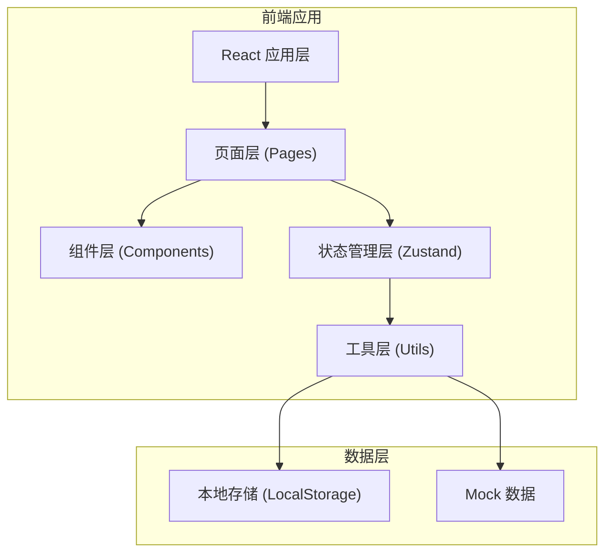
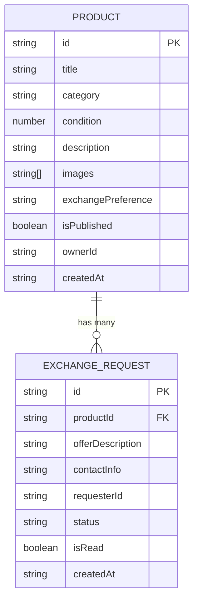

## 1. 架构设计



## 2. 技术描述

- **前端框架**：React 18 + TypeScript
- **构建工具**：Vite 5
- **状态管理**：Zustand
- **路由管理**：React Router DOM v6
- **样式方案**：Tailwind CSS 3
- **图标库**：lucide-react
- **数据存储**：LocalStorage 本地持久化 + Mock 初始数据
- **开发语言**：TypeScript（严格模式）

## 3. 目录结构

```
src/
├── pages/              # 页面组件
│   ├── PublishPage.tsx    # 发布商品页
│   ├── BrowsePage.tsx     # 商品浏览页
│   ├── DetailPage.tsx     # 商品详情页
│   └── ProfilePage.tsx    # 个人中心页
├── components/         # 可复用组件
│   ├── ProductCard.tsx    # 商品卡片
│   ├── ImageUpload.tsx    # 图片上传组件
│   ├── ImageCarousel.tsx  # 图片轮播组件
│   ├── Modal.tsx          # 弹窗组件
│   ├── NavBar.tsx         # 导航栏
│   └── FilterBar.tsx      # 筛选栏
├── hooks/              # 自定义 Hooks
│   ├── useLazyImage.ts    # 图片懒加载
│   └── useDragSort.ts     # 拖拽排序
├── utils/              # 工具函数
│   ├── dataStore.ts       # 数据存储层（封装所有 CRUD）
│   └── helpers.ts         # 通用辅助函数
├── types/              # 类型定义
│   └── index.ts           # 全局类型
├── App.tsx             # 主应用组件
├── main.tsx            # 应用入口
└── index.css           # 全局样式
```

## 4. 路由定义

| 路由路径 | 页面名称 | 功能说明 |
|----------|----------|----------|
| `/` | 商品浏览页 | 瀑布流展示所有商品，支持筛选 |
| `/publish` | 发布商品页 | 表单发布新商品 |
| `/product/:id` | 商品详情页 | 展示商品详情和轮播图，可发起交换申请 |
| `/profile` | 个人中心页 | 管理我的发布和收到的交换申请 |

## 5. 数据模型

### 5.1 数据模型定义



### 5.2 类型定义

```typescript
// 商品类别
type Category = 'electronics' | 'books' | 'home' | 'clothing' | 'sports' | 'other';

// 商品状态
type ProductStatus = 'published' | 'sold' | 'offline';

// 申请状态
type RequestStatus = 'pending' | 'accepted' | 'rejected';

// 商品
interface Product {
  id: string;
  title: string;
  category: Category;
  condition: number; // 1-10
  description: string;
  images: string[]; // base64 或 URL
  exchangePreference: string;
  status: ProductStatus;
  ownerId: string;
  createdAt: number;
}

// 交换申请
interface ExchangeRequest {
  id: string;
  productId: string;
  offerDescription: string;
  contactInfo: string;
  requesterId: string;
  status: RequestStatus;
  isRead: boolean;
  createdAt: number;
}
```

## 6. 状态管理

使用 Zustand 管理全局状态，数据存储层封装在 `dataStore.ts` 中：

```typescript
interface AppState {
  products: Product[];
  requests: ExchangeRequest[];
  currentUser: string;
  
  // 商品操作
  addProduct: (product: Omit<Product, 'id' | 'createdAt' | 'ownerId' | 'status'>) => void;
  getProduct: (id: string) => Product | undefined;
  updateProduct: (id: string, updates: Partial<Product>) => void;
  deleteProduct: (id: string) => void;
  
  // 申请操作
  addRequest: (request: Omit<ExchangeRequest, 'id' | 'createdAt' | 'status' | 'isRead'>) => void;
  getRequestsForProduct: (productId: string) => ExchangeRequest[];
  getRequestsForUser: (userId: string) => ExchangeRequest[];
  markRequestRead: (id: string) => void;
  acceptRequest: (id: string) => void;
  rejectRequest: (id: string) => void;
  
  // 持久化
  loadFromStorage: () => void;
  saveToStorage: () => void;
}
```

## 7. 性能优化策略

1. **图片懒加载**：使用 Intersection Observer 实现瀑布流图片懒加载
2. **虚拟滚动**：列表量大时考虑使用虚拟滚动（初期可不实现）
3. **状态记忆**：筛选状态、滚动位置记忆
4. **代码分割**：按路由级代码分割（Vite 原生支持）
5. **图片压缩**：上传时压缩图片，减少存储和渲染压力
6. **CSS 动画**：使用 transform 和 opacity 属性，触发 GPU 加速

## 8. 开发规范

- 所有组件使用 TypeScript，类型定义完整
- 组件文件不超过 300 行，超出则拆分
- 使用函数组件 + Hooks，不使用 class 组件
- 样式使用 Tailwind CSS 原子类
- 命名规范：组件 PascalCase，函数/变量 camelCase，类型 PascalCase
- 统一使用 lucide-react 图标库
