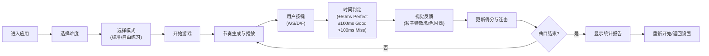

## 1. 产品概述

在线音乐教学节奏训练应用，帮助学生通过交互式游戏化方式锻炼节奏感和听力，解决传统节拍器练习枯燥且缺乏反馈的问题。

- **目标用户**：音乐学习者、乐器演奏者、节奏感训练需求者
- **核心价值**：通过视觉化节奏落点、即时反馈和多难度模式，让节奏训练变得有趣且高效
- **产品定位**：专业级节奏训练工具，兼顾趣味性与训练效果

---

## 2. 核心功能

### 2.1 用户角色
| 角色 | 注册方式 | 核心权限 |
|------|----------|----------|
| 普通用户 | 无需注册，直接使用 | 完整使用所有训练功能、切换难度和主题、查看训练统计 |

### 2.2 功能模块
1. **节奏匹配核心**：四轨道(A/S/D/F)节奏下落，时间判定系统，即时反馈
2. **难度选择系统**：简单/普通/困难三档，动态节拍生成
3. **练习模式**：标准模式 + 自由练习模式（无Miss判定，显示精确偏差）
4. **统计系统**：实时得分、连击、准确率、详细报告
5. **主题系统**：三套视觉主题（复古像素/霓虹科幻/极简黑白）
6. **音效系统**：节拍音、判定反馈音

### 2.3 页面详情
| 页面名称 | 模块名称 | 功能描述 |
|----------|----------|----------|
| 主界面 | 游戏区域 | 四轨道节奏下落、判定线、按键反馈 |
| 主界面 | 得分面板 | 实时得分、连击数、准确率显示 |
| 主界面 | 设置面板 | 难度选择、主题切换、模式选择 |
| 结果页面 | 统计报告 | 总击打数、Perfect/Good/Miss比例、平均偏差、最高连击 |

---

## 3. 核心流程

---

## 4. 用户界面设计

### 4.1 设计风格
- **主色调**：深色背景 `#1a1a2e`，霓虹渐变 `#e94560`、`#0f3460`、`#16213e`
- **按钮风格**：圆角8px，弹跳缩放效果（scale 0.95→1.0，0.15s过渡）
- **字体**：显示字体使用 Orbitron，正文字体使用 JetBrains Mono
- **布局风格**：居中轨道区域（60%宽度），两侧显示得分和连击
- **动画**：判定线发光动画，粒子爆发特效，主题切换0.5s平滑过渡

### 4.2 页面设计概述
| 页面名称 | 模块名称 | UI元素 |
|----------|----------|---------|
| 主界面 | 游戏区域 | 四条垂直轨道、下落圆点、发光判定线、按键高亮反馈 |
| 主界面 | 得分面板 | 分数数字、连击计数器、准确率进度条 |
| 主界面 | 设置面板 | 右侧滑入（0.3s ease-out）、主题预览卡片、难度下拉菜单、模式切换按钮 |
| 结果页 | 统计报告 | 数据卡片、进度条可视化、色块比例图、重新开始按钮 |

### 4.3 响应式设计
- **桌面端**：轨道居中60%宽度，左右侧面板
- **移动端（≤768px）**：单列布局，轨道高度压缩30%，字号增大，底部控制区
- **触摸优化**：增大点击区域，支持触摸按键

### 4.4 视觉特效
- **Perfect**：金色粒子爆发（30个随机方向，0.6秒）
- **Good**：蓝色粒子爆发
- **Miss**：屏幕边缘红色闪烁
- **判定线**：呼吸发光动画
- **主题切换**：所有CSS属性0.5s平滑过渡
