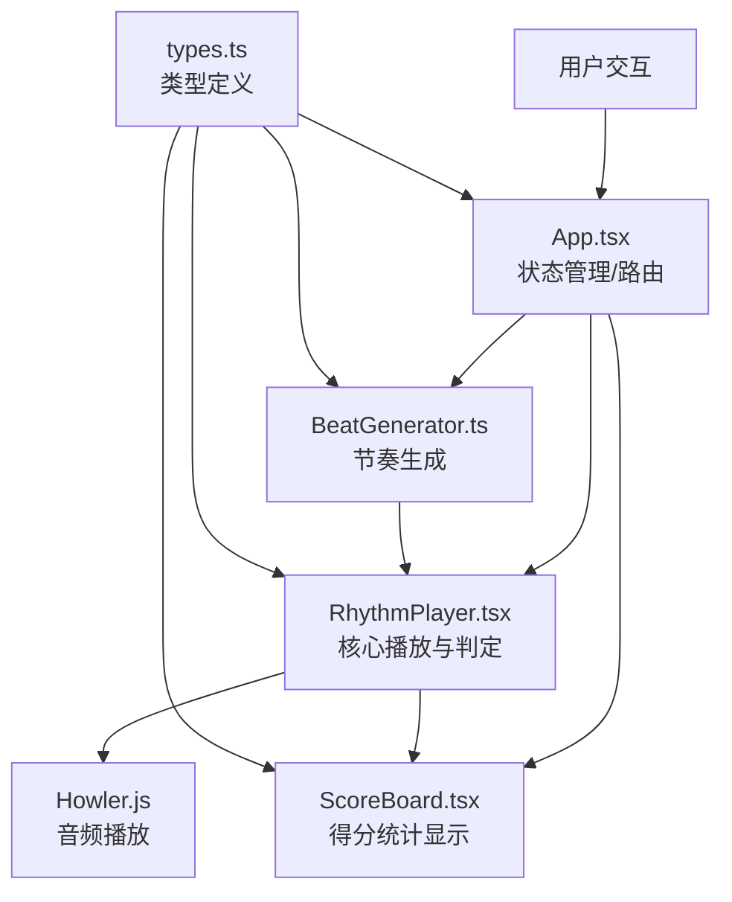

## 1. 架构设计



**数据流方向**：
1. 用户动作 → `App.tsx` → 分发给核心组件
2. `BeatGenerator.ts` → 生成节奏序列 → `RhythmPlayer.tsx`
3. `RhythmPlayer.tsx` → 得分事件 → `ScoreBoard.tsx`
4. `RhythmPlayer.tsx` → 调用 Howler → 播放音频
5. `RhythmPlayer.tsx` → 节拍匹配检测 → 输出得分

---

## 2. 技术描述

- **前端框架**：React 18 + TypeScript 5
- **构建工具**：Vite 5
- **音频引擎**：Howler.js（Web Audio封装，低延迟）
- **状态管理**：React useState/useReducer（轻量级，无需额外库）
- **样式方案**：CSS Modules + CSS Variables（主题切换）
- **动画**：CSS Transitions + requestAnimationFrame（游戏循环）

**性能保障**：
- 游戏循环使用 `requestAnimationFrame`，保证60FPS
- 粒子池管理，限制同时存在≤80个粒子
- 音频使用 Web Audio API 高精度定时器，延迟≤15ms

---

## 3. 项目结构

```
auto3/
├── package.json
├── vite.config.js
├── tsconfig.json
├── index.html
└── src/
    ├── App.tsx              # 主应用组件，状态管理
    ├── RhythmPlayer.tsx     # 核心节奏播放与交互组件
    ├── ScoreBoard.tsx       # 实时得分与统计面板
    ├── BeatGenerator.ts     # 节奏生成与难度管理工具类
    ├── types.ts             # 共享类型定义
    └── styles/
        ├── App.module.css
        ├── RhythmPlayer.module.css
        ├── ScoreBoard.module.css
        └── themes.css       # 主题CSS变量定义
```

---

## 4. 数据模型

### 4.1 核心类型定义

```typescript
// types.ts
export type DifficultyLevel = 'easy' | 'normal' | 'hard';
export type GameMode = 'standard' | 'practice';
export type JudgmentType = 'perfect' | 'good' | 'miss';
export type ThemeType = 'retro' | 'neon' | 'minimal';

export interface Beat {
  id: string;
  track: number;      // 0-3 对应 A/S/D/F
  time: number;       // 触发时间(ms)
  hit: boolean;       // 是否已击中
  judgment?: JudgmentType;
  deviation?: number; // 时间偏差(ms)
}

export interface Score {
  total: number;
  perfect: number;
  good: number;
  miss: number;
  combo: number;
  maxCombo: number;
  totalDeviation: number;
  hitCount: number;
}

export interface DifficultyConfig {
  timeSignature: [number, number]; // 拍号，如 [4, 4]
  bpm: number;
  tracks: number;      // 可用轨道数
  pattern: 'single' | 'alternate' | 'random';
  duration: number;    // 曲目时长(ms)
}

export interface Particle {
  id: string;
  x: number;
  y: number;
  vx: number;
  vy: number;
  color: string;
  life: number;
  maxLife: number;
  size: number;
  type: 'pixel' | 'glow' | 'dot';
}
```

### 4.2 难度配置表

| 难度 | 拍号 | BPM | 轨道数 | 节奏模式 |
|------|------|-----|--------|----------|
| 简单 | 4/4 | 80 | 1 | 单轨道 |
| 普通 | 4/4 | 120 | 2 | 双轨道交替 |
| 困难 | 7/8 | 150 | 4 | 四轨道随机 |

---

## 5. 核心算法

### 5.1 节拍判定算法

```typescript
const PERFECT_WINDOW = 50;  // ±50ms
const GOOD_WINDOW = 100;    // ±100ms

function judgeHit(actualTime: number, expectedTime: number): JudgmentType {
  const deviation = Math.abs(actualTime - expectedTime);
  if (deviation <= PERFECT_WINDOW) return 'perfect';
  if (deviation <= GOOD_WINDOW) return 'good';
  return 'miss';
}
```

### 5.2 分数计算

```typescript
const PERFECT_SCORE = 100;
const GOOD_SCORE = 50;
const COMBO_MULTIPLIER = 0.1;  // 连击加成

function calculateScore(judgment: JudgmentType, combo: number): number {
  const base = judgment === 'perfect' ? PERFECT_SCORE : 
               judgment === 'good' ? GOOD_SCORE : 0;
  return Math.floor(base * (1 + combo * COMBO_MULTIPLIER));
}
```

### 5.3 节奏生成算法

```typescript
function generateBeats(config: DifficultyConfig): Beat[] {
  const beats: Beat[] = [];
  const beatInterval = 60000 / config.bpm;  // 每拍间隔(ms)
  const beatsPerMeasure = config.timeSignature[0];
  
  let currentTime = 2000;  // 2秒准备时间
  let trackIndex = 0;
  
  while (currentTime < config.duration) {
    for (let i = 0; i < beatsPerMeasure; i++) {
      let track: number;
      
      switch (config.pattern) {
        case 'single':
          track = 0;
          break;
        case 'alternate':
          track = i % config.tracks;
          break;
        case 'random':
          track = Math.floor(Math.random() * config.tracks);
          break;
      }
      
      beats.push({
        id: `beat-${beats.length}`,
        track,
        time: currentTime,
        hit: false,
      });
      
      currentTime += beatInterval;
    }
  }
  
  return beats;
}
```

---

## 6. 性能优化策略

1. **游戏循环优化**：使用 `requestAnimationFrame`，每次更新只计算可见元素
2. **粒子池**：预分配80个粒子对象，复用而不是频繁创建销毁
3. **重绘优化**：使用 CSS `transform` 和 `opacity` 动画，避免触发重排
4. **音频预加载**：游戏开始前预加载所有音频资源
5. **防抖处理**：键盘事件防抖，防止快速连续按键误判

---

## 7. 依赖清单

```json
{
  "dependencies": {
    "react": "^18.2.0",
    "react-dom": "^18.2.0",
    "howler": "^2.2.4"
  },
  "devDependencies": {
    "@types/react": "^18.2.0",
    "@types/react-dom": "^18.2.0",
    "@types/howler": "^2.2.11",
    "typescript": "^5.4.0",
    "vite": "^5.2.0"
  }
}
```
