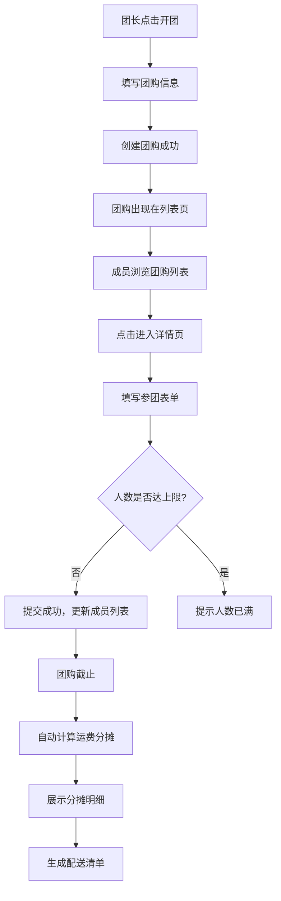

## 1. 产品概述

手工材料拼单拼团应用，面向手工爱好者社群，解决微信群接龙统计混乱、快递分发出错的问题。支持用户开团、参团、自动分摊运费并生成配送清单，让拼团流程清晰高效。

- 目标用户：手工爱好者社群成员，常需拼单购买小工具或材料
- 核心价值：用结构化工具替代混乱的群接龙，实现从开团到配送的全流程管理

## 2. 核心功能

### 2.1 用户角色
| 角色 | 说明 | 核心权限 |
|------|------|----------|
| 团长 | 创建团购的用户 | 创建团购、设置商品与规格、管理截止日期 |
| 参团成员 | 参与团购的用户 | 选择商品规格与数量、提交参团信息、查看运费分摊 |

### 2.2 功能模块
1. **团购列表页**：展示所有活跃团购，支持开团操作，卡片式网格布局
2. **团购详情页**：展示商品列表、参团成员、运费分摊结果、配送清单导出

### 2.3 页面详情
| 页面名称 | 模块名称 | 功能描述 |
|----------|----------|----------|
| 团购列表页 | 顶部导航栏 | 固定导航，左侧Logo和"开团"按钮，右侧显示当前用户昵称 |
| 团购列表页 | 团购卡片网格 | 展示团购封面渐变色、标题、进度条（已参团/总人数）、倒计时（不足1小时红色闪烁） |
| 团购列表页 | 开团弹窗 | 点击"开团"弹出，填写标题、截止日期、商品信息、规格、库存、最高人数 |
| 团购详情页 | 商品信息区 | 展示商品名称、单价、规格选项及各规格库存 |
| 团购详情页 | 参团表单 | 填写昵称、联系电话、选择规格和数量，提交后更新成员列表（新成员滑入动画） |
| 团购详情页 | 参团成员列表 | 彩虹色系渐变排列，悬停放大阴影效果，显示每人购买详情 |
| 团购详情页 | 运费分摊表格 | 截止后自动计算，每行含昵称、购买总价、分摊比例、应付运费 |
| 团购详情页 | 配送清单导出 | 一键生成按成员分组清单，可单独打印或复制为文本 |

## 3. 核心流程

1. 团长创建团购：填写标题、截止日期、商品及规格信息、最高参团人数
2. 成员参团：浏览团购列表→点击进入详情→填写表单→提交参团
3. 运费分摊：团购截止后，系统按金额比例自动计算每人运费
4. 配送清单：一键生成按成员分组的配送清单，支持打印/复制

## 4. 用户界面设计

### 4.1 设计风格
- 主色调：奶油色暖色系（#FFF8F0主背景，#F5E6D3卡片底色）
- 强调色：暖棕色系搭配柔和橙色点缀
- 按钮风格：圆角矩形，点击时0.2s ease-out缩放反馈
- 字体：手作感衬线体搭配简洁无衬线体
- 布局风格：卡片式网格布局，上下结构，顶部固定导航
- 纹理：棉质纹理感背景，营造手作温馨氛围
- 动画：新成员卡片从上方滑入，表单输入框聚焦时底部横线渐变移动

### 4.2 页面设计概览
| 页面名称 | 模块名称 | UI元素 |
|----------|----------|--------|
| 团购列表页 | 顶部导航栏 | 固定定位，奶油色底，左侧Logo+圆角"开团"按钮，右侧用户昵称 |
| 团购列表页 | 团购卡片 | 渐变色封面、标题、进度条、倒计时，悬停阴影效果 |
| 团购列表页 | 开团弹窗 | 居中弹出，放大动画，表单字段含规格动态添加 |
| 团购详情页 | 商品区 | 商品名称、单价、规格标签、库存数量 |
| 团购详情页 | 参团表单 | 输入框聚焦底部横线动画，规格下拉选择，数量输入 |
| 团购详情页 | 成员列表 | 彩虹色系渐变卡片，悬停放大阴影，滑入动画 |
| 团购详情页 | 运费分摊 | 底部表格，每行含昵称、总价、比例、运费 |
| 团购详情页 | 配送清单 | 卡片式，可打印/复制按钮 |

### 4.3 响应式设计
- 桌面优先设计，卡片网格自适应列数
- 移动端单列卡片布局，导航栏简化

### 4.4 性能约束
- 100个团购×50成员数据下，页面渲染 ≤ 50ms
- 运费分摊计算 ≤ 10ms
