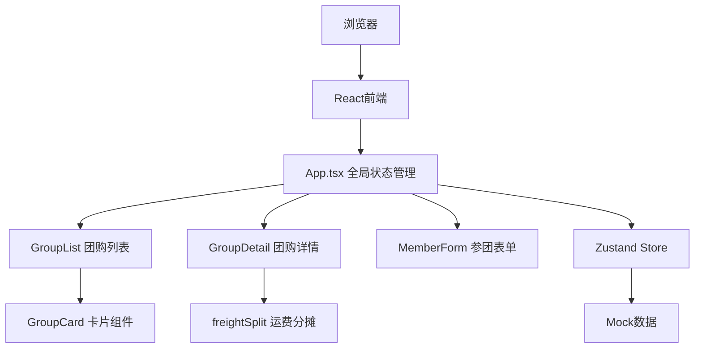
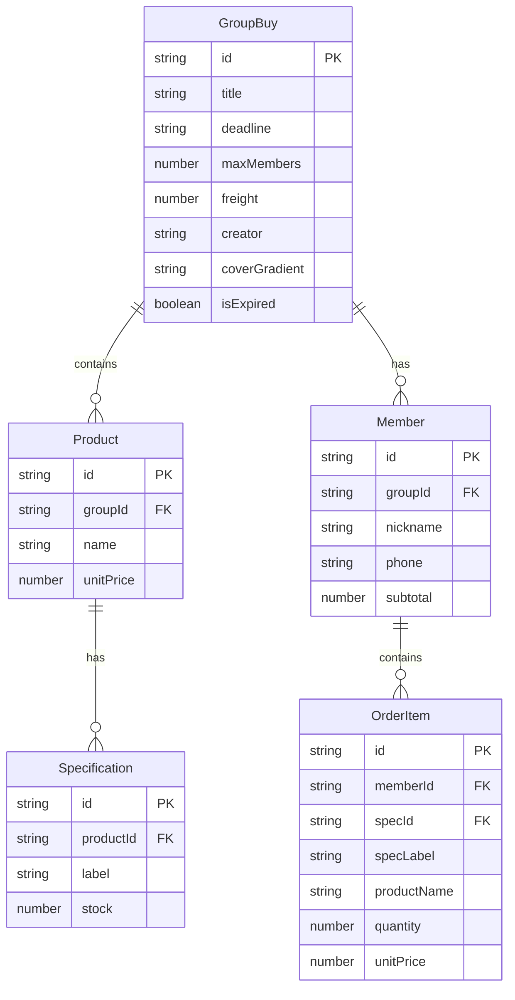

## 1. 架构设计



纯前端应用，无后端服务，数据存储在Zustand状态管理中（内存）。

## 2. 技术说明
- 前端：React@18 + TypeScript + Vite + Tailwind CSS + Zustand
- 初始化工具：vite-init（react-ts模板）
- 后端：无
- 数据库：无，使用Mock数据 + Zustand内存状态

## 3. 路由定义
| 路由 | 用途 |
|------|------|
| / | 团购列表页，展示所有活跃团购 |
| /group/:id | 团购详情页，展示商品、成员、运费分摊、配送清单 |

## 4. 数据模型

### 4.1 数据模型定义



### 4.2 TypeScript类型定义

```typescript
interface GroupBuy {
  id: string;
  title: string;
  deadline: string;
  maxMembers: number;
  freight: number;
  creator: string;
  coverGradient: string;
  products: Product[];
  members: Member[];
  isExpired: boolean;
}

interface Product {
  id: string;
  name: string;
  unitPrice: number;
  specifications: Specification[];
}

interface Specification {
  id: string;
  label: string;
  stock: number;
}

interface Member {
  id: string;
  nickname: string;
  phone: string;
  orderItems: OrderItem[];
  subtotal: number;
}

interface OrderItem {
  specId: string;
  specLabel: string;
  productName: string;
  quantity: number;
  unitPrice: number;
}

interface FreightSplitResult {
  nickname: string;
  totalPurchase: number;
  ratio: number;
  freightShare: number;
}
```

## 5. 文件结构与调用关系

```
project/
├── package.json              # 依赖与脚本
├── vite.config.js            # Vite构建配置
├── tsconfig.json             # TypeScript严格模式配置
├── index.html                # 入口HTML
└── src/
    ├── main.tsx              # 应用入口，渲染App
    ├── App.tsx               # 主应用组件，路由与全局状态
    ├── index.css             # 全局样式，Tailwind指令，自定义CSS
    ├── store/
    │   └── useGroupStore.ts  # Zustand状态管理
    ├── components/
    │   ├── GroupList.tsx     # 团购列表 → 调用GroupCard
    │   ├── GroupCard.tsx     # 团购卡片 → 接收团购数据渲染
    │   ├── GroupDetail.tsx   # 团购详情 → 调用MemberForm/freightSplit
    │   ├── MemberForm.tsx    # 参团表单 → 提交更新Store
    │   ├── CreateGroupModal.tsx # 开团弹窗 → 提交创建团购到Store
    │   └── DeliveryList.tsx  # 配送清单 → 读取成员数据生成清单
    └── utils/
        └── freightSplit.ts   # 运费分摊 → 接收金额列表→返回分摊结果
```

### 数据流向
1. **App.tsx** 初始化Zustand Store，提供路由（/ → GroupList，/group/:id → GroupDetail）
2. **GroupList** 从Store读取团购列表 → 渲染GroupCard → 点击跳转详情
3. **GroupDetail** 从Store读取团购详情 → 渲染商品/成员/运费 → 调用freightSplit计算
4. **MemberForm** 用户输入 → 校验 → 调用Store.addMember更新数据 → 新成员卡片滑入
5. **freightSplit** 接收成员金额列表 → 按比例分摊运费 → 返回FreightSplitResult[]
6. **DeliveryList** 读取Store成员数据 → 生成配送清单 → 支持打印/复制
