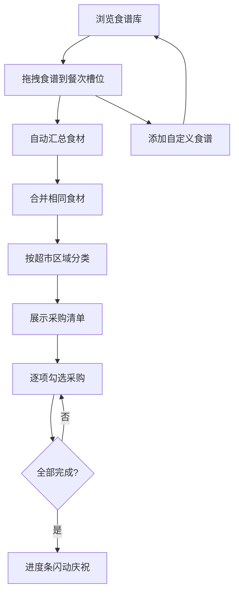

## 1. 产品概述

家庭食材采购清单规划应用，帮助用户根据食谱自动生成采购清单并跟踪采购进度。目标用户为家庭主厨和注重生活品质的家庭，通过周菜单规划与智能食材汇总，解决家庭采购中遗漏食材、重复购买、分类混乱等痛点。

## 2. 核心功能

### 2.1 用户角色

| 角色 | 注册方式 | 核心权限 |
|------|----------|----------|
| 家庭用户 | 无需注册 | 规划菜单、管理食谱、生成采购清单、追踪采购进度 |

### 2.2 功能模块

1. **菜单规划页**：周菜单规划面板、食谱库、自定义食谱添加
2. **采购清单页**：采购清单展示、分类折叠、进度追踪、雷达图可视化

### 2.3 页面详情

| 页面名称 | 模块名称 | 功能描述 |
|----------|----------|----------|
| 菜单规划页 | 食谱库面板 | 展示15+内置食谱，按类别筛选，支持拖拽到餐次槽位 |
| 菜单规划页 | 周菜单规划面板 | 周一至周日三餐槽位，拖放食谱，显示食谱名称和所需时间 |
| 菜单规划页 | 自定义食谱表单 | 添加自定义食谱，包含名称、类别、时间、食材列表、步骤，带表单校验 |
| 采购清单页 | 分类采购清单 | 按超市区域分类（蔬菜区、肉禽区、水产区、干货调味区、乳制品区、主食区），可折叠分组 |
| 采购清单页 | 进度追踪 | 圆形复选框勾选动画，环形进度条，全部完成闪动特效 |
| 采购清单页 | 雷达图可视化 | 各分类食材数量分布雷达图，周切换平滑过渡动画 |

## 3. 核心流程

用户打开应用后，首先在左侧菜单规划面板中浏览食谱库，选择食谱并拖拽到对应的日期餐次槽位中。系统自动汇总所有已规划食谱的食材，合并相同食材数量，按超市区域分类生成采购清单。用户在右侧采购清单页面中逐项勾选已购买的食材，实时查看采购进度。用户还可以添加自定义食谱来丰富食谱库。

## 4. 用户界面设计

### 4.1 设计风格

- 主色：暖橙色（#F28C28）、奶油白（#FFF8E7）
- 强调色：橄榄绿（#6B8E23）
- 文字色：深灰（#333333）
- 按钮样式：8px圆角，温暖渐变，200ms ease-out过渡
- 字体：Nunito（Google Fonts），标题粗体700，正文常规400
- 布局风格：左右两栏布局，左侧窄栏（规划面板），右侧主栏（采购清单）
- 图标风格：lucide-react线性图标

### 4.2 页面设计概览

| 页面名称 | 模块名称 | UI元素 |
|----------|----------|--------|
| 菜单规划页 | 食谱库面板 | 卡片列表，类别标签色块，拖拽半透明阴影，放置弹性缩放动画 |
| 菜单规划页 | 周菜单槽位 | 7×3网格槽位，食谱名称+时间标签，空位虚线占位 |
| 菜单规划页 | 自定义食谱表单 | 浮层表单，输入校验红框提示，提交飞入动画 |
| 采购清单页 | 分类列表 | 可折叠分组标题，圆形复选框，旋转勾选动画 |
| 采购清单页 | 进度条 | 环形进度条SVG，百分比文字，完成闪动绿色 |
| 采购清单页 | 雷达图 | recharts雷达图，分类数据轴，平滑过渡动画 |

### 4.3 响应式设计

- 桌面端：左右两栏布局（左窄右宽）
- 移动端（≤768px）：上下堆叠布局，食谱库可折叠
- 触摸优化：拖拽卡片增大触摸区域，复选框尺寸44px以上
