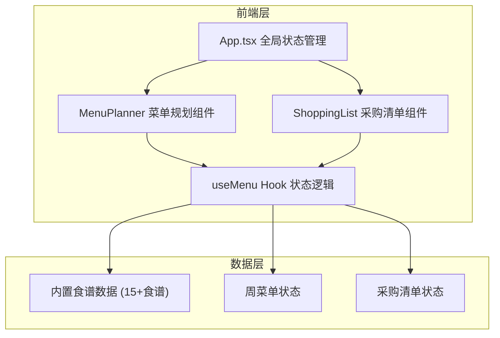
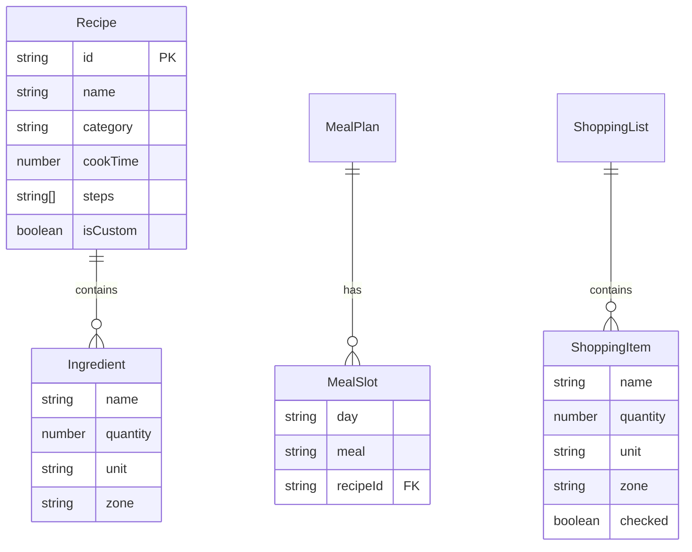

## 1. 架构设计

## 2. 技术说明

- 前端：React@18 + TypeScript + Vite + Tailwind CSS
- 初始化工具：vite-init (react-ts模板)
- 状态管理：zustand
- 图表：recharts
- 拖拽：HTML5 Drag and Drop API（原生实现，确保性能）
- 后端：无
- 数据库：无，使用本地内存状态

## 3. 路由定义

| 路由 | 用途 |
|------|------|
| / | 主页面，包含菜单规划面板和采购清单 |

## 4. API定义

无后端API，所有数据在客户端本地管理。

## 5. 数据模型

### 5.1 数据模型定义

### 5.2 数据定义

- Recipe：食谱，包含id、名称、类别（中餐/西餐/早餐/甜点）、烹饪时间、食材列表、步骤、是否自定义
- Ingredient：食材，包含名称、数量、单位、所属超市区域
- MealSlot：餐次槽位，包含星期、餐次（早餐/午餐/晚餐）、关联食谱ID
- ShoppingItem：采购项，包含名称、数量、单位、所属区域、是否已勾选
- 超市区域枚举：蔬菜区、肉禽区、水产区、干货调味区、乳制品区、主食区
