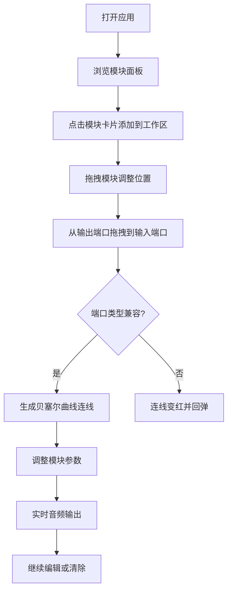

## 1. 产品概述

电子音乐合成器沙盒是一个面向音乐爱好者和初学者的浏览器端模块化音频合成工具。用户可以通过拖拽连线的方式组合不同的虚拟合成器模块（振荡器、滤波器、包络、LFO、混响等），实时创造属于自己的电子音色并即时听到效果。

- 解决的问题：降低电子音乐合成器的学习门槛，让零基础用户也能在浏览器中直观地体验模块化合成的乐趣
- 目标用户：音乐爱好者、电子音乐初学者、声音设计师

## 2. 核心功能

### 2.1 用户角色

| 角色 | 注册方式 | 核心权限 |
|------|----------|----------|
| 访客 | 无需注册 | 使用所有合成器模块和功能 |

### 2.2 功能模块

1. **主工作台页面**：模块面板、工作区画布、贝塞尔曲线连线、状态栏

### 2.3 页面详情

| 页面名称 | 模块名称 | 功能描述 |
|----------|----------|----------|
| 主工作台 | 左侧模块面板 | 展示5种基础合成器模块卡片（振荡器、滤波器、ADSR包络、LFO、混响），点击添加到工作区 |
| 主工作台 | 右侧工作区 | 渲染已添加模块的可拖拽卡片，支持贝塞尔曲线连线、端口拖拽、错误回弹 |
| 主工作台 | 底部状态栏 | 显示CPU占用百分比和音频采样率（默认44100Hz） |

## 3. 核心流程

用户打开页面后，从左侧模块面板选择需要的合成器模块点击添加到右侧工作区。在工作区中拖拽模块卡片调整位置，点击模块输出端口拖拽到另一个模块输入端口建立信号连接（生成带脉冲动画的贝塞尔曲线）。调整各模块参数（频率、波形、Q值、ADSR值等），实时听到合成音效变化。连接错误端口时连线变红并自动回弹。

## 4. 用户界面设计

### 4.1 设计风格

- 主色调：深色主题（背景#1a1a2e、面板#16213e、卡片#0f3460、高亮#e94560）
- 端口颜色编码：音频信号-青色、控制信号-黄色、触发信号-橙色
- 按钮风格：圆角阴影卡片，悬停上浮+蓝色发光边框
- 字体：JetBrains Mono 等宽字体（主UI字体），搭配清晰的参数标签
- 布局：左右两栏，左侧固定250px模块面板，右侧自适应工作区
- 动画：模块入场滑动动画、连线脉冲动画、拖拽阻尼过渡（200ms ease-out）、端口呼吸光效

### 4.2 页面设计概览

| 页面名称 | 模块名称 | UI元素 |
|----------|----------|--------|
| 主工作台 | 左侧模块面板 | 浅灰到深灰渐变底色卡片、圆角阴影、悬停上浮+蓝色发光边框、点击添加动画 |
| 主工作台 | 右侧工作区 | 深色画布背景、可拖拽模块卡片、输入/输出端口（带呼吸光效）、贝塞尔曲线连线（脉冲动画）、错误红色回弹 |
| 主工作台 | 底部状态栏 | 固定定位、显示CPU%和采样率、深色半透明背景 |

### 4.3 响应式

- 桌面优先设计，宽屏左右两栏布局
- 窄屏时左侧面板折叠为可滑出的抽屉式菜单
- 工作区自适应宽度

### 4.4 3D场景指导

不适用
